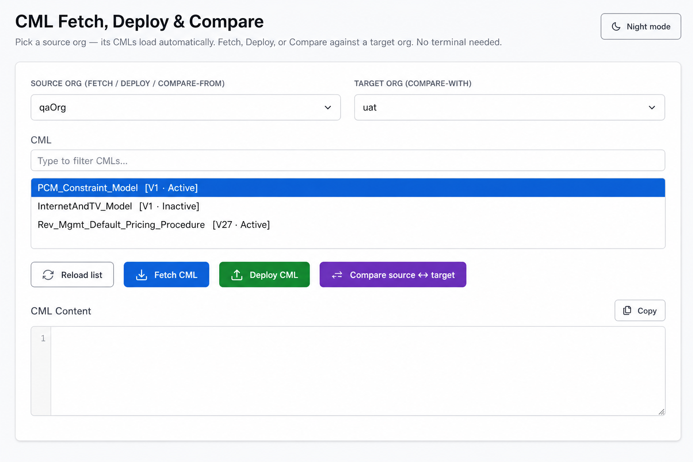
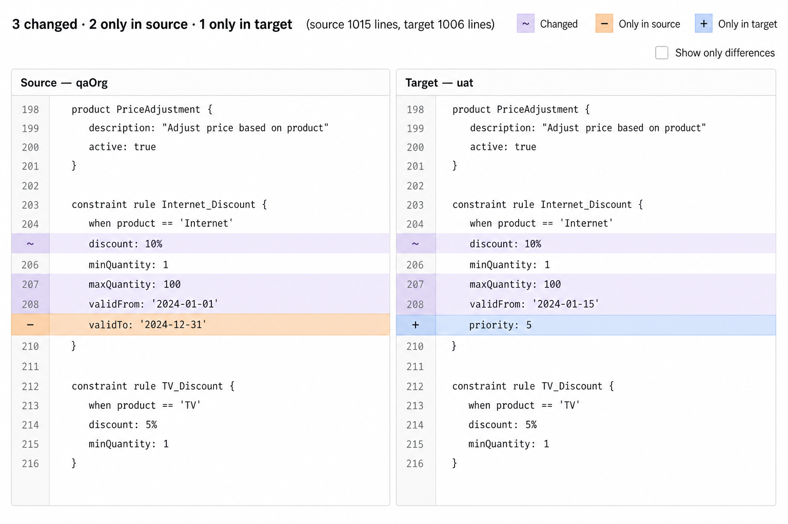
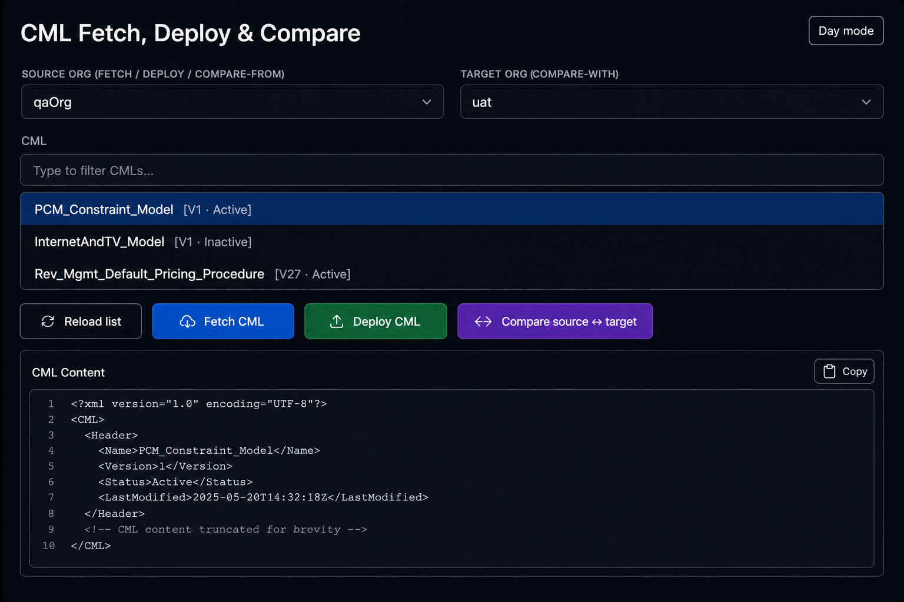
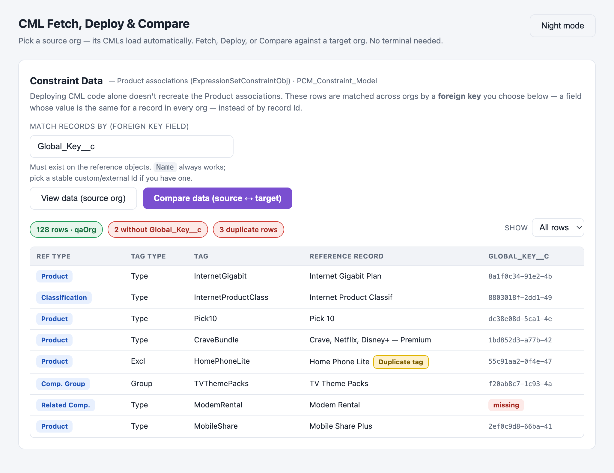
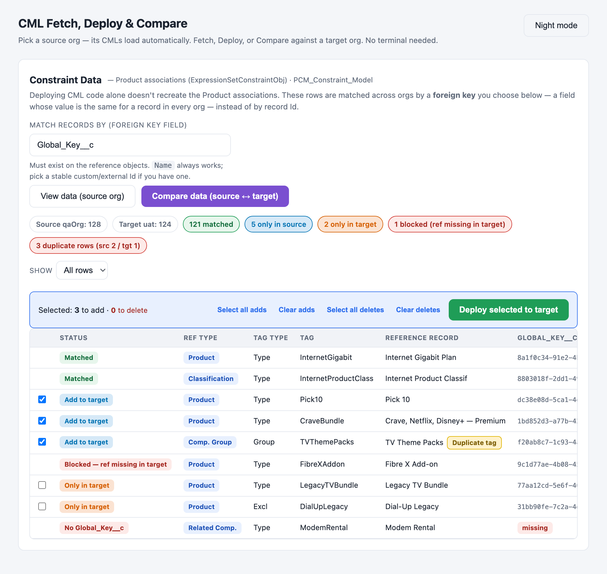
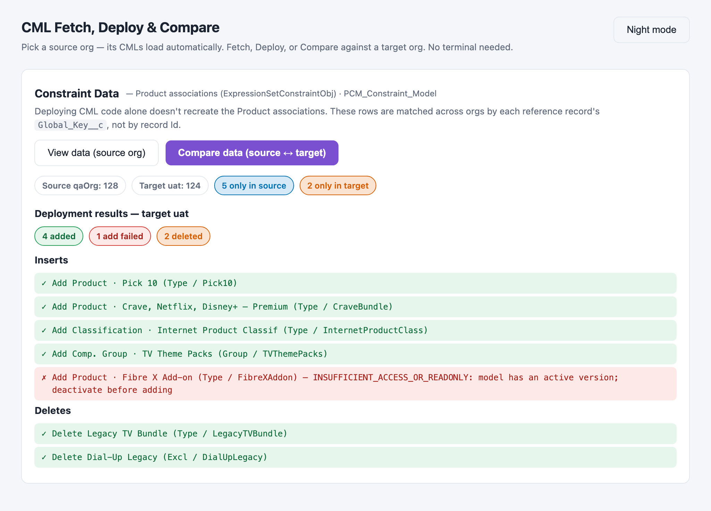

# Salesforce CML Tool

A tiny, **zero-dependency** local web app for working with Salesforce **Revenue
Cloud CML** (Constraint Model Language). Pick an org, choose a Constraint Model,
and **fetch**, **deploy**, or **compare** it — no terminal commands to type, no
installs, and nothing ever leaves your machine.

It does four things:

| Operation | What it does |
|---|---|
| **Fetch** | Download the latest CML of any Expression Set / Constraint Model from an org into an editable text box (and save a copy locally). |
| **Deploy** | Push CML (fetched or pasted) back to the latest version of that model in an org — with a confirmation prompt so nothing happens by accident. |
| **Compare** | Fetch the **same** CML from a **source** and **target** org and show a synced, line-numbered, side-by-side diff that highlights every difference. |
| **Constraint Data** | View, compare, and **deploy** the **Product associations** behind a CML (`ExpressionSetConstraintObj` records), matched across orgs by a **foreign key you choose** (default `Global_Key__c`) instead of by record Id. Pick exactly which rows to add or delete with checkboxes. |

You select everything from dropdowns and lists, so there are **no typos** in org
names or model API names.



---

## Why it's safe

- Runs a local server bound to **`127.0.0.1` only** — not reachable by anyone
  else on your network.
- **No external Python dependencies** — uses only the Python 3 standard library.
- **No telemetry, no cloud** — it talks only to your Salesforce orgs through the
  Salesforce CLI you already use.

---

## Requirements

- **Python 3.8+** (preinstalled on most macOS/Linux machines).
  - macOS: comes preinstalled, or run `xcode-select --install`.
  - Windows: install from [python.org](https://www.python.org/downloads/) and tick
    **"Add Python to PATH"**.
- **Salesforce CLI (`sf`)**, logged in to the orgs you want to use:
  ```bash
  npm install -g @salesforce/cli      # install (one time)
  sf org login web --alias myOrg      # authorize each org
  ```
  The tool reads your authorized orgs automatically via `sf org list`.

---

## Quick start

### macOS (easiest)

1. Clone or download this folder.
2. Double-click **`Open CML Tool.command`**.
3. Your browser opens at `http://127.0.0.1:8787`. Done.

The server runs in the **background**, so you can close the Terminal window and
the tool stays available. To stop it, double-click **`Stop CML Tool.command`**.

> **First launch shows a security warning?** That's normal — see
> [macOS security warning](#macos-security-warning-apple-could-not-verify) below.
> The quickest fix is to **`git clone`** the repo instead of receiving the files
> via AirDrop/Slack/email/zip.

### Windows

Double-click **`run.bat`** (or run it from a terminal). Your browser opens
automatically. Close the window to stop the tool.

### Linux / any terminal

```bash
./run.sh
# or:
python3 cml_tool.py
```

Then open `http://127.0.0.1:8787` if it doesn't open automatically. Press
`Ctrl+C` to stop.

### Change the port

```bash
CML_UI_PORT=8900 python3 cml_tool.py        # macOS / Linux
set CML_UI_PORT=8900 && python cml_tool.py  # Windows
```

---

## How to use

### Fetch
1. Pick a **Source org** — the tool automatically loads every CML in that org
   into the list (with version number and status, e.g. `[V1 · Active]`).
2. Type in the filter box to narrow the list, then click a CML to select it.
3. Click **Fetch CML**. The content appears in the box and is saved to
   `cml-files/<model>.cml`. Use **Copy** to copy it.

### Deploy
1. Make sure the desired CML text is in the box (fetched or pasted) and a CML is
   selected.
2. Choose **where** to deploy with the **Deploy to** dropdown next to the button —
   it lists **every** authorized org and defaults to the source org, so you can
   fetch from one org and deploy to another.
3. Click **Deploy CML**, confirm the prompt (which warns you when the destination
   differs from the source org), and the tool deploys it to the latest version of
   that model in the chosen org.

### Compare (source org ↔ target org)
1. Pick a **Source org** and a **Target org** (must be different).
2. Choose the **CML** to compare.
3. Click **Compare source ↔ target**. The tool fetches the CML from both orgs
   and shows a two-pane diff: **source on the left, target on the right.**



The diff is built to be **colorblind-friendly** — it uses an orange / blue /
purple palette plus text markers (`−`, `+`, `~`) so differences are clear
without relying on color:

| Highlight | Marker | Meaning |
|---|---|---|
| Purple | `~` | Line **changed** between the two orgs |
| Orange | `−` | Line exists **only in source** |
| Blue | `+` | Line exists **only in target** |

- Line numbers are shown for **both** orgs, and the panes scroll together so
  matching lines stay aligned.
- If a line isn't in the same place but exists **elsewhere** in the other org,
  the diff tells you where (e.g. `↦ also in target at L420`).
- Tick **Show only differences** to hide the matching lines.

Toggle **Night / Day mode** any time with the button in the top-right.



### Constraint Data (Product associations)

**Why this exists:** deploying CML code **alone** doesn't recreate the data
behind it. When a model is built, Salesforce creates `ExpressionSetConstraintObj`
records that link the model to **Products, Product Classifications, Component
Groups, and Related Components**. Those links must travel with the CML.

**The hard part:** each link points to its record by **record Id**, and Ids are
**different in every org**. So the tool ignores Ids and matches each row on a
**foreign key** — a field whose value is the **same for a record in every org**.

#### Choose your foreign key

- There's a **"Match records by (foreign key field)"** box. It defaults to
  **`Global_Key__c`**, but you can type **any field API name** your org uses as a
  stable cross-org identifier (e.g. an external Id, `ProductCode`,
  `StockKeepingUnit`, or even `Name`).
- The field only needs to exist on the reference objects you actually use. The
  tool checks each object (**Product2, ProductClassification,
  ProductComponentGroup, ProductRelatedComponent**) and uses the key only where
  it's present — rows on objects that lack it are shown as **unmappable**.
- `Name` always works as a fallback, though custom/external Ids are safer because
  names can be duplicated or edited.

#### Step 1 — View the data

- Pick a **Source org** and a **CML**, set your **foreign key field**, then click
  **View data (source org)**.
- You get a table of every constraint row: reference type, tag type, tag, the
  linked record's name, and your chosen key value (the last column is labelled
  with the field you picked).



#### Step 2 — Compare source ↔ target

- Click **Compare data (source ↔ target)**.
- The tool lines both orgs up by your chosen **foreign key** and labels every row:

| Badge | Meaning |
|---|---|
| **Matched** | The association exists in **both** orgs — nothing to do. |
| **Add to target** | Only in source, and the linked record **already exists** in the target — ready to create. |
| **Only in target** | Exists in the target but **not** in source (an extra). |
| **Blocked — ref missing in target** | Only in source, but the linked record **isn't in the target yet** — add that record first. |
| **No \<key field\>** | The linked record has no value for your key field, so it **can't be matched** across orgs. |

- Use the **Show** filter to focus on matched / to-add / extra / blocked /
  duplicate rows.



#### Spotting duplicates

Every row is checked for data-hygiene problems and tagged with a yellow badge:

| Badge | Meaning |
|---|---|
| **Exact duplicate** | Same tag type + tag + reference + `Global_Key__c` appears more than once — truly redundant. |
| **Duplicate tag** | The same tag type + tag is used by more than one row. |
| **Duplicate reference** | The same record is linked by more than one row. |
| **Ambiguous name** | One reference *name* maps to more than one `Global_Key__c` — a cross-org mapping hazard. |

- Pick **Duplicates only** in the Show filter to review them all at once.

#### Step 3 — Deploy what you picked (add / delete)

In **Compare** mode, each actionable row gets a **checkbox**:

- **Add to target** rows — **checked by default** → they get created in the target.
- **Only in target** rows — **unchecked by default** → tick them to **delete** the
  extras (deletion is permanent, so it's always opt-in).
- **Matched** and **blocked** rows — no checkbox (nothing to do / can't map).

Then:

- Use **Select all adds / Clear adds / Select all deletes / Clear deletes** for
  bulk selection.
- Review the running summary and click **Deploy selected to target**.
- A confirmation dialog spells out exactly how many rows will be **added** and
  **deleted**.



- Each row is processed **individually** (`allOrNone=false`) — one failure never
  blocks the rest.
- The **results panel** lists every insert/delete with a ✓ or ✗ and the **exact
  platform error** when something can't be applied (e.g. a record locked by an
  active version).
- After deploying, the comparison **refreshes automatically** so you see the new
  state.

> **Order matters:** deploy and activate the **CML** in the target **first**,
> then deploy its constraint data. New associations attach to the target's
> existing Expression Set for that model.

---

## Project structure

```
salesforce-cml-tool/
├── cml_tool.py            # Local server + UI (HTML/CSS/JS) — the whole app
├── Open CML Tool.command  # macOS: double-click to start (runs in background)
├── Stop CML Tool.command  # macOS: double-click to stop
├── run.sh                 # macOS / Linux launcher
├── run.bat                # Windows launcher (double-click this on Windows)
├── fetch-cml.sh           # Optional standalone bash helper (not used by the app)
├── deploy-cml.py          # Optional standalone Python helper (not used by the app)
├── README.md
├── LICENSE
├── .gitignore
└── docs/
    └── screenshots/       # Images used in this README
```

> **Cross-platform:** `cml_tool.py` does fetch, deploy, queries, and data sync
> entirely over the Salesforce REST API using your `sf` access token, so it runs
> the same on **macOS, Linux, and Windows**. The `.sh` helper and `.command`
> launchers are macOS/Linux conveniences; on Windows use `run.bat`. (Don't run
> the `.command` files on Windows — they're bash scripts.)

The endpoints (`/api/orgs`, `/api/models`, `/api/fetch`, `/api/deploy`,
`/api/compare`, `/api/data`, `/api/data/compare`, `/api/data/deploy`) are simple
JSON requests, so you can also script against the server if you want.

---

## How it works (in short)

- **Orgs** come from `sf org list`, and the access token for each org from
  `sf org display` — these are the only two `sf` CLI calls the tool makes. On
  Windows the CLI is `sf.cmd`, which the tool launches correctly via `cmd.exe`.
- **Everything else is REST.** SOQL queries, fetch, deploy, and the data sync all
  go straight to the Salesforce REST API with that token (no `sf data query`, no
  `curl`, no bash), which is faster and fully cross-platform.
- **CMLs** are discovered by querying `ExpressionSetDefinitionVersion`, keeping the
  latest version per model.
- **Fetch/Deploy** read and write the `ConstraintModel` field of the latest
  `ExpressionSetDefinitionVersion` via REST (GET the blob; PATCH base64 content).
- **Compare** fetches the CML from both orgs and diffs them in your browser with a
  longest-common-subsequence algorithm.
- **Constraint Data** queries `ExpressionSetConstraintObj` for the selected model
  and resolves each polymorphic `ReferenceObjectId` to its object type + your
  chosen **foreign key field** (default `Global_Key__c`) via a single SOQL
  `TYPEOF` query. The key field is **validated** (plain identifier only, to keep
  SOQL safe) and **probed per object**, so it's included only on the reference
  objects that actually have it. Rows are matched across orgs on
  `tag type + tag + reference type + <key value>`, and source-only rows are
  checked against the target to see whether their linked record already exists
  there.
- **Deploying constraint data** re-resolves each selected row in the target —
  the model's Expression Set, and each reference record by `Global_Key__c` — then
  inserts/deletes via the REST **sObject Collections** API with `allOrNone=false`
  so results are reported per row. Inserts only ever set the four required fields
  (`ExpressionSetId`, `ReferenceObjectId`, `ConstraintModelTag`,
  `ConstraintModelTagType`).

---

## Troubleshooting

### Windows: orgs don't load / `[WinError 2] The system cannot find the file specified`

This was a bug in older versions where the tool called the CLI as a bare `sf`;
on Windows the CLI is `sf.cmd`, which can't be launched that way. The current
version handles this automatically. If you still see it:

1. Make sure you started the tool with **`run.bat`** (or `python cml_tool.py`),
   **not** by running a `.command` file — those are macOS bash scripts and won't
   work on Windows.
2. Confirm the CLI is on your PATH: open a new Command Prompt and run `sf --version`.
   If that fails, reinstall the Salesforce CLI and reopen your terminal.
3. Visit `http://127.0.0.1:8787/api/debug` to see whether `sf` was found and what
   `sf org list` returned.

### Orgs are not showing in the dropdown

This is the most common issue for new users. The dropdown stays empty (or shows
an error) for one of two reasons:

**Reason 1: `sf` was installed with nvm / fnm / Volta (most likely)**

Node version managers like `nvm`, `fnm`, and `Volta` install `sf` into a
versioned path that is only added to your `PATH` inside an interactive shell
(via `.zshrc` / `.bashrc`). When macOS launches the tool via Finder or
double-click, it starts a *login* shell that does **not** source `.zshrc`, so
`sf` is invisible.

**Self-diagnosis — open the tool, then open a new browser tab and visit:**
```
http://127.0.0.1:8787/api/debug
```
This returns a JSON object showing exactly which paths were searched, whether
`sf` was found, and how many orgs `sf org list` returned. Share this output if
you need help.

**Fix (pick one):**

- **Option A (recommended):** Tell the tool exactly where `sf` is. Find it first:
  ```bash
  which sf
  ```
  Then start the tool with that path explicitly:
  ```bash
  SF_PATH=/path/from/which/sf python3 cml_tool.py
  ```
  (Or add that directory to `/etc/paths` so it persists across all apps.)

- **Option B:** Create a symlink in a standard location so macOS can always find it:
  ```bash
  sudo ln -s "$(which sf)" /usr/local/bin/sf
  ```

- **Option C:** Install `sf` outside of nvm so it has a fixed path:
  ```bash
  npm install -g @salesforce/cli   # after setting npm prefix to a fixed dir
  # or install via Homebrew:
  brew install @salesforce/cli
  ```

**Reason 2: `sf` is installed but no orgs are authorized for *this* user**

Salesforce CLI logins are stored **per operating-system user** (under
`~/.sfdx/` on macOS/Linux, `%USERPROFILE%\.sfdx\` on Windows). So if a
*different person / system owner* opens the tool on their own account, they will
see **no orgs** even though it works for you — they simply haven't logged in yet.

Each user must authorize their own orgs, in their own login session:
```bash
sf org list                          # confirm what THIS user can see
sf org login web --alias myOrg       # repeat for each org
```
Then click **Reload list** — the dropdown fills automatically.

To see exactly what the tool detects (sf path, OS user, and how many saved
logins exist), open `http://127.0.0.1:8787/api/debug` while the tool is running.
If `authorized_org_files` is `0`, that user just needs to log in as above.

### "The Salesforce CLI ('sf') was not found"
Install it and authorize at least one org:
```bash
npm install -g @salesforce/cli
sf org login web --alias myOrg
```

### A fetched CML is empty
The selected version has no Constraint Model — usually because that version is
**Inactive** or was never populated in that org. Pick an org where the model has
an **Active** version. The tool tells you when this happens.

### macOS security warning: *"Apple could not verify…"*

When you double-click `Open CML Tool.command` you may see:

> *"Apple could not verify 'Open CML Tool.command' is free of malware…"*

**Why:** macOS adds a hidden *quarantine* flag to files that arrive from "the
outside" — downloads, AirDrop, Slack/Teams, email, or an unzipped archive.
Gatekeeper then blocks unsigned scripts. The person who *created* the files
locally never sees this. It's not a sign the tool is unsafe — the source is
plain, readable Python you can inspect.

**Fix — pick whichever is easiest:**

1. **Best: clone instead of copying.** Files obtained with `git clone` are **not**
   quarantined, so there's no warning at all:
   ```bash
   git clone https://github.com/mrityu96/SalesforcesTool.git
   cd SalesforcesTool/salesforce-cml-tool
   open "Open CML Tool.command"
   ```

2. **Allow it in System Settings** (recent macOS, incl. Sequoia): double-click
   once (it gets blocked) → **System Settings → Privacy & Security** → scroll to
   the blocked-file message → **"Open Anyway"** → confirm. One-time per machine.

3. **Right-click → Open** (macOS 14 and earlier): right-click (or Control-click)
   the file → **Open** → **Open**.

4. **Remove the quarantine flag from Terminal:**
   ```bash
   xattr -dr com.apple.quarantine "/path/to/salesforce-cml-tool"
   ```

> None of this requires admin rights. If you'd rather skip the `.command`
> launcher, just run `python3 cml_tool.py` in Terminal — that never triggers
> Gatekeeper.

### "Port 8787 is in use"
Another copy is running, or something else holds the port. Stop it with
`Stop CML Tool.command`, or start on a different port:
`CML_UI_PORT=8900 python3 cml_tool.py`.

### I changed the code but don't see the update
The launcher detects a code change and restarts automatically. If you started it
manually, stop it (`Stop CML Tool.command` or `Ctrl+C`) and run it again, then
reload the browser tab.

---

## Contributing

Issues and pull requests are welcome. It's plain Python + vanilla JS with no
build step: edit `cml_tool.py` and relaunch.

## License

[MIT](./LICENSE) — free to use, modify, and share.

---

> **Disclaimer:** This is a community tool, not an official Salesforce product. It
> is provided **as-is, without warranty of any kind**. You are responsible for
> reviewing every change before you deploy — especially deletes — and for testing
> in a sandbox first. The authors accept no liability for any data loss or other
> impact to your orgs.
