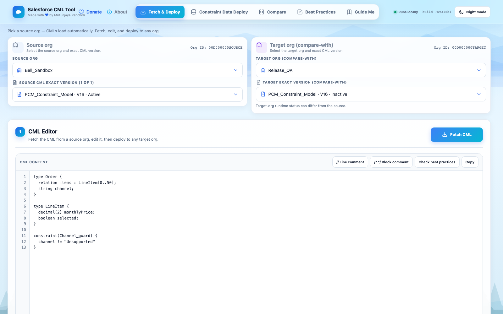
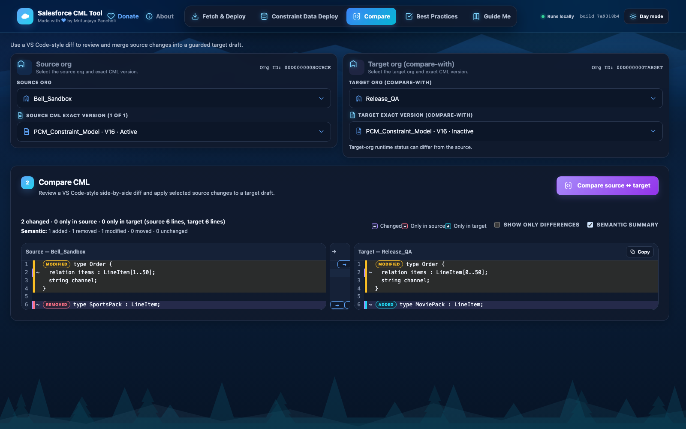
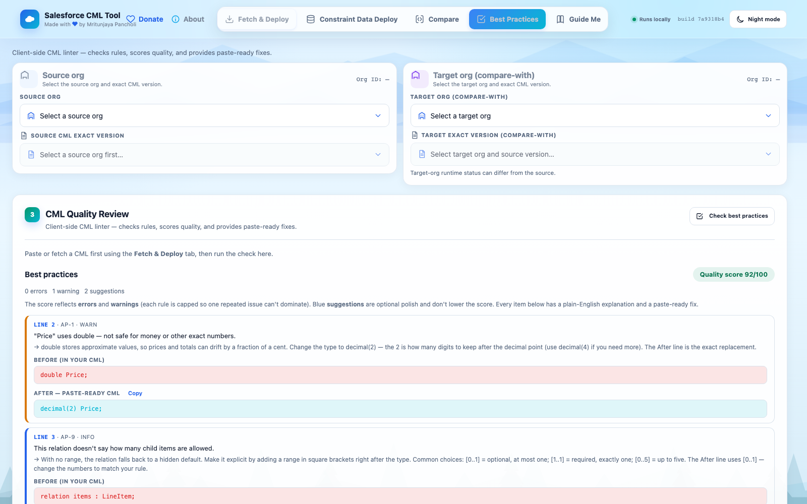
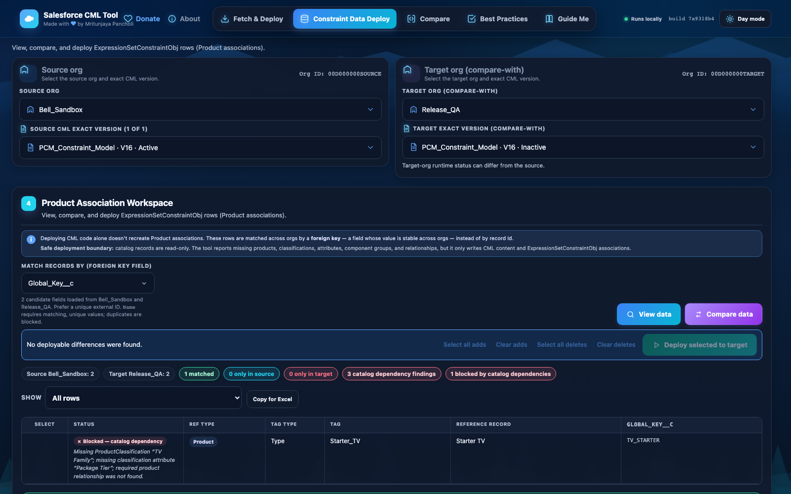
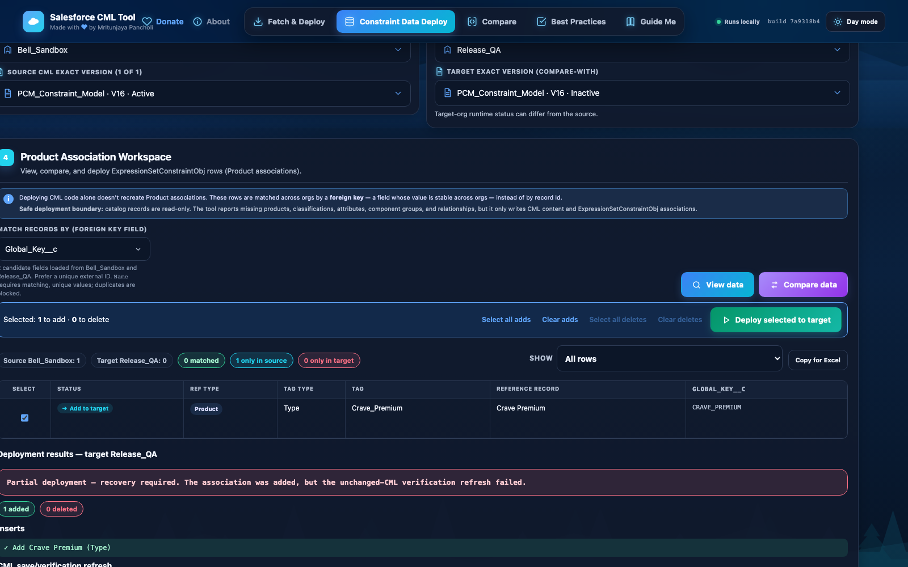
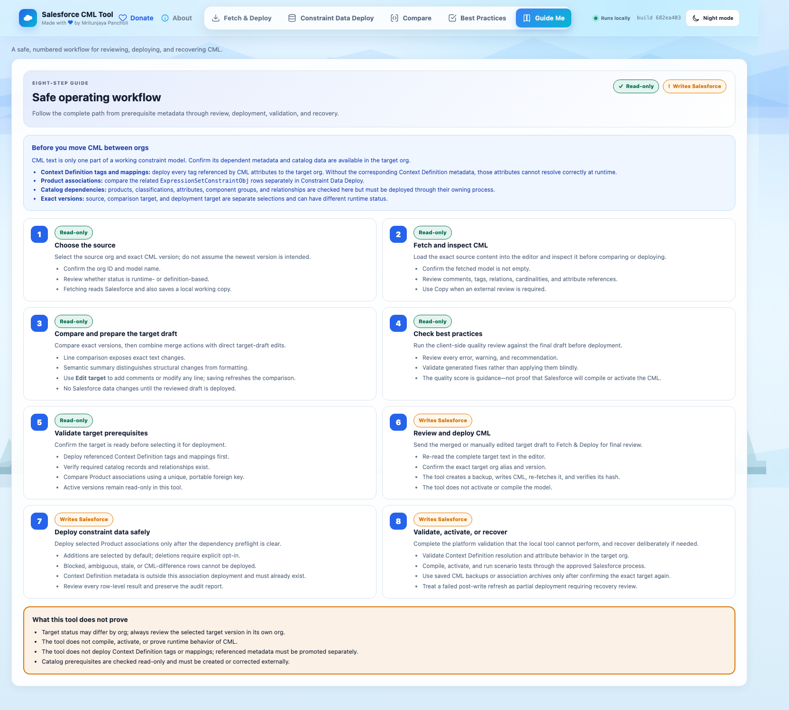

# Salesforce CML Tool

Current stable version: **1.0.0**. See the [changelog](CHANGELOG.md),
[compatibility policy](COMPATIBILITY.md), [security policy](SECURITY.md), and
[contribution guide](CONTRIBUTING.md).

A tiny, **no-install runtime** web app for working with Salesforce **Revenue
Cloud CML** (Constraint Model Language). Python uses only the standard library;
the packaged editor uses an offline, reproducibly generated CodeMirror bundle.
Pick an org, choose a Constraint Model, and **fetch**, **deploy**, **compare**,
or inspect it—no terminal commands to type and no package install. The app runs
on your machine; Salesforce
operations go only to orgs already authorized through your local Salesforce CLI.

It has four views and does six main jobs:

| Operation | What it does |
|---|---|
| **Fetch** | List every available CML version, then download the exact selected version into an editable text box (and save a copy locally). |
| **Deploy** | Push CML (fetched or pasted) to an exact, explicitly selected target version — with ownership checks and a confirmation prompt so nothing happens by accident. The small read-only status panel checks only that exact target's Active/Inactive/write-blocked state; Active versions are blocked and status is rechecked server-side during deployment. |
| **Compare** | Select exact source and target versions, fetch both, and show a synced, line-numbered, side-by-side diff. Large results use virtualized window rendering. Semantic mode overlays entity-level `Moved`, `Added`, `Removed`, `Modified`, and `Ambiguous` findings without replacing either pane. Apply source changes with merge arrows or edit any line in the target working draft—including comments—before guarded review and deployment. |
| **Check best practices** | Scan the CML in the editor against a built-in catalog of CML anti-patterns and recommended patterns, and get a **line-numbered report** with a quality score and a suggested fix for each finding. |
| **Constraint Data Deploy** | View, compare, and **deploy** the **Product associations** behind a CML (`ExpressionSetConstraintObj` records), matched across orgs by a **foreign key you choose** instead of by record Id. Candidate fields are discovered from the selected orgs; pick exactly which rows to add or delete with checkboxes. |
| **Guide Me on Tool** | Follow a static eight-step workflow that distinguishes read-only actions from Salesforce writes and explains deployment/recovery boundaries. Opening it makes no API request. |

You select everything from dropdowns and lists, so there are **no typos** in org
names or model API names. The connection strip also displays the Salesforce
Org ID for the selected source and compare-target aliases.

The full-width interface uses a blurred-glass header with one floating top
navigation island, compact source/target workspaces, a sky-blue atmospheric
gradient with layered mountain silhouettes, luminous dark-mode icons, and
semantic status styling. The retired left sidebar is no longer part of the
application.

## Guided UI walkthrough

The screenshots below are captures of the **current application interface**
using synthetic org, model, product, and key values. No customer or production
data is shown. Light and night views are both included to demonstrate the
current visual theme.

### 1. Fetch, edit, and deploy CML



1. Choose the source org and exact source CML version. After selection, the
   model picker collapses so another version cannot be selected accidentally.
   Runtime-active CML versions are listed first. Labels explicitly identify
   source, compare-target, and deployment-target status because the same model
   can have different runtime activity in different orgs.
2. Click **Fetch CML** beside the Step 1 **CML Editor** heading, then review or
   edit the exact fetched text.
3. Choose the deployment org and exact target version, click **Deploy CML**,
   approve the warning, and type the target alias exactly. The tool verifies
   that the version ID belongs to that model, backs up and verifies the
   deployment, and never activates or compiles the model.

### 2. Compare exact text or compare by meaning



1. The source is shown on the left and the target on the right.
2. Turn on **Semantic** to ignore formatting, comments, and moved blocks. Leave
   it off when exact line order matters.
3. Changed-member explanations identify the actual impact, such as a relation
   changing from required `[1..1]` to optional `[0..1]`.

### 3. Understand and correct best-practice findings



1. The quality score is maintainability guidance, not an activation result.
2. Each finding explains the problem in plain language and points to its line.
3. **Before → After** examples contain supported CML. Review the meaning, then
   use **Copy** to paste the correction into the editor.

### 4. Diagnose missing catalog dependencies safely



1. A matched `ExpressionSetConstraintObj` can still be blocked when its
   classification, products, attributes, component group, or relationship is
   incomplete.
2. The expanded message lists every missing, ambiguous, or unlinked dependency.
   **Copy for Excel** includes these full explanations for another team.
3. **Blocked — catalog dependency** means the catalog data must be corrected by
   its normal deployment process. The CML Tool only reads catalog objects.

### 5. Select and deploy valid CML associations



1. Review the add/delete count before confirming. The server repeats dependency
   preflight immediately before writing.
2. Safe additions are selected by default. Deletions are permanent and always
   require explicit selection.
3. Results show each success or the exact Salesforce error. After an association
   change, the tool performs its own unchanged-CML save/verification refresh.
   This is not documented proof of Salesforce activation, compilation, or
   runtime behavior. If the refresh fails after DML succeeded, the result is
   **Partial deployment — recovery required** because records have already
   changed.

### 6. Guide Me on Tool (the fourth view)

Open **Guide Me on Tool** for an eight-step, static walkthrough covering exact
source selection, fetch, comparison and semantic overlays, best-practice checks,
exact deployment targeting, confirmed CML deployment, dependency-preflighted
association deployment, and recovery. The guide makes read-only and Salesforce
write actions visually distinct and opening it sends no API request.



## Why it's safe

- Runs a local server bound to **`127.0.0.1` only** — not reachable by anyone
  else on your network.
- **No external Python dependencies** — uses only the Python 3 standard library.
- **No telemetry, no cloud** — it talks only to your Salesforce orgs through the
  Salesforce CLI you already use.
- Unsaved CML resilience uses `sessionStorage`, scoped to the exact source org,
  model, and version. Recovery is explicit, data stays only in the current
  browser tab/session, and successful deployment or a fresh fetch clears it.
- Every deploy, rollback, association deploy, and association restore uses the
  same accessible in-app typed-confirmation dialog. The action remains disabled
  until the target alias matches exactly; Escape cancels and focus returns.

## Keyboard and accessibility

- Both the primary and compare target-draft editors use the locally bundled
  CodeMirror experience with line numbers, search, and keyboard editing.
- Best-practice findings are also rendered directly on the affected editor
  lines with severity, rule name, and an accessible diagnostic tooltip.
- Press **Cmd/Ctrl+S** to save target-draft edits, or to preserve and prepare a
  modified primary draft for deployment review. Press **Cmd/Ctrl+/** for line
  comments. The header **Shortcuts** button lists the complete set.
- Status changes use live regions and busy state, keyboard focus is visible,
  dialogs trap focus, reduced-motion preferences are honored, and narrow/200%
  zoom layouts reflow rather than requiring a desktop-width canvas.
- CI runs the complete Chromium workflow suite plus focused Firefox and WebKit
  checks for offline security and 200% zoom behavior.

---

## Requirements

- **Python 3.9–3.13** (the supported range verified at both CI endpoints).
  - macOS: comes preinstalled, or run `xcode-select --install`.
  - Windows: install from [python.org](https://www.python.org/downloads/) and tick
    **"Add Python to PATH"**.
- **Salesforce CLI (`sf`)**, logged in to the orgs you want to use:
  ```bash
  npm install -g @salesforce/cli      # install (one time)
  sf org login web --alias myOrg      # authorize each org
  ```
  The tool reads your authorized orgs automatically via `sf org list`.
- **Salesforce REST API v66.0 (Spring '26).** The tool sends REST requests
  through v66.0. `ExpressionSetConstraintObj` was introduced in v63.0 and is
  unavailable through v62.0. Its `ReferenceObjectId` is supported here only for
  the platform's allowed polymorphic targets: `Product2`,
  `ProductClassification`, and `ProductRelatedComponent`.

---

## Quick start

### macOS (easiest)

1. Clone or download this folder.
2. Open **`Start Here - CML Tool/`** and double-click
   **`Open CML Tool for macOS.command`**.
3. Your browser opens at `http://127.0.0.1:8787`. Done.

The server runs in the **background**, so you can close the Terminal window and
the tool stays available. To stop it, double-click
**`Start Here - CML Tool/Stop CML Tool for macOS.command`**.

> **First launch shows a security warning?** That's normal — see
> [macOS security warning](#macos-security-warning-apple-could-not-verify) below.
> The quickest fix is to **`git clone`** the repo instead of receiving the files
> via AirDrop/Slack/email/zip.

### Windows

Open **`Start Here - CML Tool/`** and double-click
**`Open CML Tool for Windows.bat`** (or run it from a terminal). Your browser
opens automatically. Close the launcher window to stop the tool.

### Linux / any terminal

```bash
./Start\ Here\ -\ CML\ Tool/Open\ CML\ Tool\ for\ Linux.sh
# or:
python3 main/app/cml_tool.py
```

Then open `http://127.0.0.1:8787` if it doesn't open automatically. Press
`Ctrl+C` to stop.

### Change the port

```bash
CML_UI_PORT=8900 python3 main/app/cml_tool.py           # macOS / Linux
set CML_UI_PORT=8900 && python main\app\cml_tool.py     # Windows
```

---

## How to use

### Fetch
1. Pick a **Source org** — the tool automatically loads every CML in that org
   into the list, with **every version** shown separately (for example,
   `[V1 · Runtime: Active]` and `[V2 · Runtime: Inactive]`). If runtime activity
   cannot be queried, the label explicitly falls back to definition status.
2. Type in the filter box to narrow the list, then select the exact version.
3. Click **Fetch CML**. The content appears in the box and is saved to
   `development/runtime/cml-files/<model>.cml` by default. Use **Copy** to copy
   it.

### Deploy
1. Make sure the desired CML text is in the box (fetched or pasted) and a CML is
   selected.
2. Choose **where** to deploy with the **Deploy to** dropdown next to the button —
   it lists **every** authorized org but starts at **None**, so the target must
   be selected explicitly.
3. Select the exact target version. Source and target versions are mandatory;
   the server verifies each submitted version ID belongs to the named model.
4. Click **Deploy CML**, review the warning, and type the target org alias exactly.
   Before writing, the tool saves the target CML under
   `development/runtime/cml-backups/` by default. After Salesforce accepts the
   deployment, the tool fetches the exact version again and verifies its SHA-256
   hash. If verification fails, it automatically attempts to restore and verify
   the previous CML.
5. Use **Restore backup** to restore and verify the newest backup for that exact
   org, model, and version. Rollback first creates another safety backup, so it
   can itself be undone.

The tool blocks CML writes to an **Active** definition version. Association
insert/delete/restore also blocks when the parent `ExpressionSet` is Active, and
the post-DML save/verification step requires a non-Active exact definition
version. Deactivate the relevant Salesforce record, then refresh the tool's
version selection; a stale browser selection is not accepted.

### Compare (source org ↔ target org)
1. Pick a **Source org** and a **Target org** (must be different).
2. Choose the exact **source version** and exact **target version** to compare.
3. Click **Compare source ↔ target**. The tool fetches the CML from both orgs
   and shows a two-pane diff: **source on the left, target on the right.**

See the current [semantic comparison screenshot](main/docs/screenshots/02-semantic-compare-latest.png).

The diff is built to be **colorblind-friendly** — it uses an orange / blue /
purple palette plus text markers (`−`, `+`, `~`) so differences are clear
without relying on color:

| Highlight | Marker | Meaning |
|---|---|---|
| Purple | `~` | Line **changed** between the two orgs |
| Orange | `−` | Line exists **only in source** |
| Blue | `+` | Line exists **only in target** |

- Line numbers are shown for **both** orgs, and the panes scroll together so
  matching lines stay aligned.
- Use the arrows between the panes to apply a source hunk to the target working
  draft. Salesforce is not changed until you review the draft in the editor and
  complete the normal guarded deployment.
- Use **Edit target** to change any target-draft line or add comments directly.
  **Save edits** reruns the line comparison and local semantic analysis against
  the edited draft. **Cancel** discards unsaved typing, and **Reset target
  draft** restores the exact target content originally fetched from Salesforce.
- After merged or manual changes are saved, **Review & Deploy target draft**
  loads the complete draft into the Fetch & Deploy editor and preselects the
  comparison target. Review the full text there before using the normal guarded
  deployment action.
- The target-pane **Copy** button copies the complete target CML or current
  target draft.
- Tick **Show only differences** to hide matching raw lines.

#### Semantic diff (compare by meaning, not by line)

A plain line diff flags everything that *looks* different — even when a type was
just moved or reformatted. Tick **Semantic summary** to add structural
classification directly to the existing panes:

- The Python tokenizer and tolerant AST parser in `main/app/cml_analysis.py` identify properties,
  externs, definitions, types, scoped variables, relations, cardinalities, and
  logic declarations.
- Entities are indexed by stable scoped identity instead of line number.
- `Moved`, `Added`, `Removed`, `Modified`, and `Ambiguous` badges are overlaid on
  the corresponding source and target line ranges.
- While Semantic summary is enabled, merge arrows operate on complete parsed
  entities rather than raw line fragments. Modified entities are replaced as a
  whole, source-only entities are inserted, target-only entities are removed,
  and moved entities are repositioned in the target draft.
- Duplicate/ambiguous identities never receive a merge arrow. Resolve the
  ambiguity in CML before applying that entity.
- Formatting and comments do not create semantic property changes.
- Raw statistics remain visible and semantic statistics are added underneath.

Semantic analysis is tolerant rather than a Salesforce compiler. Parser warnings
and ambiguous duplicate identities are reported instead of being guessed.

Toggle **Night / Day mode** any time with the button in the top-right.

### Optional project support

The compact header keeps **Donate** and **About** beside the Salesforce/CML
branding. Clicking Donate reveals hidden **UPI** and **Razorpay** options. UPI displays a packaged payment QR,
provides a generic UPI link, and allows desktop users to copy the UPI ID.
Razorpay opens the verified hosted payment page in a separate browser tab.
Payment is voluntary and does not purchase support, features, priority service,
or warranty. The tool does not publish bank account or IFSC details.

### Check best practices (CML linter)

See the current [Best Practices screenshot](main/docs/screenshots/03-best-practices-latest.png).

Click **Check best practices** (above the editor) to scan the CML currently in
the box — fetched or pasted — against a built-in catalog of CML anti-patterns
and recommended patterns. You get a **quality score** and a list of findings,
each with a **line number** (click it to jump there), a plain-English
explanation, and — most usefully — a **Before → After** correction written in
**valid CML you can paste straight back into the model**. Hit **Copy** on the
*After* block to grab the fix.

Best-practice checking lives only in **Fetch & Deploy**. Click **Hide best
practices** to remove the inline report and clear its editor diagnostics.
Running **Check best practices** again shows a fresh report.

For example, an implication constraint is rewritten into the recommended guard +
auto-add pattern:

```
// Before (in your CML)
constraint(Pricing_guard) { Service_Tier == "Ultimate" -> Billing_Cycle == "Annual" }

// After — paste-ready CML
constraint(Pricing_guard) {
  Service_Tier == "Ultimate" -> Billing_Cycle == "Annual"
}
require(Pricing_auto) {
  // When Service_Tier == "Ultimate" is selected, auto-add Billing_Cycle == "Annual"
}
```

Other fixes are generated from **your own code** — `double price;` becomes
`decimal(2) price;`, an unbounded `relation x : T[..];` becomes
`relation x : T[0..50];`, and a repeated value set is turned into a shared
`define[]` domain you can reference everywhere.

What it checks:

| ID | Flags | Suggests |
|---|---|---|
| **AP-1** | `double` used for money / precise values | use `decimal(2)` |
| **AP-3** | many empty stub types (`type X;`) | consolidate / remove unused stubs |
| **AP-4** | the same enum value-set repeated across attributes | extract a shared `define[]` domain |
| **AP-5** | inheritance chains more than 4 levels deep | flatten the hierarchy |
| **AP-6** | always-true constraints (`constraint(true, …)`) | remove the no-op or fix it |
| **AP-8** | constraints combining 6+ boolean operators | break into smaller constraints |
| **AP-9** | unbounded (`[..]`) or no-cardinality relations | add explicit `[min..max]` |
| **BP-2** | vague identifiers (`x`, `temp`, `var`, …) | use descriptive names |
| **REC** | hard `->` implications | split into a guard + `require()` auto-add |

The **quality score** starts at 100 and subtracts points for **errors** and
**warnings** only. Two things keep it meaningful on large models:

- Each rule's impact is **capped**, so one repetitive issue (say, 40 relations
  missing an explicit cardinality) can't drag the score to zero on its own.
- Blue **suggestions** — including the `->` implication tip — are optional polish
  and **don't lower the score**.

Every finding includes a plain-English explanation of what's wrong and what to
do, plus the Before → After fix. Everything runs **in your browser** — no CML
leaves the page.

### Guide Me on Tool

The fourth tab is a responsive local guide, not an analyzer. It presents the safe
workflow in numbered order and calls out these boundaries: statuses are
org-specific; this tool does not compile, activate, or prove runtime behavior;
catalog prerequisites are detected read-only and fixed outside this tool; and
every Context Definition tag or mapping referenced by CML attributes must be
deployed separately to the target org. The tool does not deploy Context
Definition metadata.

The tokenizer and tolerant parser remain internal building blocks for semantic
comparison. Semantic overlays compare parsed declarations, types, variables,
relations, and logic structurally without claiming Salesforce runtime validity.

### Constraint Data Deploy (Product associations)

**Why this exists:** deploying CML code **alone** doesn't recreate the data
behind it. `ExpressionSetConstraintObj` records link an `ExpressionSet` to
**Products, Product Classifications, or Related Components**. These associations
are shared at the parent `ExpressionSet` level; they are not owned by one CML
version. The selected `ExpressionSetDefinitionVersion` is mapped to its exact
parent through
`ExpressionSetVersion.ExpressionSetDefinitionVerId → ExpressionSetId`.

**The hard part:** each link points to its record by **record Id**, and Ids are
**different in every org**. So the tool ignores Ids and matches each row on a
**foreign key** — a field whose value is the **same for a record in every org**.

> **Safe deployment boundary:** Product and catalog objects are read-only in
> this tool. It can inspect and report missing products, classifications,
> classification attributes, component groups, and product relationships, but
> it never creates or updates them. The only Salesforce writes are the CML
> content and `ExpressionSetConstraintObj` associations.

> **Context Definition prerequisite:** CML attributes can depend on Context
> Definition tags and mappings. Promote every referenced Context Definition
> tag to the target org through its approved metadata deployment process before
> expecting those attributes to resolve at runtime. Constraint Data Deploy does
> not create or update Context Definition metadata.

#### Choose your foreign key

- The **"Match records by (foreign key field)"** searchable dropdown is
  initially empty. Its suggestions are loaded from live Salesforce object descriptions for the
  selected source and target orgs. A field such as `Global_Key__c` is shown only
  when it actually exists on the same supported reference-object type in every
  selected org. You can still type another valid field API name manually.
- `Name` is supported. Its value must be populated and correspond across both
  orgs; duplicate target matches are blocked as ambiguous. Prefer a stable,
  unique external ID when one is available.
- The field only needs to exist on the reference objects you actually use. The
  tool checks each ESCO target (**Product2, ProductClassification,
  ProductRelatedComponent**) and uses the key only where
  it's present — rows on objects that lack it are shown as **unmappable**.
- `Name` is not guaranteed to exist, be queryable, populated, stable, or unique.
  Prefer an approved external/stable key.

#### Step 1 — View the data

- Pick a **Source org** and a **CML**, set your **foreign key field**, then click
  **View data**.
- You get a table of every constraint row: reference type, tag type, tag, the
  linked record's name, and your chosen key value (the last column is labelled
  with the field you picked).

See the current [constraint dependency preflight screenshot](main/docs/screenshots/04-constraint-preflight-latest.png).

#### Step 2 — Compare source ↔ target

- Click **Compare data**.
- The tool lines both orgs up by your chosen **foreign key** and labels every row:
- While retrieval is running, **Stop Comparison** sends a protected cancellation
  request to the server and also releases the browser immediately. The server
  checks cancellation between comparison stages and paginated Salesforce reads;
  no association data is written by comparison.

| Badge | Meaning |
|---|---|
| **Matched** | The association and its checked catalog dependencies exist in **both** orgs — nothing to do. |
| **Add to target** | Only in source, and the linked record **already exists** in the target — ready to create. |
| **Only in target** | Exists in the target but **not** in source (an extra). |
| **CML definitions differ** | The association is valid for one org's exact selected CML version, but the other selected version does not define that Type or Port. Compare the exact CML versions before changing data. |
| **Unused association in this org** | The association exists at the parent Expression Set, but that org's exact selected CML version does not define its Type or Port tag. Another version can still share the association; the tool does not change it automatically. |
| **Needs review — dependency key missing** | A related source Product or classification attribute has no value in the selected foreign-key field, so the tool cannot prove whether its target counterpart exists. This is an incomplete comparison, not proof that data is missing. |
| **Blocked — ambiguous key** | The selected portable key matches more than one target record. Comparison blocks the row before selection and deployment repeats the check immediately before DML. Make the key unique in the target, then compare again. |
| **Blocked — catalog dependency** | A required catalog record, relationship, product-to-classification assignment, or classification attribute is missing or ambiguous. Deploy that catalog data through its normal process, then compare again. |
| **\<key field\> is blank** | The linked record has no value for your key field, so it **can't be matched** across orgs. |

- Use the **Show** filter to focus on matched / to-add / extra / blocked /
  duplicate rows.
- Matched rows retain paired source/target constraint, Expression Set, and
  reference IDs in the comparison response. This provides auditable evidence
  that equal portable identities matched even when Salesforce IDs differ.

The preflight screenshot above demonstrates matched associations that
are still blocked by deeper catalog dependencies.

#### Spotting duplicates

Every row is checked for data-hygiene problems and tagged with a yellow badge:

| Badge | Meaning |
|---|---|
| **Exact duplicate** | Same tag type + tag + reference + selected key value appears more than once — truly redundant. |
| **Duplicate tag** | The same tag type + tag is used by more than one association for a tag that exists in the exact CML selected by the user. The check stays inside that version's resolved parent Expression Set. |
| **Duplicate reference** | The same record is linked by more than one row. |
| **Ambiguous name** | One reference *name* maps to more than one selected key value — a cross-org mapping hazard. |

- Pick **Duplicates only** in the Show filter to review them all at once.
- Duplicate checks are performed independently for the exact selected source
  CML and exact selected target CML. Only associations whose Type/Port tags are
  present in that selected CML participate. The rows are then restricted to the
  selected version's resolved parent Expression Set; unrelated models, parents,
  and tags used only by another CML version are excluded.
- Reference record names are live display values from each org, not matching
  keys. If Salesforce changes an auto-number format (for example `PRC-...` to
  `ECO-...`), matched rows show both org values when they differ. Matching
  continues to use the portable key or canonical PRC identity.
- Exact duplicates are preserved as separate rows during comparison. A surplus
  source duplicate is shown as **Skipped — exact duplicate**, has no add
  checkbox, and is rejected server-side if a forged request submits it.
- Surplus target duplicates remain visible and can be selected deliberately for
  cleanup.

#### Step 3 — Deploy what you picked (add / delete)

In **Compare** mode, each actionable row gets a **checkbox**:

- **Add to target** rows — **checked by default** → they get created in the target.
- **Only in target** rows — **unchecked by default** → tick them to **delete** the
  extras (deletion is permanent, so it's always opt-in).
- **Matched**, **CML definitions differ**, **ambiguous key**, **unused**, and
  **blocked** rows — no checkbox. The tool does not treat a CML-code difference
  or non-unique portable key as deployable data.

Then:

- Use **Select all adds / Clear adds / Select all deletes / Clear deletes** for
  bulk selection.
- Review the running summary and click **Deploy selected to target**.
- A confirmation dialog spells out exactly how many rows will be **added** and
  **deleted**, and the production safety prompt requires the exact target alias.

See the current [association deployment results screenshot](main/docs/screenshots/05-association-deploy-results-latest.png).

- Each row is processed **individually** (`allOrNone=false`) — one failure never
  blocks the rest. Mixed results are clearly labelled **Partial deployment**.
- The **results panel** lists every insert/delete with a ✓ or ✗ and the **exact
  platform error** when something can't be applied (e.g. a record locked by an
  active version).
- Before any write, the target CML is backed up. Before deletion, the complete
  target association rows are saved under
  `development/runtime/association-archives/` by default; use
  **Restore deleted associations** in the result panel to recover absent rows.
  Restore resolves the current Expression Set and each current reference record
  by portable key (or canonical PRC identity); archived Salesforce IDs are never
  reused blindly.
- Every requested deletion is checked again server-side and must still belong to
  the selected target model and the current target-only comparison. Ownership is
  queried once more immediately before destructive DML.
- A JSON audit report is saved under
  `development/runtime/deployment-reports/` by default. Results stay visible so
  recovery actions remain available; click **Compare data** when ready to
  refresh the table.
- The server repeats the read-only dependency preflight immediately before
  deployment and again for each batch of at most 200 rows. If catalog data
  changes during a large deployment, only affected rows/chunks are blocked.
  Ambiguous matches include the conflicting Salesforce record IDs.
- Every data-deploy call—including confirmation rejection, invalid input,
  preflight failure and partial success—appends exactly one entry to
  `development/runtime/logs/data-deploy-history.jsonl` by default.

> **Lifecycle matters:** writes to Active versions and Active Expression Sets
> are blocked. Select exact versions, deactivate the required Salesforce
> records, refresh the selection, perform the approved writes, and then complete
> activation manually. Deploy does not auto-activate or compile anything.

---

## Project structure

```
salesforce-cml-tool/
├── README.md                  # Root onboarding and UI walkthrough
├── .gitignore                 # Excludes generated/private data, not test source
├── Start Here - CML Tool/
│   ├── Open CML Tool for macOS.command  # macOS: start in background
│   ├── Stop CML Tool for macOS.command  # macOS: stop background server
│   ├── Open CML Tool for Windows.bat    # Windows: foreground launcher
│   └── Open CML Tool for Linux.sh       # Linux: foreground launcher
├── main/                      # Production application and packaged assets
│   ├── app/
│   │   ├── cml_tool.py        # Composition root and compatibility surface
│   │   ├── cml_lifecycle.py   # Exact-version CML lifecycle
│   │   ├── cml_constraints.py # ESCO workflows
│   │   ├── cml_salesforce.py  # Authentication and REST transport
│   │   ├── cml_http.py        # Local HTTP security and routing
│   │   ├── cml_artifacts.py   # Recovery and audit artifact handling
│   │   ├── cml_analysis.py    # Tolerant parser and semantic analysis
│   │   ├── cml_tool_page.py   # Packaged template loader
│   │   └── utilities/         # Guarded CLI and compatibility utilities
│   ├── templates/             # HTML application shell and Guide
│   ├── assets/                # Modular CSS/JS + offline CodeMirror bundle
│   ├── docs/
│   │   └── screenshots/       # Images used in this README
│   ├── favicon/               # Browser and web-app assets
│   ├── donate/                # Packaged donation assets
│   └── LICENSE
└── development/               # Tracked developer source; generated data ignored
    ├── tests/                 # 141 Python and 23 browser tests
    ├── harness/               # Read-only-by-default contract harness
    ├── scripts/               # Reproducible release archive builder
    ├── build/                 # CodeMirror bundle entry source
    ├── package.json
    ├── package-lock.json
    ├── playwright.config.js
    ├── node_modules/          # Development-only npm dependencies
    ├── .playwright-browsers/  # Local browser binaries
    ├── test-results/          # Browser-test output
    └── runtime/               # Potentially sensitive local/recovery data
        ├── logs/
        ├── cml-files/
        ├── cml-backups/
        ├── deployment-reports/
        └── association-archives/
```

Test, harness, build, package, and release-script sources under `development/`
are tracked. Generated dependencies, browser binaries/results/caches, and
potentially sensitive `development/runtime/` artifacts are ignored and must
never be force-added.

> **Cross-platform:** `main/app/cml_lifecycle.py`,
> `main/app/cml_constraints.py`, and `main/app/cml_tool.py` do guarded CML
> lifecycle operations, queries, and data sync entirely over the Salesforce
> REST API using your `sf` access token, so it runs
> the same on **macOS, Linux, and Windows**. `cml_cli.py` is the optional
> cross-platform terminal adapter. The platform-specific launchers live under
> `Start Here - CML Tool/`; use the file named for your operating system. The server loads
> lifecycle, analysis, and browser UI behavior from sibling modules.

The local endpoints require a per-process CSRF token for POST requests and reject
non-local Host headers. This prevents another browser page from silently invoking
deployment operations. Browser origins are validated, shutdown is a protected
POST, and responses include CSP, anti-framing and MIME-sniffing protections. Use
the UI rather than treating the local server as a public integration API.

---

## How it works (in short)

- **Orgs** come from `sf org list`. Org details come from `sf org display`; when
  newer Salesforce CLI versions redact the token, the tool securely requests it
  through `sf org auth show-access-token`. On Windows the CLI is `sf.cmd`, which
  the tool launches correctly via `cmd.exe`.
- **Everything else is REST.** SOQL queries, fetch, deploy, and the data sync all
  go straight to the Salesforce REST API with that token (no `sf data query`, no
  `curl`, no bash), which is faster and fully cross-platform.
- **Salesforce transport** lives in `main/app/cml_salesforce.py`. It owns robust CLI
  discovery, token retrieval, UTF-8 subprocess behavior, JSON/raw REST calls,
  cancellable paginated SOQL, ESCO capability probing, and the lowest-level
  ESCO-only write allowlist. `cml_tool.py` retains thin compatibility wrappers
  so guarded workflows and existing integrations keep the same public function
  names.
- **Local HTTP routing** lives in `main/app/cml_http.py`. It enforces localhost
  Host/Origin checks, CSRF validation, request-size limits, security headers,
  and route dispatch. Expected and unexpected failures are returned as
  structured, redacted diagnostics. Services are resolved from `cml_tool.py` at request time
  so tests and guarded adapters retain their existing patch surface.
- **Exact-version CML lifecycle** lives in `main/app/cml_lifecycle.py`. It owns model
  and version discovery, read/download/fetch/compare, active-version write
  blocks, exact target confirmation, automatic backups, verification retries,
  automatic rollback, deployment reports, and unchanged-content refresh.
  `cml_tool.py` keeps compatibility wrappers and resolves dependencies there at
  call time, so existing route, CLI, and test patch points remain stable.
- **Constraint data** lives in `main/app/cml_constraints.py`. It owns exact
  ExpressionSet ownership scoping, CML tag relevance, portable-key and catalog
  dependency checks, PRC v2 canonical identity, duplicate detection,
  comparison, recovery archives, guarded restore, and guarded chunked
  association deployment. Its dependencies resolve through `cml_tool.py` at
  call time, preserving existing names, caches, route/CLI callers, and
  `mock.patch.object` interception. Generic REST transport remains in
  `cml_salesforce.py`; local artifact primitives remain in `cml_artifacts.py`.
- **CMLs** are discovered by querying `ExpressionSetDefinitionVersion` only
  where the related `ExpressionSet.UsageType` is `Constraint`. Pricing,
  qualification, discovery, rating, and other Expression Set procedures are
  excluded. Every matching CML version is returned with its stable ID, version
  number, and status.
- **Fetch/Compare/Deploy** require exact source/target version IDs. The backend
  verifies each ID still belongs to the named definition before reading or
  writing `ExpressionSetDefinitionVersion.ConstraintModel` via REST.
  Deployments create a private backup first and re-fetch the exact version for
  byte-exact verification afterward. Writes and recovery operations for the same
  org/model are serialized by in-process and cross-process file locks to prevent
  overlapping deployments.
- **Compare** fetches the CML from both orgs and builds the raw line diff in the
  browser with a Myers shortest-edit algorithm. Its trace memory is bounded;
  highly divergent huge files retain common leading/trailing lines and treat
  the unrelated middle as one safe replacement hunk instead of freezing the
  browser. The backend uses the shared tokenizer and tolerant AST
  parser in `main/app/cml_analysis.py` to
  index semantic entities in approximately linear time. Structured semantic
  results map back to exact line ranges and overlay the existing panes without
  replacing them.
- **Check best practices** runs a small rule engine entirely in your browser over
  the CML text — building an inheritance map, scanning constraints with
  bracket-aware matching, and flagging the anti-patterns/recommendations above.
  For each finding it also generates a **paste-ready CML correction** from your
  own snippet (e.g. `double` → `decimal(2)`, `[..]` → `[0..50]`, or an
  implication rewritten into the guard + `require()` pattern). No CML is sent
  anywhere.
- **Semantic comparison** sends source and target editor text to the protected local
  semantic comparison route. The Python standard-library tokenizer and
  tolerant recursive-descent AST analyzer in `main/app/cml_analysis.py` run in the
  same local process. They return entity statuses and half-open source ranges
  used by the stable comparison panes and complete-entity merge controls. No
  Salesforce request, compiler, solver, third-party parser, telemetry service,
  or cloud analysis service is used for this operation.
- **Constraint Data** queries `ExpressionSetConstraintObj` for the selected model
  and resolves each polymorphic `ReferenceObjectId` to its object type + your
  chosen **foreign key field** via a single SOQL
  `TYPEOF` query. The key field is **validated** (plain identifier only, to keep
  SOQL safe), discovered through live object descriptions, and probed per
  object, so it's included only on the reference objects that actually have it.
  Rows are matched across orgs on
  `tag type + tag + reference type + <key value>`, and source-only rows are
  checked against the target to see whether their linked record already exists
  there.
- Exact association ownership is resolved by mapping the selected
  `ExpressionSetDefinitionVersion` through `ExpressionSetVersion` to one
  unambiguous parent `ExpressionSet`. ESCO rows are scoped to that parent and
  are shared across its definition versions.
- The ESCO query filters by that exact parent `ExpressionSetId` and also reads
  `ExpressionSet.ApiName` plus
  `ExpressionSet.ExpressionSetDefinition.DeveloperName` as readable scope
  verification. A mismatch fails closed.
- **Deploying constraint data** re-resolves each selected row in the target —
  the model's Expression Set, and each reference record by the selected key — then
  inserts/deletes via the REST **sObject Collections** API with `allOrNone=false`
  so results are reported per row. Inserts only ever set the four required fields
  (`ExpressionSetId`, `ReferenceObjectId`, `ConstraintModelTag`,
  `ConstraintModelTagType`).

### Production recovery files

By default, the tool creates these local runtime directories under
`development/runtime/` as needed:

- `development/runtime/cml-files/` — fetched CML and comparison copies.
- `development/runtime/cml-backups/` — target CML snapshots used by **Restore backup**.
- `development/runtime/association-archives/` — complete ESCO rows captured before deletion.
- `development/runtime/deployment-reports/` — timestamped JSON reports containing target org, model,
  operating-system user, selected record IDs, results, verification and recovery
  artifact IDs.
- `development/runtime/logs/data-deploy-history.jsonl` — one compact audit entry for every
  association deployment attempt, including attempts rejected before DML.
- `development/runtime/logs/cml-ui.log` — output from the macOS background launcher.

Files are created with private permissions where the operating system supports
them. Recognized JSON recovery artifacts are retained for **90 days** by
default and pruned when artifact operations run. Set
`CML_ARTIFACT_RETENTION_DAYS=0` to disable automatic pruning or set a positive
day count for the approved policy. Only recognized tool artifact kinds are
eligible; malformed or unrelated files are preserved. The runtime directory is
excluded because it can contain sensitive CML, Salesforce IDs, portable keys,
org aliases, usernames, and deployment/recovery evidence.
Atomic writing, traversal-safe reads, filename normalization, integrity hashes,
and durable audit appends are isolated in `main/app/cml_artifacts.py`.

Set `CML_RUNTIME_ROOT` to an approved alternate directory to override the
default runtime root. The same five runtime subdirectories are created beneath
that location.

Run the safety tests with:

```bash
cd development
python3 -m unittest discover -s tests -v
```

The current suite includes guarded CLI delegation, semantic identity and
property-change coverage, plus parser coverage for token coordinates,
quoted comment-like text, declarations, annotations, inheritance, variable
domains, relation cardinality and bodies, expression completeness,
malformed-input recovery, synchronized editor line numbers, semantic merge
controls, static Guide navigation, and zero-request Guide behavior.
The verified suite currently contains **141 Python tests plus 23 browser tests**,
with four focused Firefox/WebKit executions added by the cross-engine matrix.

### Browser regression tests

The application itself still has no npm or third-party Python runtime
dependency. Contributors can optionally install the development-only Playwright
test harness:

```bash
cd development
npm ci
npx playwright install chromium
npm run test:browser
```

The browser suite starts the real local HTTP server but intercepts Salesforce
API requests with synthetic responses. It verifies editor comment shortcuts and
line numbers, persistent source/target panes with semantic overlays, target CML
copy behavior, scalable large-input diffing, and server-aware comparison
cancellation. It does not authenticate to or contact a Salesforce org.

---

## Troubleshooting

### Windows: orgs don't load / `[WinError 2] The system cannot find the file specified`

This was a bug in older versions where the tool called the CLI as a bare `sf`;
on Windows the CLI is `sf.cmd`, which can't be launched that way. The current
version handles this automatically. If you still see it:

1. Make sure you started the tool with
   **`Start Here - CML Tool/Open CML Tool for Windows.bat`** (or
   `python main\app\cml_tool.py`),
   **not** by running a `.command` file — those are macOS bash scripts and won't
   work on Windows.
2. Confirm the CLI is on your PATH: open a new Command Prompt and run `sf --version`.
   If that fails, reinstall the Salesforce CLI and reopen your terminal.
3. Visit `http://127.0.0.1:8787/api/debug` to see whether `sf` was found and what
   `sf org list` returned.

### Orgs are not showing in the dropdown

This is the most common issue for new users. The dropdown stays empty (or shows
an error) for one of two reasons:

**Reason 1: `sf` was installed with nvm / fnm / Volta (most likely)**

Node version managers like `nvm`, `fnm`, and `Volta` install `sf` into a
versioned path that is only added to your `PATH` inside an interactive shell
(via `.zshrc` / `.bashrc`). When macOS launches the tool via Finder or
double-click, it starts a *login* shell that does **not** source `.zshrc`, so
`sf` is invisible.

**Self-diagnosis — open the tool, then open a new browser tab and visit:**
```
http://127.0.0.1:8787/api/debug
```
This returns a JSON object showing exactly which paths were searched, whether
`sf` was found, and how many orgs `sf org list` returned. Share this output if
you need help.

**Fix (pick one):**

- **Option A (recommended):** Tell the tool exactly where `sf` is. Find it first:
  ```bash
  which sf
  ```
  Then start the tool with that path explicitly:
  ```bash
  SF_PATH=/path/from/which/sf python3 main/app/cml_tool.py
  ```
  (Or add that directory to `/etc/paths` so it persists across all apps.)

- **Option B:** Create a symlink in a standard location so macOS can always find it:
  ```bash
  sudo ln -s "$(which sf)" /usr/local/bin/sf
  ```

- **Option C:** Install `sf` outside of nvm so it has a fixed path:
  ```bash
  npm install -g @salesforce/cli   # after setting npm prefix to a fixed dir
  # or install via Homebrew:
  brew install @salesforce/cli
  ```

**Reason 2: `sf` is installed but no orgs are authorized for *this* user**

Salesforce CLI logins are stored **per operating-system user** (under
`~/.sfdx/` on macOS/Linux, `%USERPROFILE%\.sfdx\` on Windows). So if a
*different person / system owner* opens the tool on their own account, they will
see **no orgs** even though it works for you — they simply haven't logged in yet.

Each user must authorize their own orgs, in their own login session:
```bash
sf org list                          # confirm what THIS user can see
sf org login web --alias myOrg       # repeat for each org
```
Then refresh the CML Tool — the dropdown fills automatically.

To see exactly what the tool detects (sf path, OS user, and how many saved
logins exist), open `http://127.0.0.1:8787/api/debug` while the tool is running.
If `authorized_org_files` is `0`, that user just needs to log in as above.

### "The Salesforce CLI ('sf') was not found"
Install it and authorize at least one org:
```bash
npm install -g @salesforce/cli
sf org login web --alias myOrg
```

### A fetched CML is empty
The exact selected version has no populated `ConstraintModel` blob. Empty does
**not** mean Inactive, and Active does not guarantee content. Refresh the
versions, confirm the exact version ID/status with the model owner, and select
the intended populated version.

### A write says the model has an active runtime version
Deactivate the exact definition version or constraint model in Salesforce,
then refresh the version list and select it again. The tool verifies authoring
status through `ExpressionSetDefinitionVersion.Status` and runtime activity
through `ExpressionSetVersion.IsActive`. `ExpressionSet` itself has no `Status`
field. Because ESCO rows are shared by the parent Expression Set, any active
runtime version under that parent blocks association writes.

### Association DML succeeded but validation refresh failed
Treat this as **partial / recovery required**. Some ESCO rows are already
committed; the refresh is only the tool's unchanged-CML save and exact
verification step, not activation or runtime proof. Preserve the report,
backup, and deletion archive, recompare current state, and follow the approved
recovery process before retrying.

### Guide Me on Tool does not open

Reload the local page and confirm the running build changed. The guide is static,
so opening it does not depend on Salesforce connectivity or an analysis API.

### macOS security warning: *"Apple could not verify…"*

When you double-click
`Start Here - CML Tool/Open CML Tool for macOS.command` you may see:

> *"Apple could not verify 'Open CML Tool for macOS.command' is free of malware…"*

**Why:** macOS adds a hidden *quarantine* flag to files that arrive from "the
outside" — downloads, AirDrop, Slack/Teams, email, or an unzipped archive.
Gatekeeper then blocks unsigned scripts. The person who *created* the files
locally never sees this. It's not a sign the tool is unsafe — the source is
plain, readable Python you can inspect.

**Fix — pick whichever is easiest:**

1. **Best: clone instead of copying.** Files obtained with `git clone` are **not**
   quarantined, so there's no warning at all:
   ```bash
   git clone https://github.com/mrityu96/SalesforcesTool.git
   cd SalesforcesTool/salesforce-cml-tool
   open "Start Here - CML Tool/Open CML Tool for macOS.command"
   ```

2. **Allow it in System Settings** (recent macOS, incl. Sequoia): double-click
   once (it gets blocked) → **System Settings → Privacy & Security** → scroll to
   the blocked-file message → **"Open Anyway"** → confirm. One-time per machine.

3. **Right-click → Open** (macOS 14 and earlier): right-click (or Control-click)
   the file → **Open** → **Open**.

4. **Remove the quarantine flag from Terminal:**
   ```bash
   xattr -dr com.apple.quarantine "/path/to/salesforce-cml-tool"
   ```

> None of this requires admin rights. If you'd rather skip the `.command`
> launcher, just run `python3 main/app/cml_tool.py` in Terminal — that never triggers
> Gatekeeper.

### "Port 8787 is in use"
Another copy is running, or something else holds the port. Stop it with
`Start Here - CML Tool/Stop CML Tool for macOS.command`, or start on a different port:
`CML_UI_PORT=8900 python3 main/app/cml_tool.py`.

### I changed the code but don't see the update
Just run the tool again — it now **auto-restarts on the new build**. When a launch
detects an older version already running on the port, it asks that one to quit and
takes over with the new code. You no longer have to stop it manually first.

After it relaunches, **reload the browser tab** (or hard-refresh). To confirm you're
on the latest code, check the small `build …` stamp in the top-right of the page: it
shows the running build's hash and changes whenever the code changes. If two launches
ever show the same stamp, they're the same build.

---

## Contributing and releases

See [CONTRIBUTING.md](CONTRIBUTING.md). Application assets are modular under
`main/templates/` and `main/assets/`; CodeMirror is the only generated
production asset and `npm run check:editor` proves it matches the locked source
graph. Development tests/configuration are tracked, while generated/private
data remains ignored.

Stable tags use `vMAJOR.MINOR.PATCH`. A least-privilege GitHub workflow depends
on the full CI suite, verifies the tag against `VERSION`, creates deterministic
operator `.tar.gz` and `.zip` archives, inspects their allowlisted contents,
and publishes `SHA256SUMS`.

## License

[MIT](LICENSE) — free to use, modify, and share. Bundled dependency terms are
listed in [THIRD_PARTY_NOTICES.md](THIRD_PARTY_NOTICES.md).

---

> **Disclaimer:** This is a community tool, not an official Salesforce product. It
> is provided **as-is, without warranty of any kind**. You are responsible for
> reviewing every change before you deploy — especially deletes — and for testing
> in a sandbox first. The authors accept no liability for any data loss or other
> impact to your orgs.
