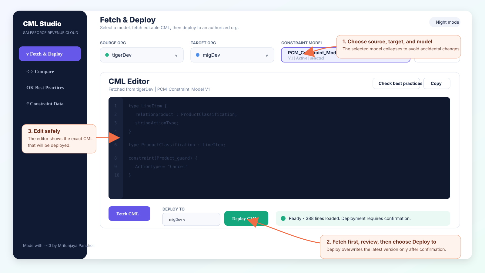
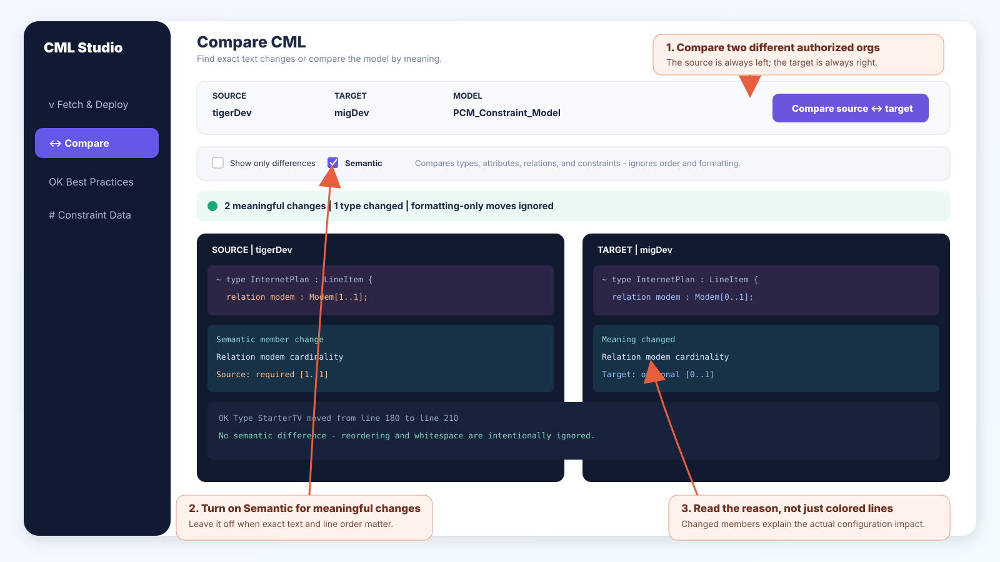
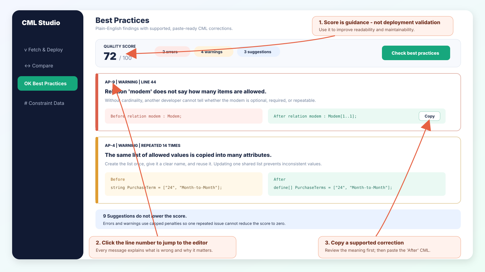
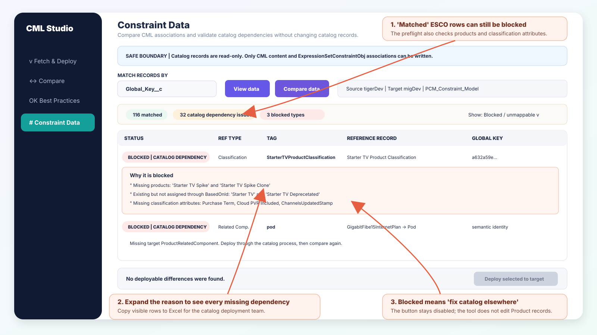
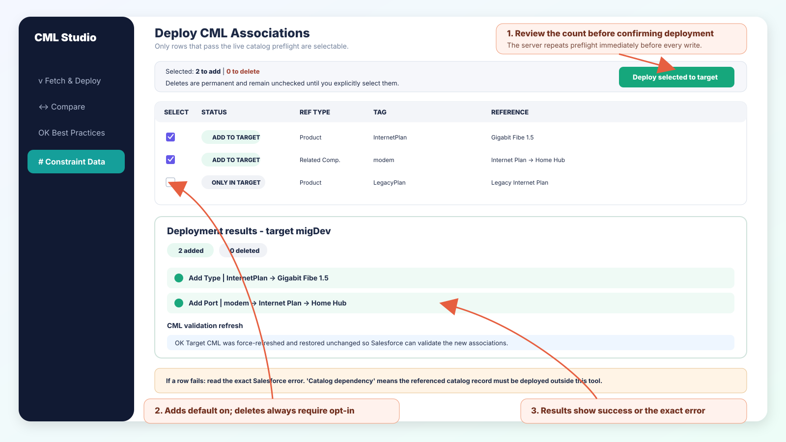

# Salesforce CML Tool

A tiny, **zero-dependency** local web app for working with Salesforce **Revenue
Cloud CML** (Constraint Model Language). Pick an org, choose a Constraint Model,
and **fetch**, **deploy**, **compare**, or inspect it — no terminal commands to
type and no installs. The app and Logic Explorer run on your machine; Salesforce
operations go only to orgs already authorized through your local Salesforce CLI.

It has five views and does six main jobs:

| Operation | What it does |
|---|---|
| **Fetch** | List every available CML version, then download the exact selected version into an editable text box (and save a copy locally). |
| **Deploy** | Push CML (fetched or pasted) to an exact, explicitly selected target version — with ownership checks and a confirmation prompt so nothing happens by accident. Active versions are read-only in the tool. |
| **Compare** | Select exact source and target versions, fetch both, and show a synced, line-numbered, side-by-side diff that highlights every difference. Includes a **Semantic** mode that compares by structure (types, attributes, relations, constraints) and ignores reordering and formatting. |
| **Check best practices** | Scan the CML in the editor against a built-in catalog of CML anti-patterns and recommended patterns, and get a **line-numbered report** with a quality score and a suggested fix for each finding. |
| **Constraint Data** | View, compare, and **deploy** the **Product associations** behind a CML (`ExpressionSetConstraintObj` records), matched across orgs by a **foreign key you choose** (default `Global_Key__c`) instead of by record Id. Pick exactly which rows to add or delete with checkboxes. |
| **Explore logic** | Analyze fetched or pasted CML locally, search or filter its logic items by kind, and read plain-English details and condition clauses. This is guidance, not a prediction of exact Salesforce runtime behavior. |

You select everything from dropdowns and lists, so there are **no typos** in org
names or model API names.

## Guided UI walkthrough

The screenshots below use **synthetic org, model, product, and key values**. No
customer or production data is shown. Numbered arrows explain which control to
use and what the status messages mean.

### 1. Fetch, edit, and deploy CML



1. Choose the source org, target org, and Constraint Model. After selection, the
   model picker collapses so another model cannot be selected accidentally.
2. Click **Fetch CML** and review the exact text in the editor.
3. Choose **Deploy to** and the exact target version, click **Deploy CML**,
   approve the warning, and type the target alias exactly. The tool verifies
   that the version ID belongs to that model, backs up and verifies the
   deployment, and never activates or compiles the model.

### 2. Compare exact text or compare by meaning



1. The source is shown on the left and the target on the right.
2. Turn on **Semantic** to ignore formatting, comments, and moved blocks. Leave
   it off when exact line order matters.
3. Changed-member explanations identify the actual impact, such as a relation
   changing from required `[1..1]` to optional `[0..1]`.

### 3. Understand and correct best-practice findings



1. The quality score is maintainability guidance, not an activation result.
2. Each finding explains the problem in plain language and points to its line.
3. **Before → After** examples contain supported CML. Review the meaning, then
   use **Copy** to paste the correction into the editor.

### 4. Diagnose missing catalog dependencies safely



1. A matched `ExpressionSetConstraintObj` can still be blocked when its
   classification, products, attributes, component group, or relationship is
   incomplete.
2. The expanded message lists every missing, ambiguous, or unlinked dependency.
   **Copy for Excel** includes these full explanations for another team.
3. **Blocked — catalog dependency** means the catalog data must be corrected by
   its normal deployment process. The CML Tool only reads catalog objects.

### 5. Select and deploy valid CML associations



1. Review the add/delete count before confirming. The server repeats dependency
   preflight immediately before writing.
2. Safe additions are selected by default. Deletions are permanent and always
   require explicit selection.
3. Results show each success or the exact Salesforce error. After an association
   change, the tool performs its own unchanged-CML save/verification refresh.
   This is not documented proof of Salesforce activation, compilation, or
   runtime behavior. If the refresh fails after DML succeeded, the result is
   **Partial deployment — recovery required** because records have already
   changed.

### Logic Explorer (the fifth view)

1. Fetch CML in **Fetch & Deploy**, or paste CML into that editor.
2. Open **Logic Explorer** and click **Analyze logic**.
3. Use search and the **Logic kind** filter to narrow the logic-item list.
4. Select an item to see its plain-English detail, including scope,
   syntax-level effect, dependencies, and a **Phase 1 condition breakdown**.
   Nested conditions are decomposed into
   business-readable clauses and `ALL` / `ANY` Boolean gates. Each clause shows
   its expected value and identifies runtime inputs still required; it never
   claims an actual value or pass/fail result. Selecting an item also opens its
   line in the editor.

The **Fetch & Deploy** editor has a visible line-number gutter synchronized with
editor input, scrolling, and resizing. Clicking a logic item or condition clause
switches to the editor and selects the corresponding line.

> **Exact boundary:** Logic Explorer does not prove that the CML compiles, that
> a scope is instantiated, that an action executes, what the solver returns,
> that catalog data is available, how the model performs, or that a version can
> be activated. Validate all of those in Salesforce.

---

## Why it's safe

- Runs a local server bound to **`127.0.0.1` only** — not reachable by anyone
  else on your network.
- **No external Python dependencies** — uses only the Python 3 standard library.
- **No telemetry, no cloud** — it talks only to your Salesforce orgs through the
  Salesforce CLI you already use.

---

## Requirements

- **Python 3.8+** (preinstalled on most macOS/Linux machines).
  - macOS: comes preinstalled, or run `xcode-select --install`.
  - Windows: install from [python.org](https://www.python.org/downloads/) and tick
    **"Add Python to PATH"**.
- **Salesforce CLI (`sf`)**, logged in to the orgs you want to use:
  ```bash
  npm install -g @salesforce/cli      # install (one time)
  sf org login web --alias myOrg      # authorize each org
  ```
  The tool reads your authorized orgs automatically via `sf org list`.
- **Salesforce REST API v66.0 (Spring '26).** The tool sends REST requests
  through v66.0. `ExpressionSetConstraintObj` was introduced in v63.0 and is
  unavailable through v62.0. Its `ReferenceObjectId` is supported here only for
  the platform's allowed polymorphic targets: `Product2`,
  `ProductClassification`, and `ProductRelatedComponent`.

---

## Quick start

### macOS (easiest)

1. Clone or download this folder.
2. Open `launchers/` and double-click **`Open CML Tool.command`**.
3. Your browser opens at `http://127.0.0.1:8787`. Done.

The server runs in the **background**, so you can close the Terminal window and
the tool stays available. To stop it, double-click **`launchers/Stop CML Tool.command`**.

> **First launch shows a security warning?** That's normal — see
> [macOS security warning](#macos-security-warning-apple-could-not-verify) below.
> The quickest fix is to **`git clone`** the repo instead of receiving the files
> via AirDrop/Slack/email/zip.

### Windows

Double-click **`launchers/run.bat`** (or run it from a terminal). Your browser opens
automatically. Close the window to stop the tool.

### Linux / any terminal

```bash
./launchers/run.sh
# or:
python3 app/cml_tool.py
```

Then open `http://127.0.0.1:8787` if it doesn't open automatically. Press
`Ctrl+C` to stop.

### Change the port

```bash
CML_UI_PORT=8900 python3 app/cml_tool.py           # macOS / Linux
set CML_UI_PORT=8900 && python app\cml_tool.py     # Windows
```

---

## How to use

### Fetch
1. Pick a **Source org** — the tool automatically loads every CML in that org
   into the list, with **every version** shown separately (for example,
   `[V1 · Active]` and `[V2 · Inactive]`).
2. Type in the filter box to narrow the list, then select the exact version.
3. Click **Fetch CML**. The content appears in the box and is saved to
   `cml-files/<model>.cml`. Use **Copy** to copy it.

### Deploy
1. Make sure the desired CML text is in the box (fetched or pasted) and a CML is
   selected.
2. Choose **where** to deploy with the **Deploy to** dropdown next to the button —
   it lists **every** authorized org but starts at **None**, so the target must
   be selected explicitly.
3. Select the exact target version. Source and target versions are mandatory;
   the server verifies each submitted version ID belongs to the named model.
4. Click **Deploy CML**, review the warning, and type the target org alias exactly.
   Before writing, the tool saves the target CML under `cml-backups/`. After
   Salesforce accepts the deployment, the tool fetches the exact version again
   and verifies its SHA-256 hash. If verification fails, it automatically attempts
   to restore and verify the previous CML.
5. Use **Restore backup** to restore and verify the newest backup for that exact
   org, model, and version. Rollback first creates another safety backup, so it
   can itself be undone.

The tool blocks CML writes to an **Active** definition version. Association
insert/delete/restore also blocks when the parent `ExpressionSet` is Active, and
the post-DML save/verification step requires a non-Active exact definition
version. Deactivate the relevant Salesforce record, then refresh the tool's
version selection; a stale browser selection is not accepted.

### Compare (source org ↔ target org)
1. Pick a **Source org** and a **Target org** (must be different).
2. Choose the exact **source version** and exact **target version** to compare.
3. Click **Compare source ↔ target**. The tool fetches the CML from both orgs
   and shows a two-pane diff: **source on the left, target on the right.**

See the annotated [semantic comparison screenshot](docs/screenshots/02-semantic-compare-guide.svg).

The diff is built to be **colorblind-friendly** — it uses an orange / blue /
purple palette plus text markers (`−`, `+`, `~`) so differences are clear
without relying on color:

| Highlight | Marker | Meaning |
|---|---|---|
| Purple | `~` | Line **changed** between the two orgs |
| Orange | `−` | Line exists **only in source** |
| Blue | `+` | Line exists **only in target** |

- Line numbers are shown for **both** orgs, and the panes scroll together so
  matching lines stay aligned.
- If a line isn't in the same place but exists **elsewhere** in the other org,
  the diff tells you where (e.g. `↦ also in target at L420`).
- Tick **Show only differences** to hide the matching lines.

#### Semantic diff (compare by meaning, not by line)

A plain line diff flags everything that *looks* different — even when a type was
just moved or reformatted. Tick the **Semantic** box (next to *Show only
differences*) to compare the two CMLs by **structure** instead:

- The tool parses each side into its building blocks — `property`, `extern`,
  `define`, and every `type` with its **attributes, relations, variables, and
  constraints** — and matches them by **name/identity**, not by position.
- Reordering a type, re-indenting, or adding comments shows up as **no change**.
- For each genuinely changed type, you see **exactly which members differ**
  (added / removed / changed), and which types are **only in one org**.

Use the line diff when you care about exact text; use **Semantic** when you care
about *"are these two models actually the same configuration?"*

Toggle **Night / Day mode** any time with the button in the top-right.

### Check best practices (CML linter)

See the annotated [Best Practices screenshot](docs/screenshots/03-best-practices-guide.svg).

Click **Check best practices** (above the editor) to scan the CML currently in
the box — fetched or pasted — against a built-in catalog of CML anti-patterns
and recommended patterns. You get a **quality score** and a list of findings,
each with a **line number** (click it to jump there), a plain-English
explanation, and — most usefully — a **Before → After** correction written in
**valid CML you can paste straight back into the model**. Hit **Copy** on the
*After* block to grab the fix.

For example, an implication constraint is rewritten into the recommended guard +
auto-add pattern:

```
// Before (in your CML)
constraint(Pricing_guard) { Service_Tier == "Ultimate" -> Billing_Cycle == "Annual" }

// After — paste-ready CML
constraint(Pricing_guard) {
  Service_Tier == "Ultimate" -> Billing_Cycle == "Annual"
}
require(Pricing_auto) {
  // When Service_Tier == "Ultimate" is selected, auto-add Billing_Cycle == "Annual"
}
```

Other fixes are generated from **your own code** — `double price;` becomes
`decimal(2) price;`, an unbounded `relation x : T[..];` becomes
`relation x : T[0..50];`, and a repeated value set is turned into a shared
`define[]` domain you can reference everywhere.

What it checks:

| ID | Flags | Suggests |
|---|---|---|
| **AP-1** | `double` used for money / precise values | use `decimal(2)` |
| **AP-3** | many empty stub types (`type X;`) | consolidate / remove unused stubs |
| **AP-4** | the same enum value-set repeated across attributes | extract a shared `define[]` domain |
| **AP-5** | inheritance chains more than 4 levels deep | flatten the hierarchy |
| **AP-6** | always-true constraints (`constraint(true, …)`) | remove the no-op or fix it |
| **AP-8** | constraints combining 6+ boolean operators | break into smaller constraints |
| **AP-9** | unbounded (`[..]`) or no-cardinality relations | add explicit `[min..max]` |
| **BP-2** | vague identifiers (`x`, `temp`, `var`, …) | use descriptive names |
| **REC** | hard `->` implications | split into a guard + `require()` auto-add |

The **quality score** starts at 100 and subtracts points for **errors** and
**warnings** only. Two things keep it meaningful on large models:

- Each rule's impact is **capped**, so one repetitive issue (say, 40 relations
  missing an explicit cardinality) can't drag the score to zero on its own.
- Blue **suggestions** — including the `->` implication tip — are optional polish
  and **don't lower the score**.

Every finding includes a plain-English explanation of what's wrong and what to
do, plus the Before → After fix. Everything runs **in your browser** — no CML
leaves the page.

### Logic Explorer

Logic Explorer analyzes the same text shown in the **Fetch & Deploy** editor.
Its focused UI presents logic only: search, a **Logic kind** filter, a logic-item
list, and plain-English detail with business-readable condition clauses. It does
not display declaration/type/relation inventories, parser-diagnostic panels,
outcome or confidence labels, or filters for outcome and confidence.

Internally, the local analyzer still recognizes top-level `property`, `extern`,
`define`, and `type` declarations; official variable types such as `decimal(n)`,
`double(n)`, and `date`; annotations and type inheritance; typed variables and
their assigned domains; fixed (`[1]`) and range (`[0..4]`) cardinality;
relation `order(...)`, relation bodies, and `count`/`max`/`min`/`sum`/`total`
aggregates; and these logic kinds:
`constraint`, `require`, `exclude`, `preference`, `recommend`, `rule`,
`setdefault`, and `message`.

Its expression reader handles literals, names, grouped and list expressions,
unary operators, common boolean/comparison/arithmetic operators, implication
and equivalence, XOR (`^`), conditional (`?:`), membership, member access,
indexing, calls, table row literals and `SalesforceTable(...)`,
`cardinality(...)`, and configured targets such as
`Internet{speed="1G"} == 1`. Named rule signatures and their syntax-level
effects are represented according to the official forms for `constraint`,
`message`, `preference`, `require`, `setDefault`, `exclude`, and
`rule(..., "Hide"|"Disable"|"recommend", ...)`. A standalone
`recommend(...)` is accepted only for legacy recovery and is explicitly marked
unverified; the documented recommendation form is
`rule(condition, "recommend", scope, target)`. It reports
detected inheritance, relation-target, and logic-reference dependencies with
line information. Every recovered declaration, type, member, condition, and
diagnostic also carries an exact source range internally so the UI can connect
results back to the editor.

Phase 1 turns each supported condition into business-readable clauses and
Boolean gates. It can describe requirements such as relation/type counts,
string and null comparisons, and constant expressions. The detail view shows
the expected side of each comparison and names required runtime inputs. Its
**Actual value** and **Result** fields are placeholders only: Phase 1 does not
observe a configured transaction, evaluate Salesforce runtime data, or report
whether a clause passed.

**Phase 2 runtime validation** is a separate future capability. Runtime values,
evaluated clause results, and end-to-end solver behavior must continue to be
validated in Salesforce until that phase exists.

Analysis is intentionally tolerant. Internally, unknown characters, incomplete
strings or comments, unbalanced blocks, unsupported constructs, unresolved
names, missing relation cardinality, and possibly unreachable types can produce
diagnostics. The analyzer resumes at balanced boundaries where possible and
returns partial structures and logic items instead of hiding everything after
the first error. Those maintenance structures remain in the local API response;
they are not additional Logic Explorer panels.

Logic Explorer is a reader, not a Salesforce compiler or solver. Its
plain-English explanation does not mean a rule will run or a model will behave
that way.

> **Source hierarchy:** the April 2026 Salesforce CML guide and the official
> linked [Constraint Modeling Language documentation](https://developer.salesforce.com/docs/atlas.en-us.revenue_lifecycle_management_dev_guide.meta/revenue_lifecycle_management_dev_guide/cml_what_is_constraint_modeling_language.htm)
> are authoritative. Official topic pages such as
> [Table Constraints](https://developer.salesforce.com/docs/atlas.en-us.revenue_lifecycle_management_dev_guide.meta/revenue_lifecycle_management_dev_guide/cml_table_constraints.htm)
> and [Recommendation Rule](https://developer.salesforce.com/docs/atlas.en-us.revenue_lifecycle_management_dev_guide.meta/revenue_lifecycle_management_dev_guide/cml_recommendation_rule.htm)
> take precedence over local reference examples. Examples are illustrative;
> `AllPatterns_recommended` is malformed recovery corpus, not a grammar oracle.
> NotebookLM-generated prose is also non-authoritative.

### Constraint Data (Product associations)

**Why this exists:** deploying CML code **alone** doesn't recreate the data
behind it. `ExpressionSetConstraintObj` records link an `ExpressionSet` to
**Products, Product Classifications, or Related Components**. These associations
are shared at the parent `ExpressionSet` level; they are not owned by one CML
version. The selected `ExpressionSetDefinitionVersion` is mapped to its exact
parent through
`ExpressionSetVersion.ExpressionSetDefinitionVerId → ExpressionSetId`.

**The hard part:** each link points to its record by **record Id**, and Ids are
**different in every org**. So the tool ignores Ids and matches each row on a
**foreign key** — a field whose value is the **same for a record in every org**.

> **Safe deployment boundary:** Product and catalog objects are read-only in
> this tool. It can inspect and report missing products, classifications,
> classification attributes, component groups, and product relationships, but
> it never creates or updates them. The only Salesforce writes are the CML
> content and `ExpressionSetConstraintObj` associations.

#### Choose your foreign key

- There's a **"Match records by (foreign key field)"** box. It defaults to
  **`Global_Key__c`**, but you can type **any field API name** your org uses as a
  stable cross-org identifier (e.g. an external Id, `ProductCode`,
  `StockKeepingUnit`, or `Name` where the referenced object actually exposes it).
- The field only needs to exist on the reference objects you actually use. The
  tool checks each ESCO target (**Product2, ProductClassification,
  ProductRelatedComponent**) and uses the key only where
  it's present — rows on objects that lack it are shown as **unmappable**.
- `Name` is not guaranteed to exist, be queryable, populated, stable, or unique.
  Prefer an approved external/stable key.

#### Step 1 — View the data

- Pick a **Source org** and a **CML**, set your **foreign key field**, then click
  **View data (source org)**.
- You get a table of every constraint row: reference type, tag type, tag, the
  linked record's name, and your chosen key value (the last column is labelled
  with the field you picked).

See the annotated [constraint dependency preflight screenshot](docs/screenshots/04-constraint-preflight-guide.svg).

#### Step 2 — Compare source ↔ target

- Click **Compare data (source ↔ target)**.
- The tool lines both orgs up by your chosen **foreign key** and labels every row:

| Badge | Meaning |
|---|---|
| **Matched** | The association and its checked catalog dependencies exist in **both** orgs — nothing to do. |
| **Add to target** | Only in source, and the linked record **already exists** in the target — ready to create. |
| **Only in target** | Exists in the target but **not** in source (an extra). |
| **CML definitions differ** | The association is valid for one org's exact selected CML version, but the other selected version does not define that Type or Port. Compare the exact CML versions before changing data. |
| **Unused association in this org** | The association exists at the parent Expression Set, but that org's exact selected CML version does not define its Type or Port tag. Another version can still share the association; the tool does not change it automatically. |
| **Needs review — dependency key missing** | A related source Product or classification attribute has no value in the selected foreign-key field, so the tool cannot prove whether its target counterpart exists. This is an incomplete comparison, not proof that data is missing. |
| **Blocked — ambiguous key** | The selected portable key matches more than one target record. Comparison blocks the row before selection and deployment repeats the check immediately before DML. Make the key unique in the target, then compare again. |
| **Blocked — catalog dependency** | A required catalog record, relationship, product-to-classification assignment, or classification attribute is missing or ambiguous. Deploy that catalog data through its normal process, then compare again. |
| **No \<key field\>** | The linked record has no value for your key field, so it **can't be matched** across orgs. |

- Use the **Show** filter to focus on matched / to-add / extra / blocked /
  duplicate rows.
- Matched rows retain paired source/target constraint, Expression Set, and
  reference IDs in the comparison response. This provides auditable evidence
  that equal portable identities matched even when Salesforce IDs differ.

The annotated preflight screenshot above demonstrates matched associations that
are still blocked by deeper catalog dependencies.

#### Spotting duplicates

Every row is checked for data-hygiene problems and tagged with a yellow badge:

| Badge | Meaning |
|---|---|
| **Exact duplicate** | Same tag type + tag + reference + `Global_Key__c` appears more than once — truly redundant. |
| **Duplicate tag** | The same tag type + tag is used by more than one row. |
| **Duplicate reference** | The same record is linked by more than one row. |
| **Ambiguous name** | One reference *name* maps to more than one `Global_Key__c` — a cross-org mapping hazard. |

- Pick **Duplicates only** in the Show filter to review them all at once.
- Exact duplicates are preserved as separate rows during comparison. A surplus
  source duplicate is shown as **Skipped — exact duplicate**, has no add
  checkbox, and is rejected server-side if a forged request submits it.
- Surplus target duplicates remain visible and can be selected deliberately for
  cleanup.

#### Step 3 — Deploy what you picked (add / delete)

In **Compare** mode, each actionable row gets a **checkbox**:

- **Add to target** rows — **checked by default** → they get created in the target.
- **Only in target** rows — **unchecked by default** → tick them to **delete** the
  extras (deletion is permanent, so it's always opt-in).
- **Matched**, **CML definitions differ**, **ambiguous key**, **unused**, and
  **blocked** rows — no checkbox. The tool does not treat a CML-code difference
  or non-unique portable key as deployable data.

Then:

- Use **Select all adds / Clear adds / Select all deletes / Clear deletes** for
  bulk selection.
- Review the running summary and click **Deploy selected to target**.
- A confirmation dialog spells out exactly how many rows will be **added** and
  **deleted**, and the production safety prompt requires the exact target alias.

See the annotated [association deployment results screenshot](docs/screenshots/05-association-deploy-results-guide.svg).

- Each row is processed **individually** (`allOrNone=false`) — one failure never
  blocks the rest. Mixed results are clearly labelled **Partial deployment**.
- The **results panel** lists every insert/delete with a ✓ or ✗ and the **exact
  platform error** when something can't be applied (e.g. a record locked by an
  active version).
- Before any write, the target CML is backed up. Before deletion, the complete
  target association rows are saved under `association-archives/`; use
  **Restore deleted associations** in the result panel to recover absent rows.
  Restore resolves the current Expression Set and each current reference record
  by portable key (or canonical PRC identity); archived Salesforce IDs are never
  reused blindly.
- Every requested deletion is checked again server-side and must still belong to
  the selected target model and the current target-only comparison. Ownership is
  queried once more immediately before destructive DML.
- A JSON audit report is saved under `deployment-reports/`. Results stay visible
  so recovery actions remain available; click **Compare data** when ready to
  refresh the table.
- The server repeats the read-only dependency preflight immediately before
  deployment and again for each batch of at most 200 rows. If catalog data
  changes during a large deployment, only affected rows/chunks are blocked.
  Ambiguous matches include the conflicting Salesforce record IDs.
- Every data-deploy call—including confirmation rejection, invalid input,
  preflight failure and partial success—appends exactly one entry to
  `logs/data-deploy-history.jsonl`.

> **Lifecycle matters:** writes to Active versions and Active Expression Sets
> are blocked. Select exact versions, deactivate the required Salesforce
> records, refresh the selection, perform the approved writes, and then complete
> activation manually. Deploy does not auto-activate or compile anything.

---

## Project structure

```
salesforce-cml-tool/
├── app/
│   ├── cml_tool.py        # Local server + UI (HTML/CSS/JS) — the whole app
│   └── utilities/
│       ├── fetch-cml.sh   # Optional standalone bash helper (not used by the app)
│       └── deploy-cml.py  # Optional standalone Python helper (not used by the app)
├── launchers/
│   ├── Open CML Tool.command  # macOS: double-click to start (runs in background)
│   ├── Stop CML Tool.command  # macOS: double-click to stop
│   ├── run.sh                 # Linux / macOS terminal launcher
│   └── run.bat                # Windows launcher
├── tests/
│   └── test_cml_tool.py   # Safety tests plus Logic Explorer parser/UI/API tests
├── README.md
├── LICENSE
├── .gitignore
├── favicon/               # Browser, Apple touch, and web-app icon assets
│   ├── favicon.svg
│   ├── favicon.ico
│   ├── favicon-96x96.png
│   ├── apple-touch-icon.png
│   ├── web-app-manifest-192x192.png
│   ├── web-app-manifest-512x512.png
│   └── site.webmanifest
└── docs/
    └── screenshots/       # Images used in this README
```

> **Cross-platform:** `app/cml_tool.py` does fetch, deploy, queries, and data sync
> entirely over the Salesforce REST API using your `sf` access token, so it runs
> the same on **macOS, Linux, and Windows**. The `.sh` helper and `.command`
> launchers are macOS/Linux conveniences; on Windows use `launchers/run.bat`. (Don't run
> the `.command` files on Windows — they're bash scripts.)

The local endpoints require a per-process CSRF token for POST requests and reject
non-local Host headers. This prevents another browser page from silently invoking
deployment operations. Browser origins are validated, shutdown is a protected
POST, and responses include CSP, anti-framing and MIME-sniffing protections. Use
the UI rather than treating the local server as a public integration API.

---

## How it works (in short)

- **Orgs** come from `sf org list`. Org details come from `sf org display`; when
  newer Salesforce CLI versions redact the token, the tool securely requests it
  through `sf org auth show-access-token`. On Windows the CLI is `sf.cmd`, which
  the tool launches correctly via `cmd.exe`.
- **Everything else is REST.** SOQL queries, fetch, deploy, and the data sync all
  go straight to the Salesforce REST API with that token (no `sf data query`, no
  `curl`, no bash), which is faster and fully cross-platform.
- **CMLs** are discovered by querying `ExpressionSetDefinitionVersion`; every
  version is returned with its stable ID, version number, and status.
- **Fetch/Compare/Deploy** require exact source/target version IDs. The backend
  verifies each ID still belongs to the named definition before reading or
  writing `ExpressionSetDefinitionVersion.ConstraintModel` via REST.
  Deployments create a private backup first and re-fetch the exact version for
  byte-exact verification afterward. Writes and recovery operations for the same
  org/model are serialized to prevent overlapping deployments.
- **Compare** fetches the CML from both orgs and diffs them in your browser with a
  longest-common-subsequence algorithm. **Semantic** mode additionally parses each
  CML into structural blocks (types and their attributes/relations/constraints)
  and compares them by identity, so reordering and formatting are ignored.
- **Check best practices** runs a small rule engine entirely in your browser over
  the CML text — building an inheritance map, scanning constraints with
  bracket-aware matching, and flagging the anti-patterns/recommendations above.
  For each finding it also generates a **paste-ready CML correction** from your
  own snippet (e.g. `double` → `decimal(2)`, `[..]` → `[0..50]`, or an
  implication rewritten into the guard + `require()` pattern). No CML is sent
  anywhere.
- **Logic Explorer** sends the current editor text only to the app's local
  `POST /api/logic/analyze` route. A Python standard-library tokenizer and
  tolerant recursive-descent AST analyzer run in the same local process. They
  return an internal JSON schema containing inventories, logic items,
  conservative outcomes, dependency edges, diagnostics, and half-open source
  ranges. The focused UI consumes the logic items and their plain-English
  condition details; it does not expose every response structure. No Salesforce
  request, compiler, solver, third-party parser, telemetry service, or cloud
  analysis service is used for this operation.
- **Constraint Data** queries `ExpressionSetConstraintObj` for the selected model
  and resolves each polymorphic `ReferenceObjectId` to its object type + your
  chosen **foreign key field** (default `Global_Key__c`) via a single SOQL
  `TYPEOF` query. The key field is **validated** (plain identifier only, to keep
  SOQL safe) and **probed per object**, so it's included only on the reference
  objects that actually have it. Rows are matched across orgs on
  `tag type + tag + reference type + <key value>`, and source-only rows are
  checked against the target to see whether their linked record already exists
  there.
- Exact association ownership is resolved by mapping the selected
  `ExpressionSetDefinitionVersion` through `ExpressionSetVersion` to one
  unambiguous parent `ExpressionSet`. ESCO rows are scoped to that parent and
  are shared across its definition versions.
- **Deploying constraint data** re-resolves each selected row in the target —
  the model's Expression Set, and each reference record by `Global_Key__c` — then
  inserts/deletes via the REST **sObject Collections** API with `allOrNone=false`
  so results are reported per row. Inserts only ever set the four required fields
  (`ExpressionSetId`, `ReferenceObjectId`, `ConstraintModelTag`,
  `ConstraintModelTagType`).

### Production recovery files

The tool creates these local runtime directories as needed:

- `cml-backups/` — target CML snapshots used by **Restore backup**.
- `association-archives/` — complete ESCO rows captured before deletion.
- `deployment-reports/` — timestamped JSON reports containing target org, model,
  operating-system user, selected record IDs, results, verification and recovery
  artifact IDs.
- `logs/data-deploy-history.jsonl` — one compact audit entry for every
  association deployment attempt, including attempts rejected before DML.

Files are created with private permissions where the operating system supports
them and are excluded from Git. Protect and retain them according to your
organization's production-data policy.

Run the safety tests with:

```bash
python3 -m unittest discover -s tests -v
```

The current suite includes Logic Explorer coverage for token coordinates,
quoted comment-like text, declarations, annotations, inheritance, variable
domains, relation cardinality and bodies, all supported logic kinds and effect
shapes, nested condition breakdowns, relation/type count checks, string and null
comparisons, runtime placeholders, constant conditions, context dependency
resolution, built-ins, malformed-input recovery, conservative diagnostics, JSON
serialization, synchronized editor line numbers, click-to-line and breakdown UI
contracts, absence of removed inventory/diagnostic/outcome controls, and the
protected local analysis route. Parser and schema tests cover internal analyzer
behavior even when those structures are not displayed in Logic Explorer.
The verified suite currently contains **81 tests**.

---

## Troubleshooting

### Windows: orgs don't load / `[WinError 2] The system cannot find the file specified`

This was a bug in older versions where the tool called the CLI as a bare `sf`;
on Windows the CLI is `sf.cmd`, which can't be launched that way. The current
version handles this automatically. If you still see it:

1. Make sure you started the tool with **`launchers/run.bat`** (or `python app\cml_tool.py`),
   **not** by running a `.command` file — those are macOS bash scripts and won't
   work on Windows.
2. Confirm the CLI is on your PATH: open a new Command Prompt and run `sf --version`.
   If that fails, reinstall the Salesforce CLI and reopen your terminal.
3. Visit `http://127.0.0.1:8787/api/debug` to see whether `sf` was found and what
   `sf org list` returned.

### Orgs are not showing in the dropdown

This is the most common issue for new users. The dropdown stays empty (or shows
an error) for one of two reasons:

**Reason 1: `sf` was installed with nvm / fnm / Volta (most likely)**

Node version managers like `nvm`, `fnm`, and `Volta` install `sf` into a
versioned path that is only added to your `PATH` inside an interactive shell
(via `.zshrc` / `.bashrc`). When macOS launches the tool via Finder or
double-click, it starts a *login* shell that does **not** source `.zshrc`, so
`sf` is invisible.

**Self-diagnosis — open the tool, then open a new browser tab and visit:**
```
http://127.0.0.1:8787/api/debug
```
This returns a JSON object showing exactly which paths were searched, whether
`sf` was found, and how many orgs `sf org list` returned. Share this output if
you need help.

**Fix (pick one):**

- **Option A (recommended):** Tell the tool exactly where `sf` is. Find it first:
  ```bash
  which sf
  ```
  Then start the tool with that path explicitly:
  ```bash
  SF_PATH=/path/from/which/sf python3 app/cml_tool.py
  ```
  (Or add that directory to `/etc/paths` so it persists across all apps.)

- **Option B:** Create a symlink in a standard location so macOS can always find it:
  ```bash
  sudo ln -s "$(which sf)" /usr/local/bin/sf
  ```

- **Option C:** Install `sf` outside of nvm so it has a fixed path:
  ```bash
  npm install -g @salesforce/cli   # after setting npm prefix to a fixed dir
  # or install via Homebrew:
  brew install @salesforce/cli
  ```

**Reason 2: `sf` is installed but no orgs are authorized for *this* user**

Salesforce CLI logins are stored **per operating-system user** (under
`~/.sfdx/` on macOS/Linux, `%USERPROFILE%\.sfdx\` on Windows). So if a
*different person / system owner* opens the tool on their own account, they will
see **no orgs** even though it works for you — they simply haven't logged in yet.

Each user must authorize their own orgs, in their own login session:
```bash
sf org list                          # confirm what THIS user can see
sf org login web --alias myOrg       # repeat for each org
```
Then click **Reload list** — the dropdown fills automatically.

To see exactly what the tool detects (sf path, OS user, and how many saved
logins exist), open `http://127.0.0.1:8787/api/debug` while the tool is running.
If `authorized_org_files` is `0`, that user just needs to log in as above.

### "The Salesforce CLI ('sf') was not found"
Install it and authorize at least one org:
```bash
npm install -g @salesforce/cli
sf org login web --alias myOrg
```

### A fetched CML is empty
The exact selected version has no populated `ConstraintModel` blob. Empty does
**not** mean Inactive, and Active does not guarantee content. Refresh the
versions, confirm the exact version ID/status with the model owner, and select
the intended populated version.

### A write says the model has an active runtime version
Deactivate the exact definition version or constraint model in Salesforce,
then refresh the version list and select it again. The tool verifies authoring
status through `ExpressionSetDefinitionVersion.Status` and runtime activity
through `ExpressionSetVersion.IsActive`. `ExpressionSet` itself has no `Status`
field. Because ESCO rows are shared by the parent Expression Set, any active
runtime version under that parent blocks association writes.

### Association DML succeeded but validation refresh failed
Treat this as **partial / recovery required**. Some ESCO rows are already
committed; the refresh is only the tool's unchanged-CML save and exact
verification step, not activation or runtime proof. Preserve the report,
backup, and deletion archive, recompare current state, and follow the approved
recovery process before retrying.

### Logic Explorer shows no or incomplete logic

1. Confirm that **Fetch & Deploy** contains the complete intended CML rather
   than a truncated paste or empty/partial fetch.
2. Check nearby quotes, comments, parentheses, brackets, braces, and semicolons,
   then click **Analyze logic** again.
3. Use Salesforce validation as the authority. Logic Explorer is a tolerant
   local reader and does not display its internal parser-diagnostic inventory.
4. If Salesforce accepts the CML but expected logic is still missing, preserve a
   small sanitized example for the maintainers.

### macOS security warning: *"Apple could not verify…"*

When you double-click `launchers/Open CML Tool.command` you may see:

> *"Apple could not verify 'Open CML Tool.command' is free of malware…"*

**Why:** macOS adds a hidden *quarantine* flag to files that arrive from "the
outside" — downloads, AirDrop, Slack/Teams, email, or an unzipped archive.
Gatekeeper then blocks unsigned scripts. The person who *created* the files
locally never sees this. It's not a sign the tool is unsafe — the source is
plain, readable Python you can inspect.

**Fix — pick whichever is easiest:**

1. **Best: clone instead of copying.** Files obtained with `git clone` are **not**
   quarantined, so there's no warning at all:
   ```bash
   git clone https://github.com/mrityu96/SalesforcesTool.git
   cd SalesforcesTool/salesforce-cml-tool
   open "launchers/Open CML Tool.command"
   ```

2. **Allow it in System Settings** (recent macOS, incl. Sequoia): double-click
   once (it gets blocked) → **System Settings → Privacy & Security** → scroll to
   the blocked-file message → **"Open Anyway"** → confirm. One-time per machine.

3. **Right-click → Open** (macOS 14 and earlier): right-click (or Control-click)
   the file → **Open** → **Open**.

4. **Remove the quarantine flag from Terminal:**
   ```bash
   xattr -dr com.apple.quarantine "/path/to/salesforce-cml-tool"
   ```

> None of this requires admin rights. If you'd rather skip the `.command`
> launcher, just run `python3 app/cml_tool.py` in Terminal — that never triggers
> Gatekeeper.

### "Port 8787 is in use"
Another copy is running, or something else holds the port. Stop it with
`launchers/Stop CML Tool.command`, or start on a different port:
`CML_UI_PORT=8900 python3 app/cml_tool.py`.

### I changed the code but don't see the update
Just run the tool again — it now **auto-restarts on the new build**. When a launch
detects an older version already running on the port, it asks that one to quit and
takes over with the new code. You no longer have to stop it manually first.

After it relaunches, **reload the browser tab** (or hard-refresh). To confirm you're
on the latest code, check the small `build …` stamp in the top-right of the page: it
shows the running build's hash and changes whenever the code changes. If two launches
ever show the same stamp, they're the same build.

---

## Contributing

Issues and pull requests are welcome. It's plain Python + vanilla JS with no
build step: edit `app/cml_tool.py` and relaunch. Maintainers must mirror functional
changes in `scripts/cml-ui.py` while preserving the documented bootstrap,
module-description, and artifact-root differences. Run
`python3 tests/test_cml_tool.py -v` and compare the two implementation files
before review; there is currently no automated mirror-consistency test.

## License

[MIT](./LICENSE) — free to use, modify, and share.

---

> **Disclaimer:** This is a community tool, not an official Salesforce product. It
> is provided **as-is, without warranty of any kind**. You are responsible for
> reviewing every change before you deploy — especially deletes — and for testing
> in a sandbox first. The authors accept no liability for any data loss or other
> impact to your orgs.
