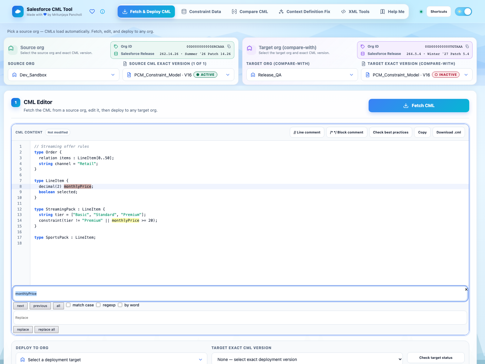
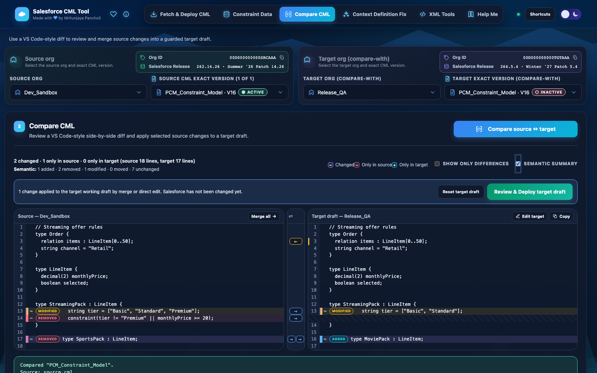
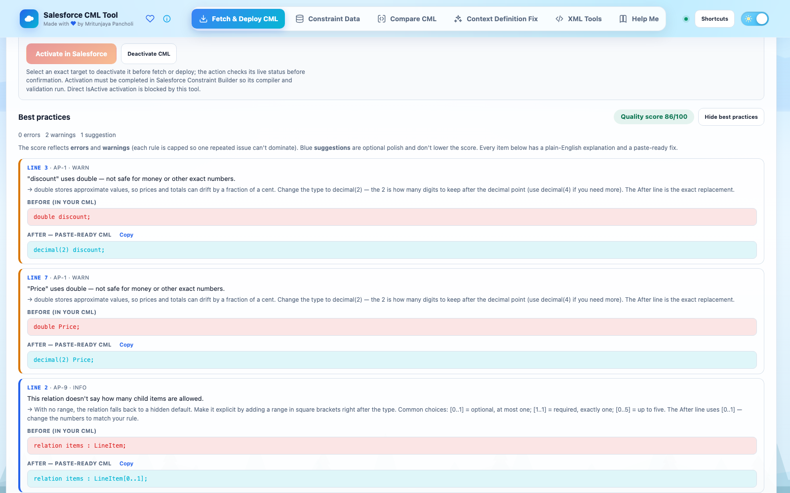
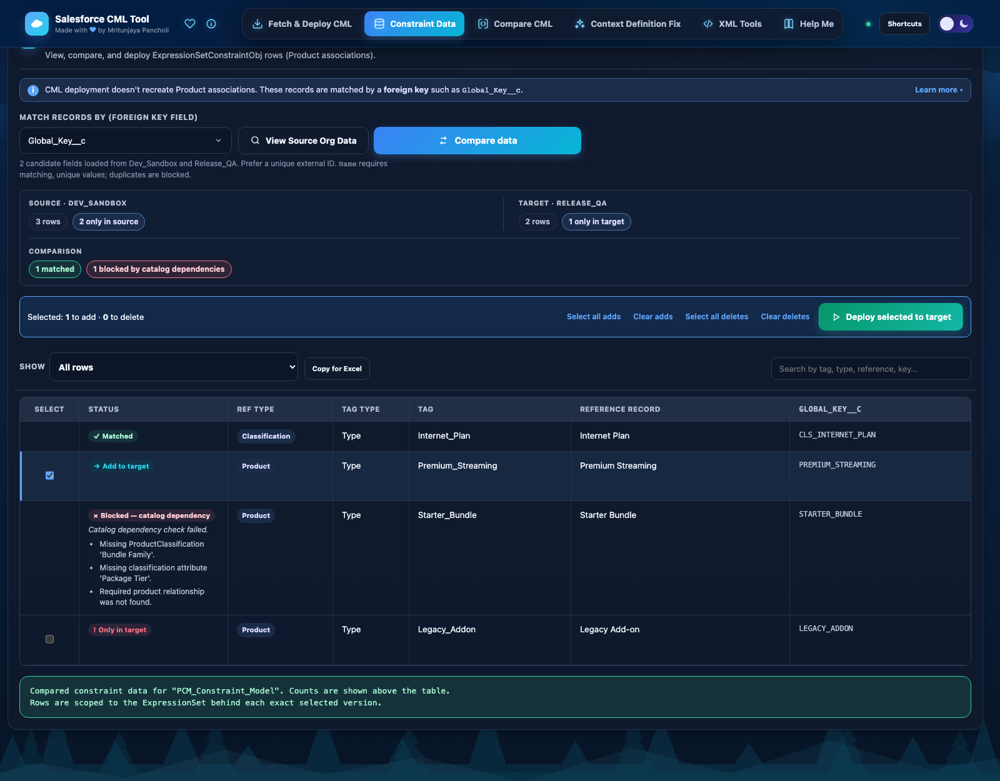
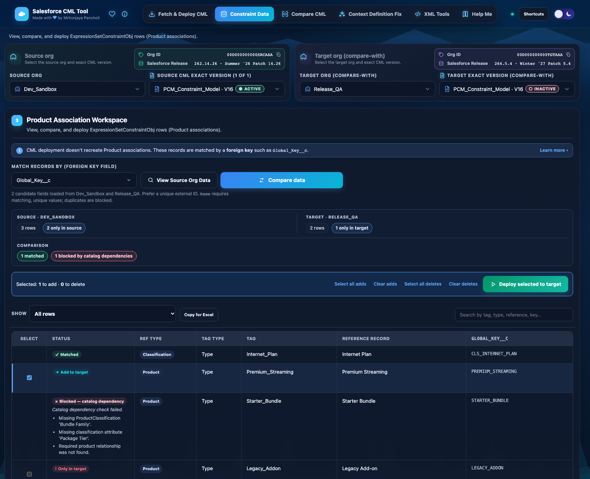
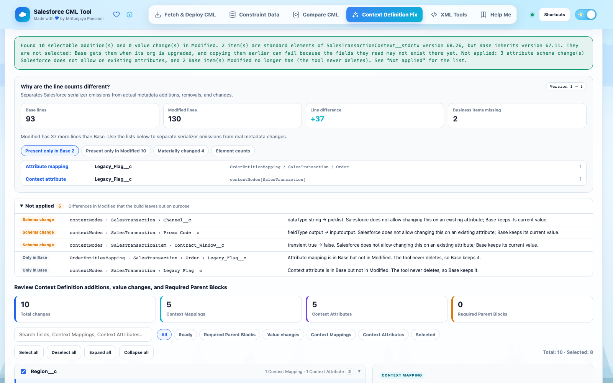
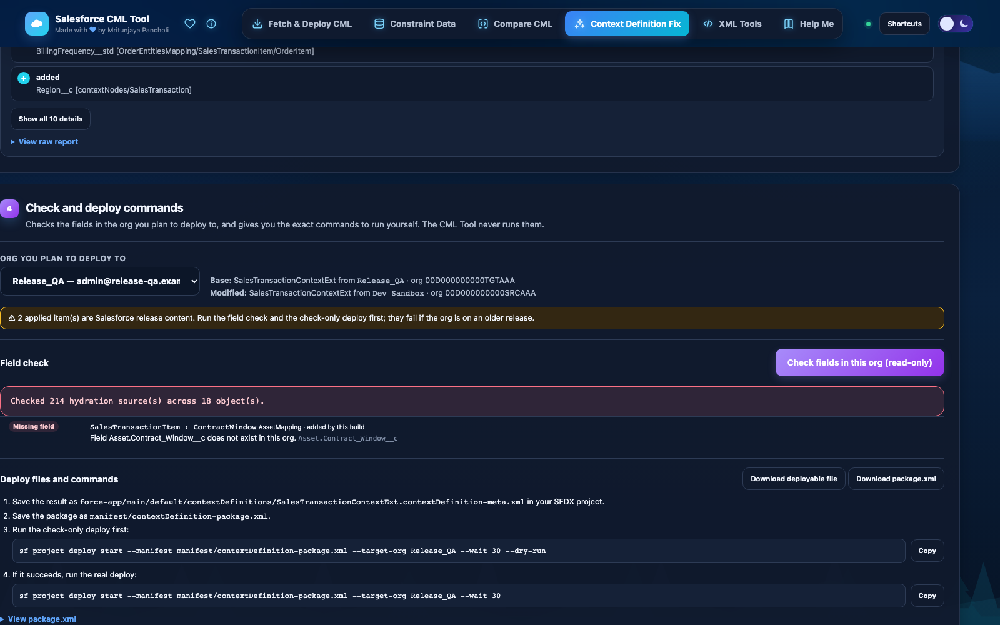
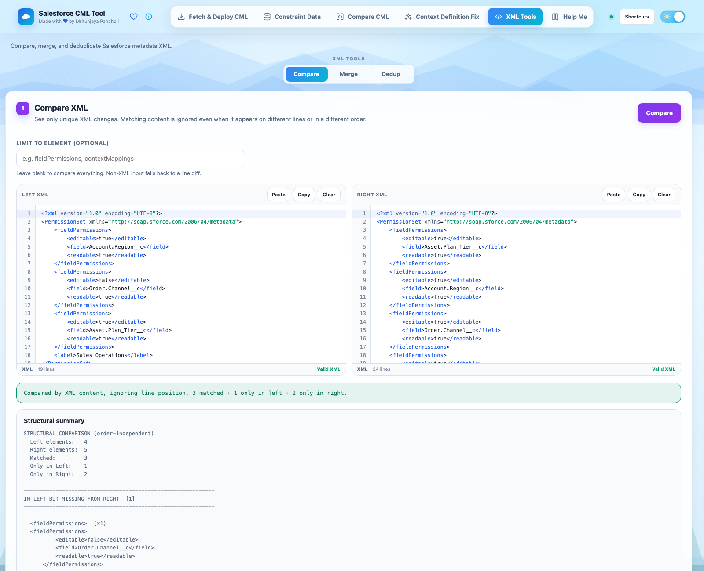
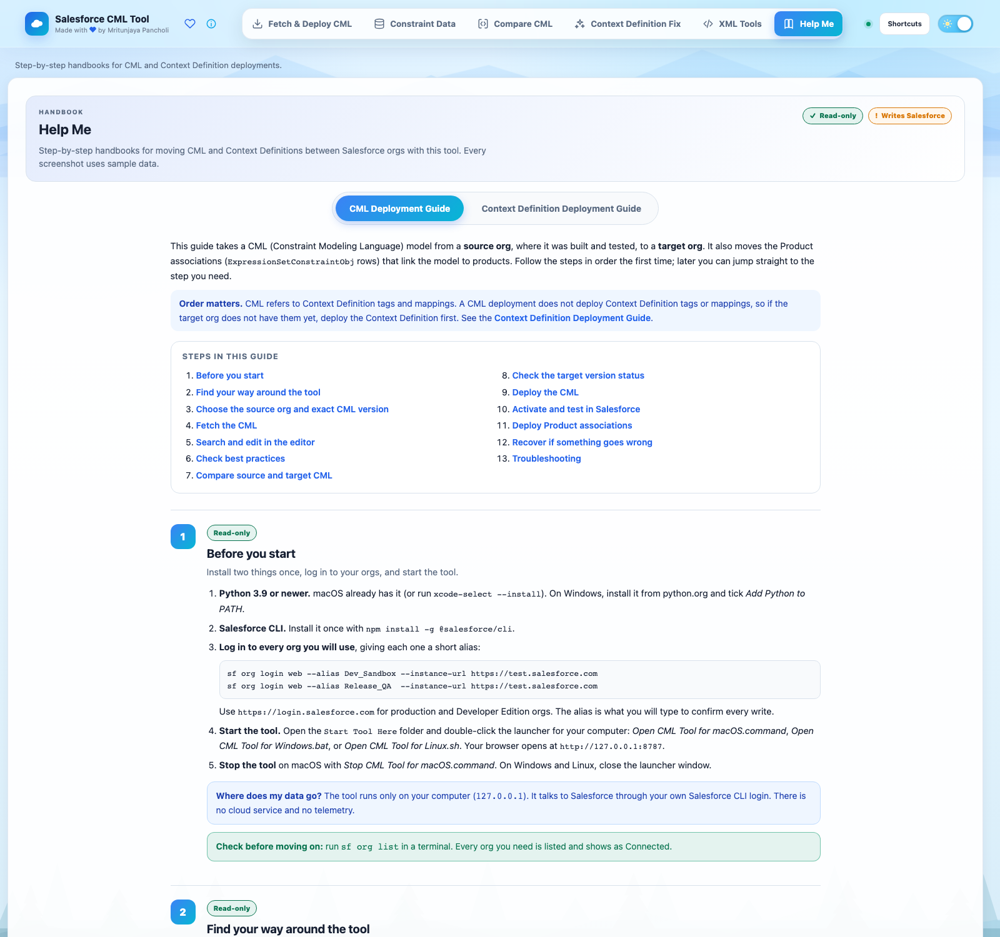

<!-- cover -->
# Salesforce CML Tool
Security & Operations Handbook — for Security Review and Approval
Product version: 2.0.2 (desktop tool and companion Chrome extension)
Document version: 1.3 · Date: 8 October 2026
Owner and maintainer: Mritunjaya Pancholi
Classification: Internal — for security review
Status: Submitted for approval
<!-- /cover -->

# Document control

| Field | Value |
|---|---|
| Document title | Salesforce CML Tool — Security & Operations Handbook |
| Document version | 1.3 |
| Product version reviewed | 2.0.2 (`main/VERSION`), Chrome extension 2.0.2 (`manifest.json`) |
| Date | 8 October 2026 |
| Author / tool owner | Mritunjaya Pancholi |
| Intended approvers | Information Security, Salesforce Platform Owner, Change Advisory Board (CAB) |
| Source of truth | The application source code at the reviewed version. Where this handbook and older documents disagree, this handbook records the code-verified behaviour and lists the discrepancy (Chapter 16.4). |
| Related documents | `CML_TOOL_COMPLETE_GUIDE.md` (functional guide v1.3), `SECURITY.md`, `COMPATIBILITY.md`, `THIRD_PARTY_NOTICES.md`, `CHANGELOG.md` |

## Revision history

| Version | Date | Author | Change |
|---|---|---|---|
| 1.0 | 2026-10-03 | M. Pancholi | First security-review edition. Built from the complete guide, the policy files, and a line-by-line verification of the 2.0.1 source (Python backend, browser UI, Chrome extension, build and release scripts). |
| 1.1 | 2026-10-03 | M. Pancholi | Added Chapter 25 (getting unstuck, step by step, with the tool's own messages). Added D-08: the in-app Help Me guide orders activation before association deploy, which the Active-parent block prevents. Added test 39. |
| 1.2 | 2026-10-03 | M. Pancholi | Corrections against the 2.0.1 source: cover version aligned with document control; backend module count; `/api/debug` is POST; field-check API version; source-control layout; Playwright browser matrix; Heading 1 for Document control and Contents so a generated table of contents is complete. |
| 1.3 | 2026-10-08 | M. Pancholi | Aligned with product 2.0.2: Fetch & Deploy has no Activate/Deactivate UI; Check target status is read-only; blocked PRC rows report identity field mismatches. |

## How to read this handbook

- **Security reviewers** should start with Chapter 1 (executive summary), Chapter 4 (architecture and trust boundaries), Chapter 15 (threat model) and Chapter 16 (risk register and conditions of approval). Appendix E answers the usual security-questionnaire items in one place.
- **Salesforce platform owners and CAB members** should read Chapter 7 (permissions), Chapter 11 (write boundary and change-safety controls), Chapter 21 (operating procedure and go/no-go) and Chapter 22 (recovery runbooks).
- **Operators** should read Chapters 5, 20, 21, 22, 23 and 25. Chapter 25 is the step-by-step companion to use when stuck during a deployment.
- Every factual claim about behaviour is tied to a source file and line in Appendix G so that a reviewer can check it.

> **Google Docs tip:** after importing, place the cursor under **Contents** and choose **Insert → Table of contents**, so the list links to every heading. Document control, Contents, numbered chapters and appendices are Heading 1; sections are Heading 2–4. The document outline (View → Show outline) builds from the same styles.

## Approval sign-off

| Role | Name | Decision (Approve / Approve with conditions / Reject) | Signature | Date |
|---|---|---|---|---|
| Information Security reviewer | | | | |
| Salesforce Platform Owner | | | | |
| Change Advisory Board | | | | |
| Tool owner | Mritunjaya Pancholi | Submitted | | 2026-10-03 |

Conditions of approval, if any, are recorded in Chapter 16.3 and must be signed off in Appendix H.

# Contents

*Insert a Google Docs table of contents here (Insert → Table of contents). Front matter is Document control. The numbered chapters are:*

1. Executive summary
2. Business context and problem statement
3. Scope of this review
4. Architecture and trust boundaries
5. Features and data flows
6. Data inventory and classification
7. Identity, authentication and authorization
8. Secrets and credential handling
9. Local API and network security
10. Input validation and injection defences
11. Salesforce write boundary and change-safety controls
12. Chrome extension security model
13. Logging, audit and evidence
14. Local storage, retention and disposal
15. Threat model (STRIDE)
16. Risk register and conditions of approval
17. Control mapping (OWASP ASVS / Top 10)
18. Secure development lifecycle
19. Third-party components and supply chain
20. Installation and hardening guide
21. Operating procedures and go/no-go
22. Incident response and recovery runbooks
23. Troubleshooting
24. Known limitations and non-goals
25. Getting unstuck: step-by-step deployment companion

Appendices: A — Local API route reference · B — Artifact schemas · C — Status and error reference · D — Sandbox validation test matrix · E — Security questionnaire quick answers · F — Glossary · G — Evidence index · H — Approval record


# 1. Executive summary

## 1.1 What the tool is

The Salesforce CML Tool is a **locally run, single-operator utility** for moving Salesforce Revenue Cloud **Constraint Modeling Language (CML)** models and their **Expression Set Constraint Object (ESCO)** associations between Salesforce orgs that the operator is already authorised to use. It also provides read-only analysis: exact and structural (semantic) comparison of CML, a best-practice linter, a Context Definition analysis helper, and XML compare, merge and de-duplicate utilities.

It ships in two forms that share one user interface:

| Form | How it runs | How it reaches Salesforce |
|---|---|---|
| **Desktop tool** | A Python 3.9–3.13 process using only the standard library. It listens on `127.0.0.1` (loopback only) and the operator opens it in a local browser. | Uses the operator's existing **Salesforce CLI** (`sf`) login to get an access token, then calls Salesforce REST API v66.0 over HTTPS. |
| **Chrome extension** | A Manifest V3 extension, loaded unpacked, with no server component. | Reuses the Salesforce browser session (the `sid` cookie) of a Salesforce tab the operator already has open, and calls Salesforce REST from the extension's service worker. |

Neither form has a hosted backend, a database server, user accounts, telemetry, or any third-party runtime dependency. The only third-party code at runtime is the MIT-licensed CodeMirror 6 editor, vendored as a local file.

## 1.2 What it is allowed to change in Salesforce

The tool's write surface is deliberately narrow. It can write exactly three things:

1. `ExpressionSetDefinitionVersion.ConstraintModel` — the CML text of one exact, **non-Active** model version.
2. `ExpressionSetVersion.IsActive = false` — **deactivation only**, of one exact runtime version, with typed confirmation. The Fetch & Deploy UI does not expose this; deactivate in Salesforce Constraint Builder. Activation (`IsActive = true`) is blocked in code so the platform compiler validates the model.
3. `ExpressionSetConstraintObj` (ESCO) records — **insert and delete only**, in chunks of at most 200 records.

It never writes products, classifications, attributes, component groups, product relationships, selling models, Context Definition metadata, or any other object. It never runs a Metadata API deploy. The Context Definition helper only *displays* `sf project deploy` commands for the operator to review and run through their normal process.

## 1.3 Why it is low risk to approve, with conditions

| Area | Position |
|---|---|
| Exposure | Loopback-only listener (`127.0.0.1`), Host allowlist (blocks DNS rebinding), Origin check, per-process CSRF token on every POST, strict Content Security Policy, 10 MiB request cap. No inbound network exposure. |
| Credentials | No credential is stored by the tool. Tokens live only in process memory (desktop) or service-worker memory (extension), are sent only to the Salesforce instance over TLS, and are redacted from error output. |
| Authorisation | The tool can do nothing the operator's own Salesforce user cannot already do. It adds restrictions on top of Salesforce permissions (write allowlist, typed confirmation, Active-version blocking); it never broadens them. |
| Change safety | Typed target-alias confirmation, server-side re-validation of every selection, SHA-256 backups before every write, byte-exact read-after-write verification with automatic rollback, deletion archives before every delete, per-model locks, per-row results, and a JSONL audit log. |
| Supply chain | Python standard library only. One vendored, MIT-licensed front-end bundle. Development tooling (esbuild, Playwright) is never shipped. |
| Data residency | All artifacts stay on the operator's computer (desktop) or in the Chrome profile's IndexedDB (extension). Nothing is sent to any service other than the selected Salesforce org and, for the release-name banner only, the public Salesforce Trust status API. |

The review found **no critical or high-severity issues**. It found a small set of **medium and low hardening items** — chiefly XML entity-expansion protection, validation of the org alias before it reaches the CLI on Windows, provenance of imported backups in the extension, the extension's broad permissions and unpacked distribution, consistent HTML escaping in the UI, and a few documentation inaccuracies. These are listed with owners and target releases in Chapter 16. None of them can be exploited remotely. Each one needs the attacker to have already compromised the operator's computer, or to trick the operator into pasting or importing a hostile file. One item (R-05) is a publication-hygiene issue: real org identifiers in test fixtures must be removed before the source is published.

## 1.4 Recommendation

**Approve for supervised use by named operators**, under the conditions in Chapter 16.3:

- the tool is used only from a managed workstation, by a named operator, against orgs the operator is already authorised for;
- every production write follows the go/no-go checklist in Chapter 21 under an approved change record;
- the medium-severity items R-01 to R-05 are fixed in the next release (2.0.2) or are accepted in writing by Information Security before production use; and
- runtime artifacts are stored only in an approved, access-controlled location and are never committed to source control.

# 2. Business context and problem statement

## 2.1 Why the tool exists

Revenue Cloud product-configuration rules are written in CML and stored on `ExpressionSetDefinitionVersion` records. A working model is more than its text: each `type` and `relation` tag in the CML is bound to catalog records (products, classifications, product-related components) through ESCO rows. Moving a model from one org to another — sandbox to UAT, UAT to production — therefore has two parts that must agree, and doing it by hand has several traps:

| Problem | What goes wrong when done by hand |
|---|---|
| CML text and ESCO data are separate | Copying the text alone leaves the model with no or wrong catalog bindings. |
| Salesforce record IDs differ in every org | ESCO rows exported from one org reference IDs that do not exist in the target; re-importing them fails or, worse, binds to the wrong record. |
| CML and ESCO can drift | An ESCO row may refer to a tag the CML no longer defines (stale), or the two orgs' CML may define different tags. |
| Activation depends on catalog state | A model may save but fail to activate, or activate with missing dependencies. |
| Line diffs are noisy | Formatting, comments and re-ordering hide the real structural change. |
| CLI output may redact tokens | Newer `sf` versions redact the token in `sf org display`, breaking simple scripts. |
| Production writes are destructive and can partially fail | An overwrite has no built-in undo; a collection insert or delete can succeed for some rows and fail for others. |

## 2.2 How the tool answers each problem

| Problem | Tool control | What stays with the operator |
|---|---|---|
| Text must move between orgs | Fetch and PATCH the exact selected version only; back up first; verify the saved bytes | Choose and review the exact source and target versions |
| Org-specific IDs | Match by a **portable business key** and re-resolve target IDs at deploy time | Keep key values populated, stable and unique |
| CML/ESCO drift | Parse each org's exact CML for Type/Port tags; classify `stale` and `cml-difference` rows as non-deployable | Decide the intended CML and catalog state |
| Missing catalog prerequisites | Read-only dependency preflight with blocking statuses | Deploy catalog data through its owning process |
| Noisy diffs | Bounded Myers line diff plus a structural semantic overlay | Interpret the significance of changes |
| Token redaction | Fall back to `sf org auth show-access-token`; hold the token only in memory | Authenticate and protect local CLI state |
| Accidental production write | Explicit `None` defaults, typed alias confirmation re-checked by the server | Follow change-control approval |
| Failed or partial write | Backup, verification, automatic rollback attempt, deletion archive, per-row results, `recoveryRequired` flag, audit log | Review, reconcile and retain evidence |

## 2.3 Who uses it

The intended users are a small number of named Salesforce Revenue Cloud developers and release engineers who already hold Salesforce access to the source and target orgs. The tool is not a self-service portal, has no multi-user mode, and is not intended for business users.

## 2.4 Alternatives considered

| Alternative | Why it is not sufficient on its own |
|---|---|
| Manual copy and paste in Constraint Builder | No backup, no verification, no ESCO handling, high error rate. |
| Metadata API / change sets | CML content and ESCO rows are data, not metadata; IDs are not portable. |
| Data Loader / `sf data` commands | Bulk tools do not understand portable identity, CML tags, or the Active-version rules, and offer no rollback. |
| Custom scripts | Each script repeats the same risks without the guardrails, tests and audit trail. |

# 3. Scope of this review

## 3.1 In scope

| Component | Location | Version |
|---|---|---|
| Desktop Python backend | `salesforce-cml-tool/main/app/` (10 modules, plus the guarded CLI under `utilities/`) | 2.0.2 |
| Browser UI (shared by both forms) | `main/templates/index.html`, `main/assets/` | 2.0.2 |
| Vendored editor | `main/assets/vendor/codemirror.bundle.js` (CodeMirror 6 + Lezer) | as pinned in `development/package-lock.json` |
| Optional guarded CLI | `main/app/utilities/cml_cli.py` | 2.0.2 |
| Launchers | `Start Tool Here/` (macOS, Linux, Windows) | 2.0.2 |
| Chrome extension | `salesforce-cml-tool-chrome-extension/extension/` | 2.0.2 |
| Build, test and release scripts | `development/`, `.github/workflows/`, extension `scripts/` | 2.0.2 |

### Backend module sizes (lines of code)

| Module | Lines | Responsibility |
|---|---:|---|
| `cml_xml.py` | 2,881 | XML compare, merge, de-duplicate and Context Definition helpers |
| `cml_constraints.py` | 2,251 | ESCO export, matching, dependency preflight, deploy, restore |
| `cml_analysis.py` | 1,378 | Tokenizer, tolerant parser, semantic comparison |
| `cml_tool.py` | 1,276 | Composition root, locks, operation registry, server lifecycle |
| `cml_tool_page.py` | 14 | HTML page loader (CSRF placeholder substitution) |
| `cml_lifecycle.py` | 871 | Exact-version fetch, deploy, verify, rollback, deactivate |
| `cml_salesforce.py` | 579 | CLI discovery, credentials, REST transport, ESCO write allowlist |
| `cml_context_definition.py` | 449 | Context Definition retrieve, field check, deploy-command text |
| `cml_http.py` | 391 | Host/Origin/CSRF/CSP/body-size controls and routing |
| `cml_artifacts.py` | 199 | Safe filenames, atomic private files, audit append |

Front-end: `app.js` (3,795 lines) and `xml-tools.js` (1,036 lines).

## 3.2 Out of scope

- The Salesforce platform itself, the Salesforce CLI, Chrome, Python and the operating system. These are treated as trusted dependencies.
- Organisation-specific Salesforce permission-set design (guidance is given in Chapter 7).
- Catalog data quality, CML model correctness, and activation behaviour inside Salesforce.

## 3.3 Method

1. Read the complete functional guide (v1.3), `SECURITY.md`, `COMPATIBILITY.md`, `THIRD_PARTY_NOTICES.md` and `CHANGELOG.md`.
2. Verified each security-relevant claim against the 2.0.1 source code, line by line, in four independent passes: Python backend; Context Definition and XML; Chrome extension; and SDLC, supply chain and front end.
3. Recorded every gap between documentation and code as either a risk-register item (Chapter 16) or a documentation correction (Chapter 16.4).
4. Confirmed on the reference workstation that the bundled Python is 3.9.6 with expat 2.2.8, which matters for finding R-01.

## 3.4 Review limitations

This is a **design and code review with a self-assessed control mapping**, not a third-party penetration test. Dynamic testing was limited to the project's automated test suites. Live Salesforce write scenarios (save, restore, activation) are documented in Appendix D and must be run in an approved sandbox as a condition of production use.


# 4. Architecture and trust boundaries

## 4.1 Component view — desktop tool

| # | Component | Description |
|---|---|---|
| 1 | Operator's browser | Loads the UI from `http://127.0.0.1:<port>/`. Runs the editor, line diff, linter and XML Tools rendering. Holds no Salesforce credential. |
| 2 | Local HTTP server (`cml_http.py`) | Python `ThreadingHTTPServer` bound to `127.0.0.1` only. Enforces Host, Origin, CSRF, body-size and security-header controls and routes requests. |
| 3 | Guarded services (`cml_lifecycle.py`, `cml_constraints.py`, `cml_context_definition.py`) | Business rules: exact-version ownership, Active-version blocking, backup, verify, rollback, ESCO matching and preflight, deletion archives. |
| 4 | Analysis (`cml_analysis.py`, `cml_xml.py`) | Pure local computation: semantic CML comparison, XML compare, merge and de-duplicate. No network calls. |
| 5 | Salesforce transport (`cml_salesforce.py`) | Locates and calls the `sf` CLI for credentials; sends REST/SOAP over HTTPS; enforces the lowest-level ESCO write allowlist. |
| 6 | Artifacts (`cml_artifacts.py`) | Private, atomic JSON files for backups, archives, reports and the audit log under `CML_RUNTIME_ROOT`. |
| 7 | Salesforce CLI (`sf`) | External, trusted. Holds the operator's org authorisations in the operator's home directory. |
| 8 | Salesforce org(s) | External, trusted. Reached only at the instance URL returned by `sf`. |
| 9 | Salesforce Trust status API | External, public, unauthenticated. Used only to show the org's release name. |

## 4.2 Component view — Chrome extension

| # | Component | Description |
|---|---|---|
| 1 | Extension page (`index.html`) | The same UI as the desktop tool, copied in by `scripts/sync-assets.py`. Sends requests to the service worker with `chrome.runtime.sendMessage` instead of HTTP. |
| 2 | Service worker (`background.js` + `lib/*.js`) | Re-implements the guarded services in JavaScript: routing, session discovery, REST transport, lifecycle, ESCO, XML and Context Definition. Holds the session in memory only. |
| 3 | IndexedDB `cml-tool` | Backups, deployment reports and deletion archives for this Chrome profile only. |
| 4 | Salesforce tabs and cookies | The operator's existing Salesforce browser session (`sid` cookie), read through the `cookies` permission. |
| 5 | Salesforce org(s) and Trust status API | As for the desktop tool. |

In 2.0.1 the extension does **not** talk to the desktop Python server. Its runtime config sets `transport: "extension"` with no API base, its CSP has no `127.0.0.1` entry, and a test asserts this.

## 4.3 Trust boundaries

| ID | Boundary | What crosses it | Controls at the boundary |
|---|---|---|---|
| TB-1 | Other processes and web pages → local HTTP server | HTTP requests to `127.0.0.1:<port>` | Loopback bind; Host allowlist; Origin allowlist on POST/OPTIONS; CSRF token on every POST; 10 MiB cap; generic 500 errors |
| TB-2 | Browser UI → backend (same operator) | JSON requests carrying selections, CML text, XML | Server treats UI input as untrusted: re-queries ownership, re-runs comparisons, validates IDs, names and keys |
| TB-3 | Backend → Salesforce CLI | Process execution with an argument list | `subprocess.run` with an argv list (no shell on macOS/Linux); fixed set of commands; 120 s timeout |
| TB-4 | Backend / extension → Salesforce | HTTPS REST and SOAP with a bearer token | TLS with certificate and hostname verification; write allowlist; typed confirmation; Active-version blocking |
| TB-5 | Backend / extension → local storage | Backups, archives, reports, audit | `0700` directories, `0600` files, atomic writes, safe filenames, basename-only reads |
| TB-6 | Web pages / other extensions → extension service worker | Chrome messages | No `externally_connectable`, no `onMessageExternal`; internal handler rejects messages from other extension IDs |
| TB-7 | Backend / extension → Trust status API | Instance name (for example `NA123`) | Read-only GET; no token; 6 s timeout |

## 4.4 Request flow — desktop tool

1. The operator starts the tool with a launcher or `python3 main/app/cml_tool.py`.
2. On start-up the tool probes `http://127.0.0.1:<port>/api/ping`. If an older build of the same tool is running there, it asks it to quit using that process's CSRF token. If the port belongs to some other program, the tool exits instead of picking a different port.
3. The browser loads `/`. The server injects the per-process CSRF token into a `<meta>` tag.
4. The UI calls `GET /api/orgs` (alias, username and org ID only — no tokens) and then `GET /api/models?org=…`.
5. Read operations (fetch, compare, data export) are POSTs carrying the CSRF token. The backend gets credentials from `sf`, queries Salesforce over HTTPS, and returns results.
6. Write operations additionally require `confirmTarget` to equal the target alias exactly. The backend re-resolves ownership and status, writes a backup or archive, takes the per-model lock, performs the write, verifies it, writes the report and audit line, and returns per-row results.
7. The UI never refreshes a comparison silently after a write; the operator must compare again.

## 4.5 Request flow — Chrome extension

1. The operator opens a Salesforce org in Chrome and logs in normally.
2. The extension page asks the service worker for orgs. The worker reads `sid` cookies for Salesforce domains, keeps those whose org-ID prefix matches an open, allowed Salesforce tab, and confirms the identity through the Salesforce identity endpoint.
3. The page receives only alias, username, org ID, a usable flag and any warning.
4. All other operations follow the same guarded sequence as the desktop tool, implemented in `lib/lifecycle.js` and `lib/esco.js`, with artifacts stored in IndexedDB.

## 4.6 Deployment model

- One operator, one workstation, one process (or one Chrome profile).
- No server installation, no service account, no scheduler, no shared database.
- The tool runs with the operating-system rights of the user who starts it and the Salesforce rights of that user's CLI or browser login.

# 5. Features and data flows

The application has six views reached from one top navigation bar. Every view is labelled in the in-app guide as **Read-only** or **Writes Salesforce**.

| View | Purpose | Writes Salesforce? |
|---|---|---|
| Fetch & Deploy CML | Fetch one exact version, edit it, check best practices, check target status (read-only), deploy to one exact non-Active target version, restore from backup | **Yes** (CML PATCH) |
| Constraint Data | Export, compare and deploy ESCO associations by portable key; restore deleted associations | **Yes** (ESCO insert/delete) |
| Compare CML | Exact line diff and semantic overlay between two orgs; build a target draft | No (draft is handed to Fetch & Deploy) |
| Context Definition Fix | Retrieve and analyse Context Definitions, build corrected XML, check fields, show deploy commands | No (commands are displayed, never run) |
| XML Tools | Compare, merge and de-duplicate XML files | No (local only) |
| Help Me | Static, step-by-step guides with screenshots | No (makes no API request at all) |

All screenshots in this chapter were taken with synthetic sample data.

## 5.1 Fetch & Deploy CML



**Data flow.** Source org and exact source version are selected (both default to `None`). `POST /api/fetch` re-queries the version ID, confirms it belongs to the named model, reads the `ConstraintModel` blob, saves a copy under `cml-files/`, and returns the text to the editor. Deploy sends the exact target version ID, the content and `confirmTarget`.

**Controls on deploy.**

- Target org, model, exact target version and non-empty content are required.
- The operator types the target alias into a dialog; the server repeats the check.
- The server re-queries ownership and status and **refuses Active or unknown-status versions**.
- The current target CML is saved as a SHA-256-stamped backup before the PATCH; if the backup cannot be saved, nothing is written.
- Only `ConstraintModel` on that one version is patched.
- The tool re-reads the version up to four times and requires an exact text match. If it does not match, it automatically restores the previous content and verifies that too.

**Check target status.** Read-only. The Target version status panel reports whether the exact target version is Active, Inactive, or write-blocked. Fetch & Deploy does not activate or deactivate CML; do that in Salesforce Constraint Builder, then check status again. Requests to activate (`IsActive=true`) are rejected by the server.

**Restore backup.** Rollback checks that the backup's stored SHA-256 matches its content and that it belongs to the same exact version, takes a fresh safety backup, then patches and verifies.

**Editor safety.** No autosave to disk. A debounced draft copy is kept in the browser tab's `sessionStorage` only, scoped by org, model and version, and offered back with explicit Restore and Discard choices.

## 5.2 Compare CML



Both exact versions are fetched (`POST /api/compare`). The browser runs a bounded Myers line diff (at most 4,000,000 trace cells and 100,000 combined lines; beyond that it falls back to one coarse replacement block). The optional semantic overlay calls `POST /api/semantic/compare`, which parses both texts locally with the tolerant parser and reports Moved, Added, Removed, Modified, Unchanged and Ambiguous entities. Merge arrows change only a **local target draft**; nothing reaches Salesforce until the draft is loaded into Fetch & Deploy and passes the normal guarded deploy. Semantic analysis has its own limits (`CML_SEMANTIC_MAX_CHARS`, `_LINES`, `_SECONDS`, `_CONCURRENCY`).

## 5.3 Best-practice check



A browser-side linter scores the editor text from 100 down (error 15, warning 6, information 2; at most 12 points per rule) for rules AP-1, AP-3 to AP-6, AP-8, AP-9, BP-2 and REC. It sends nothing anywhere. Findings are guidance only and do not replace Salesforce compilation.

## 5.4 Constraint Data — export, compare, preflight



**Data flow.** `POST /api/data/compare` maps each exact version through `ExpressionSetVersion` to exactly one parent Expression Set (zero or multiple parents block), exports ESCO rows, reads both exact CMLs for Type and Port tags, and pairs rows by a **portable identity**:

`tag type ␟ tag ␟ reference object type ␟ selected key value`

`ProductRelatedComponent` rows use a richer **PRC identity v2** made of parent and child keys, relationship type, component group, selling models and ten stable discriminator fields. The key field is chosen explicitly by the operator from live object descriptions and must be a plain API name of up to 80 characters.

Each row gets a status (`matched`, `ready`, `extra`, `cml-difference`, `stale`, `exact-duplicate`, `ambiguous-key`, `blocked`, `dependency-unverified`, `unmappable`). Only `ready` rows can be added (selected by default) and only fresh target-only `extra` rows can be deleted (never selected by default). The full matrix is in Appendix C.

**Copy for Excel** copies the visible rows to the clipboard as tab-separated text; it does not create a file.

## 5.5 Constraint Data — deploy and restore



The browser submits **only IDs** (source ESCO IDs to add, target ESCO IDs to delete) plus `confirmTarget`. The server ignores any status the browser claims and:

1. re-runs the full comparison;
2. accepts an addition only if it is still in the fresh source-only set with status `ready`;
3. accepts a deletion only if it is still in the fresh target-only set, is not `cml-difference`, starts with the ESCO prefix `1JE`, and is found again under the target model;
4. backs up the target CML and writes a **deletion archive** before any delete (no archive, no delete);
5. inserts and deletes in chunks of at most 200 with `allOrNone=false`, re-resolving references and dependencies for every chunk;
6. performs an unchanged-CML save and exact verification afterwards (a tool-specific "validation refresh", not activation);
7. returns per-row results, `outcome` (`success`, `partial`, `failed`, `skipped`) and `recoveryRequired`, and writes a report and one audit line.

**Restore deleted associations** re-inserts archived rows after typed confirmation. It resolves *current* IDs by portable identity (never replaying archived IDs), skips rows already present, and blocks on zero or multiple matches. Weak legacy PRC archives are refused.

## 5.6 Context Definition Fix



**Purpose.** CML attributes resolve at runtime through Context Definition tags and mappings, which are metadata the tool does not deploy. This view helps the operator find and correct gaps.

**Data flow.**

- `GET /api/context-definitions` lists Context Definitions with the Metadata SOAP API `listMetadata`.
- `POST /api/context-definitions/retrieve` calls `retrieve` and `checkRetrieveStatus`. The returned zip is processed **in memory**; nothing is written to disk.
- `POST /api/cdfix/analyze` and `/api/cdfix/build` are local XML processing that show Sources, Not applied items and the proposed corrected XML.
- `POST /api/cdfix/preflight` is a **read-only** Tooling API `FieldDefinition` query at the **org's newest API version** (v66.0 is the floor) to confirm the fields exist. Object names are validated and the query is URL-encoded; field names never go into SOQL.
- `POST /api/cdfix/deploy-plan` returns **text only**: the `sf project deploy start …` commands the operator would run through their normal metadata process.



**Security position.** No Metadata API deploy call exists in the tool. The deploy-plan target alias is validated (`^[A-Za-z0-9][A-Za-z0-9._@+\-]{0,254}$`) and shell-quoted, and the name is validated and XML-escaped, so the displayed command is safe to copy.

## 5.7 XML Tools



`POST /api/xml/compare`, `/api/xml/merge` and `/api/xml/dedup` are pure local functions with **no Salesforce calls**. Results are downloaded in the browser as a Blob with a sanitised filename (characters outside `[\w.\-]` become `_`, at most 120 characters). XML parsing hardening is covered in Chapter 10.4 and risk R-01.

## 5.8 Help Me



Two static guides — a 13-step CML Deployment Guide and an 11-step Context Definition Deployment Guide — each step labelled Read-only or Writes Salesforce. Opening the view makes **no API request**; this is covered by an automated test.

## 5.9 Extension mode

The extension shows the same six views. Differences that matter for security:

- Org discovery uses open Salesforce tabs and `sid` cookies, not the CLI (Chapter 12).
- Backups, reports and archives are stored in IndexedDB for that Chrome profile, kept for 90 days and at most 50 per target.
- Backups and archives can be **imported** from files; see risk R-03.
- The in-extension Help text was copied from the desktop tool and still says "runs only on 127.0.0.1" and "Salesforce CLI login", which is inaccurate in the extension (documentation item D-05).


# 6. Data inventory and classification

## 6.1 Data the tool handles

| Data item | Source | Where it is held | Persistence | Suggested classification |
|---|---|---|---|---|
| Salesforce access token (desktop) | `sf org display` / `sf org auth show-access-token` | Python process memory (`_CREDS_CACHE`) | Discarded at process exit | **Secret** |
| Salesforce session ID (extension) | `sid` cookie of an open Salesforce tab | Service-worker memory (`sessionsByAlias`) | Discarded when the worker stops | **Secret** |
| Local CSRF token | `secrets.token_urlsafe(32)` per process | Process memory, page `<meta>` tag | Per process | Internal (local only) |
| Org alias, username, org ID | `sf org list` / identity endpoint | Memory; reports; audit log | Artifacts: 90 days default | Internal |
| CML model text | `ExpressionSetDefinitionVersion.ConstraintModel` | Editor; `cml-files/`; `cml-backups/`; IndexedDB (extension) | 90 days default | **Confidential** — business rules and product logic |
| ESCO rows and catalog identifiers | ESCO, Product2, ProductClassification, ProductRelatedComponent queries | Memory; deletion archives; reports | 90 days default | Confidential (record IDs, product codes and names) |
| Context Definition XML | Metadata `retrieve` | Memory only (zip handled in memory) | Not persisted by the backend; operator downloads | Confidential |
| XML files for XML Tools | Operator upload/paste | Memory; operator download | Not persisted by the backend | As per file content |
| Deployment reports | Generated | `deployment-reports/`; IndexedDB | 90 days default | Confidential (evidence) |
| Audit log | Generated | `logs/data-deploy-history.jsonl` | Append-only; operator-managed | Internal (evidence) |
| OS username | `getpass.getuser()` | Reports and audit log | As above | Internal |
| Editor draft | Operator typing | Browser `sessionStorage` for that tab | Until tab closes or draft is cleared | Confidential |

## 6.2 Personal data

The tool does not process customer personal data. It handles operator identifiers (Salesforce username, org alias, OS username) for audit purposes. Product and catalog records are business data. If catalog key fields in a particular org contain personal data (unusual), that data would appear in comparison results and archives and should be classified accordingly.

## 6.3 Data the tool never handles

- Passwords, MFA codes, OAuth client secrets, refresh tokens, or private keys.
- Customer records (Accounts, Contacts, Opportunities, Orders, Assets).
- Payment data.

## 6.4 Data leaving the workstation

| Destination | Data sent | Purpose |
|---|---|---|
| The selected Salesforce org instance (HTTPS) | Bearer token or session ID; SOQL queries; CML content on deploy; ESCO records on insert; IDs on delete | Core function |
| `https://api.status.salesforce.com/v1/instances/{instance}/status` | Instance name only (for example `USA123S`); no token, no org ID | Release-name banner |
| Nothing else | — | No telemetry, analytics, update check, CDN or crash reporting |

The donation links in the header (`razorpay.me`, LinkedIn) are plain hyperlinks; nothing is fetched from them unless the operator clicks.

# 7. Identity, authentication and authorization

## 7.1 Operator identity

The tool has **no accounts of its own**. Identity is inherited:

- **Desktop:** the operating-system user who starts the process, and that user's Salesforce CLI authorisations stored under their home directory. Another OS user on the same machine cannot use those authorisations.
- **Extension:** the Chrome profile, and the Salesforce user already logged in to a tab in that profile.

Every report and audit line records the OS user (`operatingSystemUser` / `operating_system_user`) and the target org alias.

## 7.2 Authentication to Salesforce

| Form | Mechanism | Notes |
|---|---|---|
| Desktop | Salesforce CLI web login (OAuth, with the org's own SSO/MFA policy) performed by the operator outside the tool. The tool reads the resulting access token with `sf org display --json` and, if that output is redacted, `sf org auth show-access-token --json --no-prompt`. | A value is accepted as a token only if it contains `!` and does not contain `REDACTED`. One refresh is attempted on an authentication error. |
| Extension | The operator's normal Salesforce browser login. The extension reads the `sid` cookie for that org and validates that the cookie's org-ID prefix matches the tab and that its domain is an API-usable host (Lightning, Visualforce and setup hosts are rejected). Identity is confirmed through the identity URL or `/services/oauth2/userinfo`. | Login, test and help hosts are blocked. Only `https` tabs are considered. |

The tool never asks for, receives or stores a Salesforce password.

## 7.3 Authorisation model

The tool **cannot exceed** the Salesforce permissions of the logged-in user. On top of those permissions it applies its own restrictions:

| Restriction | Enforced where |
|---|---|
| Only three write targets (CML field, IsActive=false, ESCO insert/delete) | Lifecycle and constraint services; lowest-level transport allowlist |
| `IsActive = true` always rejected | `cml_lifecycle.py:239-252`; extension `lifecycle.js:420-433` |
| Active or unknown-status targets refused | Lifecycle and constraint services, before any write |
| Typed alias must equal target org | Server side for every write path |
| Exact version must belong to the named model | Re-queried on every request |
| ESCO insert only for `attributes.type == "ExpressionSetConstraintObj"` | `cml_salesforce.py:500-513`; `rest.js:136-148` |
| ESCO delete only for IDs prefixed `1JE` that are fresh target-only rows | `cml_salesforce.py:545`; `cml_constraints.py:1983`; `rest.js:197-208` |

## 7.4 Least-privilege Salesforce access

The deploying user should be a named individual (not a shared integration user). Recommended minimum access, to be implemented as a dedicated permission set in each target org:

| Purpose | Object / permission | Access |
|---|---|---|
| Model discovery and fetch | `ExpressionSetDefinition`, `ExpressionSetDefinitionVersion`, `ExpressionSet`, `ExpressionSetVersion` | Read |
| CML deploy and rollback | `ExpressionSetDefinitionVersion.ConstraintModel` | Edit |
| Deactivation | `ExpressionSetVersion.IsActive` | Edit |
| ESCO export and compare | `ExpressionSetConstraintObj` | Read |
| ESCO deploy and restore | `ExpressionSetConstraintObj` | Create, Delete |
| Dependency preflight | `Product2`, `ProductClassification`, `ProductClassificationAttr`, `ProductRelatedComponent`, `ProductComponentGroup`, `ProductRelationshipType`, `ProductSellingModel` and the chosen key fields | Read |
| Context Definition helper | API Enabled; Modify Metadata or View Setup sufficient for `listMetadata`/`retrieve`; Tooling API read of `FieldDefinition` | Read |
| All | API Enabled | Yes |

Exact permission names depend on the org's Revenue Cloud licence. Read-only reviewers (compare and export only) need only the Read rows. **Do not** grant Modify All Data to work around a permission error; the tool reports permission failures clearly and does not try to broaden access.

## 7.5 Separation of duties

The tool does not enforce separation of duties. It is designed to be used inside a change process that does:

- a peer reviewer inspects the exact and semantic CML differences and the planned ESCO adds and deletes;
- the change record names the operator, source, target, model and exact versions;
- production activation is performed in Constraint Builder, ideally by a different person or after a second review.

# 8. Secrets and credential handling

## 8.1 Desktop token lifecycle

1. **Acquire.** `sf org display --target-org <alias> --json`; if the token looks redacted, `sf org auth show-access-token --target-org <alias> --json --no-prompt` (`cml_salesforce.py:254-338`).
2. **Hold.** In process memory only: `_CREDS_CACHE[org] = (token, instanceUrl)` (`cml_tool.py:217`).
3. **Use.** Sent only as `Authorization: Bearer …` to the instance URL over HTTPS, and inside the SOAP `<met:sessionId>` element (XML-escaped) for Metadata reads.
4. **Refresh.** Once, after an authentication error.
5. **Discard.** When the process exits.

The token is **never** written to disk, logged, placed in a backup, report, archive or audit line, or returned to the browser. `/api/orgs` returns alias, username and org ID only.

## 8.2 Extension session lifecycle

1. **Acquire.** `chrome.cookies.get` / `getAll` for `sid` on Salesforce domains (`lib/session.js:14-45`).
2. **Validate.** Org-ID prefix and API-usable domain checks (`lib/session-core.js:37-139`), then identity confirmation (`lib/rest.js:82-114`).
3. **Hold.** Only in the service worker's in-memory `sessionsByAlias` map. There are no `chrome.storage` calls and IndexedDB holds no session.
4. **Use.** As `Authorization: Bearer` to the instance and in the SOAP `SessionHeader`.
5. **Discard.** When the service worker is stopped by Chrome or the browser closes.

## 8.3 Redaction of diagnostics

Error details that might contain credentials are scrubbed before they are shown:

- keys whose names look sensitive are dropped (`_SENSITIVE_KEY`, `cml_salesforce.py:25-28`);
- values matching bearer, token, session-ID and `xxxxxxxx!yyyyyyyy` token shapes are masked (`cml_salesforce.py:29-44`; extension `rest.js:5-10`);
- of the Salesforce response headers, only `Sforce-Limit-Info` and request-ID headers are kept (`cml_salesforce.py:109-114`).

## 8.4 Other secrets

| Secret | Handling |
|---|---|
| Local CSRF token | Generated per process with `secrets.token_urlsafe(32)` (256 bits). Never written to disk. See Chapter 9 and risks R-07 and R-08. |
| Extension signing key | The private key that fixes the extension ID is kept at `.local/cml-tool-extension.pem`, is git-ignored, and is excluded from packaged zips by `scripts/pack.py`. Only the public `key` is in `manifest.json`. |
| Repository secrets | None are needed at runtime. See Chapter 18 for the committed-secret scan. |

## 8.5 Operator rules

- Never paste an access token or session ID into CML, the UI, logs, screenshots or support tickets.
- Share `/api/debug` output (desktop, only when `CML_DEBUG=1`) only after review; it contains local paths and the OS username, but no tokens.
- Revoke the CLI session (`sf org logout --target-org <alias>`) when a workstation is reassigned.

# 9. Local API and network security

## 9.1 Listener

- Bound to `("127.0.0.1", port)` with Python's `ThreadingHTTPServer` (`cml_tool.py:1253`). There is **no option** to bind another address, no IPv6 listener and no TLS listener.
- Port from `CML_UI_PORT` (default `8787`). If the port is taken by another program the tool exits rather than choose a different port.
- Plain HTTP on loopback is acceptable because traffic never leaves the host; HSTS is therefore not applicable.

## 9.2 Request admission controls

| Control | Behaviour | Code |
|---|---|---|
| Host allowlist | Host must be `127.0.0.1`, `localhost` or `::1`, on GET, POST and OPTIONS. Blocks DNS-rebinding attacks. | `cml_http.py:83-86` |
| Origin check | On POST and OPTIONS: a missing Origin is allowed (non-browser local clients); otherwise the hostname must be loopback, or the Origin must be `chrome-extension://` plus an allowlisted ID. | `cml_http.py:109-119` |
| Extension allowlist | Pinned ID `kjjnjiakeemdgpenipimehklndhfbmmp`; more via `CML_EXTENSION_IDS`, each checked against `^[a-p]{32}$`. | `cml_http.py:15-41` |
| CORS | Only for an allowlisted extension Origin: that exact Origin is echoed (never `*`), with `Vary: Origin`. No `Allow-Credentials`. `Allow-Private-Network: true` on preflight only. | `cml_http.py:95-137` |
| CSRF | Every POST must carry `X-CML-CSRF` equal to the per-process token. | `cml_http.py:245` |
| Body size | Non-integer or negative `Content-Length` → 400. Over 10 MiB → 413. | `cml_http.py:250-263` |
| JSON | Invalid JSON → `{"ok":false,"log":"Invalid request body."}`. | `cml_http.py:265-270` |
| Errors | Unhandled exceptions → generic 500 `Unexpected server error.`; the stack trace goes only to the server's stderr. | `cml_http.py:138-142, 230-233, 272-275` |
| Debug route | `POST /api/debug` returns 404 unless `CML_DEBUG=1`. | `cml_tool.py:256-301` |
| Shutdown | `/api/quit` is POST-only and CSRF-protected. | `cml_http.py` |

## 9.3 Response headers

Every non-OPTIONS response is sent through one function (`_send`, `cml_http.py:64-79`) that adds:

```
Cache-Control: no-store, no-cache, must-revalidate
Content-Security-Policy: default-src 'self'; script-src 'self';
  style-src 'self' 'nonce-<per-process token>'; img-src 'self'; font-src 'self';
  connect-src 'self'; frame-ancestors 'none'; base-uri 'none';
  form-action 'none'; object-src 'none'
X-Content-Type-Options: nosniff
X-Frame-Options: DENY
Referrer-Policy: no-referrer
```

The CSP forbids inline and remote scripts, framing, plugins, form posts and off-origin connections from the page. Because `connect-src 'self'`, even a script bug in the page cannot send data to another host.

## 9.4 Why a malicious web page cannot drive the tool

1. It cannot **read** responses: no CORS headers are returned to web origins, so the browser's same-origin policy blocks reading `/api/ping` (which carries the CSRF token).
2. It cannot **write**: POSTs from a web origin fail the Origin check, and without the token they also fail the CSRF check.
3. It cannot use **DNS rebinding**: the Host header would be the attacker's hostname, which is not on the allowlist.
4. It cannot **frame** the UI: `frame-ancestors 'none'` and `X-Frame-Options: DENY`.

## 9.5 Local processes

Any process running as the same OS user can call `GET /api/ping`, obtain the token, and drive the API, because it can already read the user's Salesforce CLI credentials directly. The loopback API therefore **does not add** an attack path for local malware; the OS account is the security boundary. Processes running as *other* OS users can reach the port but gain nothing they could not get by calling Salesforce with their own credentials, because the tool always uses the credentials of the user who started it — such a process could, however, trigger operations under that user's login. This is why the tool must only be run on single-user workstations (Chapter 20).

## 9.6 Outbound connections

| Destination | Library | TLS | Timeout |
|---|---|---|---|
| Salesforce instance REST and SOAP | `urllib.request.urlopen` with `ssl.create_default_context()` | Certificate and hostname verified | 120 s |
| Trust status API | `urllib.request.urlopen` (default context, which also verifies) | Verified | 6 s |
| `127.0.0.1` start-up probe | `urllib` | n/a (loopback) | short |

The instance URL is taken from the Salesforce CLI and is not separately checked to be HTTPS (risk R-09). Query pagination follows `nextRecordsUrl` relative to the instance and is capped at 2,000 pages.

# 10. Input validation and injection defences

## 10.1 SOQL injection

| Input | Defence | Code |
|---|---|---|
| String literals (model names, tags, keys) | `_soql_str` escapes `\` and `'` | `cml_tool.py:550-552` |
| Key field name (operator-chosen) | Must match `^[A-Za-z][A-Za-z0-9_]*$`, at most 80 characters | `cml_constraints.py:289-300` |
| Record IDs | Filtered by `[A-Za-z0-9]{15}(?:[A-Za-z0-9]{3})?` | `cml_constraints.py:1068` |
| Object names in Tooling queries | `^[A-Za-z][A-Za-z0-9_]{0,254}$` | `cml_tool.py:943`; `cml_context_definition.py` |
| Context Definition field names | Never placed in SOQL; compared locally | `cml_context_definition.py` |
| Whole query | URL-encoded with `urllib.parse.quote` | `cml_salesforce.py:478` |

## 10.2 Command injection

- The Salesforce CLI is run with `subprocess.run(argv_list, …)` and **no shell** on macOS and Linux (`cml_salesforce.py:219-251`).
- Only four fixed command shapes are used: `org list`, `org display`, `org auth show-access-token`, `--version`.
- On Windows, when `sf` resolves to a `.cmd` or `.bat` launcher, the tool must run it through `cmd.exe /c`, which re-parses the command line. The org alias passed as `--target-org` is **not** validated against a safe pattern before this call (`cml_salesforce.py:262-265, 315-317`). Aliases normally come from the operator's own `sf org list`, but the server accepts whatever alias a request contains. This is risk **R-02**; the fix is to apply the existing `_ALIAS_PATTERN` to every alias at the HTTP boundary.
- The Context Definition deploy plan **never executes** anything; its alias is validated and `shlex.quote`d for display.

## 10.3 Path traversal

| Surface | Defence |
|---|---|
| Static assets (`/assets/*`) | `realpath` plus `commonpath` containment; NUL bytes rejected; must be a regular file |
| Other static files | Fixed allowlist (`STATIC_ASSETS`) |
| Artifact writes | `safe_filename`: only `[A-Za-z0-9-_.]`; leading/trailing `._` stripped; Windows reserved names prefixed; truncated to 109 characters with an 8-character SHA-256 suffix when changed (`cml_artifacts.py:102-119`) |
| Artifact reads (backups, archives) | Basename only and must end in `.json` (`cml_artifacts.py:167-171`) |
| Operation IDs | `[A-Za-z0-9_-]{8,128}` (`cml_tool.py:89`) |
| Browser downloads (XML Tools) | Filename sanitised to `[\w.\-]`, at most 120 characters |

## 10.4 XML processing

XML is parsed in two places: Context Definition metadata returned by Salesforce, and files the operator gives to XML Tools.

| Threat | Status in 2.0.1 |
|---|---|
| External entity (XXE) file or network reads | **Not exploitable.** Python's `xml.etree.ElementTree` does not resolve external entities. |
| Entity expansion ("billion laughs") | **Possible on older expat.** The tool uses `ElementTree.fromstring` with no DOCTYPE/ENTITY rejection. Expat added expansion limits in 2.4.1; the macOS system Python checked during review (3.9.6) ships **expat 2.2.8**. A crafted XML file pasted into XML Tools could exhaust memory and stop the local process. Risk **R-01**. |
| Deep nesting | `_cd_hydration_paths` recurses without a depth cap (`cml_xml.py:1764-1771`); a very deeply nested file could hit Python's recursion limit and fail the request. Risk **R-06**. |
| Zip bomb in Metadata retrieve | The zip comes from Salesforce over TLS and is processed in memory with no per-member size limit. The 10 MiB request cap does not apply to responses. Low likelihood because the source is the trusted org. Risk **R-06**. |

**Recommended fix (2.0.2):** reject any document containing `<!DOCTYPE` or `<!ENTITY` before parsing (CML and Salesforce metadata never need them); refuse to start on expat older than 2.4.1, or vendor a minimal `defusedxml`-equivalent check; cap recursion depth; and cap zip member count and uncompressed size.

## 10.5 Cross-site scripting in the UI

- The UI builds much of its markup with `innerHTML` (59 uses in `app.js`, 31 in `xml-tools.js`; none in other files). There is no `insertAdjacentHTML`, `outerHTML` or `document.write`.
- There are two separate `esc()` helpers. The one in `xml-tools.js:8` escapes `& < > "` (not `'`; all its attributes are double-quoted). The one in `app.js:2082` escapes only `& < >`, yet it is also used inside double-quoted attributes (for example `data-value="${esc(org.alias)}"` at `app.js:785`).
- The org picker options are built **without escaping** at `app.js:1109`: `<option value="${o.alias}">${o.alias} — ${o.username}`. Alias and username come from the operator's own `sf org list` (desktop) or the Salesforce identity response (extension), so the value is not attacker-controlled in normal use. A hostile alias could still inject markup into the page. This is risk **R-15**; the fix is one shared helper that escapes all five characters, used everywhere, including line 1109.
- Reports and generated commands are rendered with `textContent`.
- There is no `eval`, `new Function` or string-based `setTimeout` anywhere, including the vendored bundle.
- The CSP (`script-src 'self'`) blocks inline script and inline event handlers (`onerror=` and similar), and `connect-src 'self'` blocks sending data elsewhere. So even an escaping mistake could not run injected script or exfiltrate data; at most it could change what the page displays. The extension's CSP (`script-src 'self'; object-src 'none'`) gives the same protection.

## 10.6 Request size and resource limits

- 10 MiB request body cap.
- Semantic analysis bounded by `CML_SEMANTIC_MAX_CHARS`, `CML_SEMANTIC_MAX_LINES`, `CML_SEMANTIC_MAX_SECONDS` and `CML_SEMANTIC_MAX_CONCURRENCY`.
- Line diff bounded to 4,000,000 trace cells and 100,000 lines, with a safe fallback.
- Salesforce CLI calls time out after 120 s; REST and SOAP calls after 120 s.
- Long comparisons can be cancelled with an operation ID.


# 11. Salesforce write boundary and change-safety controls

## 11.1 The complete write surface

| Write | Endpoint | Field / payload | Preconditions |
|---|---|---|---|
| CML deploy | `PATCH /services/data/v66.0/sobjects/ExpressionSetDefinitionVersion/{id}` | `{"ConstraintModel": <base64>}` only | Exact version re-resolved by SOQL; belongs to the named model; not Active; status known; typed confirmation; backup saved; lock held |
| CML rollback | Same as above | Content of a verified backup | Backup SHA-256 matches; backup belongs to the same exact version; fresh safety backup saved; typed confirmation |
| Validation refresh (after ESCO changes) | Same as above | Unchanged content plus a newline, then the original | Runs only after successful ESCO DML; verified byte for byte; a failure makes the operation `partial` and `recoveryRequired` |
| Deactivation | `PATCH …/sobjects/ExpressionSetVersion/{runtimeVersionId}` | `{"IsActive": false}` only | Exact definition-to-runtime mapping; typed confirmation; read-after-write check. `active=true` is always rejected |
| ESCO insert | `POST …/composite/sobjects` | Records built on the server with `attributes.type = ExpressionSetConstraintObj` and only `ExpressionSetId`, `ReferenceObjectId`, `ConstraintModelTag`, `ConstraintModelTagType` | Fresh comparison status `ready`; references and dependencies re-resolved per chunk; chunks ≤ 200; `allOrNone=false` |
| ESCO delete | `DELETE …/composite/sobjects?ids=…` | IDs only | Every ID prefixed `1JE`; fresh target-only, not `cml-difference`; found again under the target model; ownership re-checked per chunk; deletion archive saved first |

No other `POST`, `PATCH` or `DELETE` exists in the backend or the extension. The Tooling API is used for GET queries only. The Metadata API is used for `listMetadata`, `retrieve` and `checkRetrieveStatus` only.

## 11.2 Defence in depth for every write

| Layer | Control |
|---|---|
| 1. UI defaults | Every org and version picker starts at `None`. Nothing is inferred. Additions are pre-selected; deletions never are. |
| 2. Typed confirmation | One accessible dialog summarises the action and target and enables submit only when the typed alias matches exactly. Native `prompt()`/`confirm()` are not used. |
| 3. Server confirmation | The server repeats `confirmTarget == org` on every write route. Editing browser JavaScript does not bypass it. |
| 4. Ownership re-validation | Every version ID is re-queried and must belong to the named model; the parent Expression Set is re-resolved through `ExpressionSetVersion` (zero or multiple parents block). |
| 5. Status re-validation | `ExpressionSetDefinitionVersion.Status` and `ExpressionSetVersion.IsActive` are re-read; Active or unknown blocks the write. |
| 6. Decision re-validation | Data deploys re-run the comparison server-side; browser-supplied statuses are ignored. |
| 7. Lowest-level allowlist | The transport refuses any insert that is not ESCO and any delete ID that is not `1JE…`. |
| 8. Recovery artifact first | CML backup before every CML write; deletion archive before every delete; failure to save stops the write. |
| 9. Serialisation | In-process lock plus a cross-process advisory file lock per `(target org, model)`; a second operation fails immediately. |
| 10. Verification | Exact read-after-write comparison (up to four reads with back-off); automatic rollback on mismatch, itself verified. |
| 11. Partial-result honesty | Per-row results; `outcome` is `success`, `partial`, `failed` or `skipped`; `recoveryRequired` is set when DML committed but the refresh failed. |
| 12. Evidence | A timestamped deployment report and exactly one audit line per data-deploy call, including rejected calls. |

## 11.3 CML backup and integrity

Each backup records `kind: "cml-backup"`, reason, org, model, exact version ID, number and status, the SHA-256 of the content, the full content, the creation time and the OS user. Rollback refuses a backup whose content no longer matches its SHA-256 (tamper or corruption) or that belongs to a different version.

## 11.4 Post-deploy verification and automatic rollback

After a CML PATCH the tool re-fetches the exact version up to four times with increasing short delays and requires exact text equality. If verification fails it patches the previous content back, verifies that, and records both outcomes. If the automatic restore also fails, the saved backup remains the recovery source and the report says so.

## 11.5 Deletion archives and restore

Before any ESCO delete, the complete authoritative comparison rows for the rows being deleted are saved under `association-archives/` (desktop) or the `archives` store (extension). No archive means no delete. Restore never replays archived IDs blindly: it re-resolves the current Expression Set and current reference records by portable identity, requires exactly one match, skips rows already present, and refuses legacy archives that lack PRC identity v2 evidence.

## 11.6 Chunking and partial outcomes

Key and parent queries use chunks of at most 200 values. ESCO inserts and deletes use chunks of at most 200 with `allOrNone=false`. A successful row is not rolled back because another row failed; instead every row's result is shown and the operator reconciles after a fresh comparison. This is a deliberate choice: a single failing row should not undo a large, otherwise correct change, and every outcome is visible.

## 11.7 Locks

Writes are serialised per `(target org, model)` within the process and with a non-blocking advisory lock file (`sha256(org\0model).lock`) under `locks/`, using `fcntl.flock` on macOS/Linux and `msvcrt.locking` on Windows. A second local process using the same runtime root is rejected immediately. Locks do not coordinate across different machines or different `CML_RUNTIME_ROOT` values (risk R-17). The extension has an equivalent per-org-and-model lock in `lifecycle.js:539-553`.

## 11.8 Activation is outside the tool

Direct `IsActive = true` can mark CML active without running the platform compiler. The tool therefore rejects every activation request; activation must be done in Salesforce Constraint Builder, where Salesforce validates the model. Deploy never activates as a side effect.

# 12. Chrome extension security model

## 12.1 Manifest

| Item | Value |
|---|---|
| Manifest version | 3 |
| Name / version | Salesforce CML Tool / 2.0.2 |
| `permissions` | `storage`, `alarms`, `cookies`, `tabs` |
| `host_permissions` | `https://*.salesforce.com/*`, `https://*.force.com/*`, `https://*.cloudforce.com/*`, `https://*.salesforce-setup.com/*`, `https://*.salesforce.mil/*`, `https://*.cloudforce.mil/*`, `https://*.sfcrmapps.cn/*`, `https://*.sfcrmproducts.cn/*` |
| Not present | `optional_permissions`, `externally_connectable`, `web_accessible_resources`, `content_scripts`, `update_url` |
| CSP (`extension_pages`) | `script-src 'self'; object-src 'none'; connect-src 'self'` plus the eight Salesforce host patterns |
| Background | `service_worker: background.js`; `importScripts` loads only local `lib/*.js` |
| Extension ID | Pinned by a public `key` to `kjjnjiakeemdgpenipimehklndhfbmmp`; the private key is git-ignored and excluded from packages |

### Why each permission is needed

| Permission | Use | Could it be narrower? |
|---|---|---|
| `cookies` + host permissions | Read the `sid` cookie for the org the operator has open | Host list could be cut to the commercial cloud the organisation uses (for example `*.salesforce.com`, `*.force.com`) |
| `tabs` | Find open Salesforce tabs and their URLs to pair cookie and org | Required for the current design |
| `alarms` | Service-worker housekeeping | Required |
| `storage` | **Not used** by the code; the README says it is used for the badge, but no `chrome.storage` call exists | **Remove** (risk R-04) |

## 12.2 Session handling

- The extension reads the `sid` cookie of a Salesforce org that the operator has already logged into in a tab of the same Chrome profile.
- It accepts a cookie only if:
  - it is `secure`;
  - its org-ID prefix (the text before `!`) matches the org;
  - its domain is an API-usable host (Lightning, Visualforce and setup hosts are rejected); and
  - the tab is `https` and not a login, test or help host.
- It confirms the identity with the Salesforce identity URL or `/services/oauth2/userinfo` before use.
- The session lives only in service-worker memory. The page receives alias, username, org ID, a usable flag and warnings — never the cookie.
- Error text is redacted for session-ID shapes; there is no `console.log` in runtime code.

**Security implication.** The extension acts with the full power of the operator's browser session for that org, not a scoped OAuth token. This is the same power the operator already has in the Salesforce UI, and the tool's write boundary (Chapter 11) applies on top of it. But it means the **integrity of the extension code is critical**: anything that could alter the unpacked extension folder could read sessions for every Salesforce org open in that profile. See risk R-04 and the hardening steps in Chapter 20.4.

## 12.3 Message passing

- Exactly one `chrome.runtime.onMessage` handler (`background.js:99-121`). It accepts only `type: "cml-api"` and rejects a message whose `sender.id` differs from the extension's own ID.
- There is no `onMessageExternal` and no `externally_connectable`, so web pages and other extensions cannot send messages to it.
- There are no content scripts, so no Salesforce page runs extension code and no extension code runs inside Salesforce pages.
- The router (`lib/api-router.js:424-813`) exposes the same route set as the desktop API (Appendix A), plus import routes for backups, archives and reports.

## 12.4 Guard parity with the desktop tool

| Guard | Desktop | Extension |
|---|---|---|
| Typed target confirmation | Yes | Yes — `artifact-core.js:56-61`, used by deploy, rollback, deactivate, data deploy, restore |
| Exact-version ownership | Yes | Yes — `api-router.js:150-197` (version ID, `UsageType = Constraint`, DeveloperName) |
| Active-version blocking | Yes | Yes — `lifecycle.js:29-62` |
| Backup before CML write | Yes | Yes — `lifecycle.js:179-190`; rollback takes a safety backup and checks the hash |
| Verify and auto-rollback | Yes | Yes — `lifecycle.js:120-137, 214-262` |
| `IsActive = true` blocked | Yes | Yes — `lifecycle.js:420-433` |
| ESCO insert/delete allowlist | Yes | Yes — `rest.js:136-148, 197-208` |
| Deletion archive before delete | Yes | Yes — `esco.js:2231-2250` |
| Per-org/model lock | In-process + cross-process | Per service worker — `lifecycle.js:539-553` |
| Audit JSONL file | Yes | No — reports are stored in IndexedDB instead |

## 12.5 Storage in the extension

- IndexedDB database `cml-tool` (version 2) with stores `backups`, `reports`, `archives`. No tokens or sessions.
- Retention: 90 days, pruned on every write; at most 50 items per target.
- There is no in-app "clear all" control; removing the extension or clearing site data for the extension removes the database.
- **Import:** backups, archives and reports can be imported from files. If an imported backup has no `sha256`, the extension computes one (`artifacts.js:473-500`). An imported file therefore passes the integrity check and can be used for rollback; the hash proves internal consistency, not that the tool created it. Risk **R-03**.

## 12.6 Outbound calls

Only the selected Salesforce instance and the public Trust status API. No telemetry, no CDN, no update URL, no `eval` or `new Function`.

## 12.7 Distribution

The extension is loaded unpacked (Developer mode → Load unpacked) from a local folder, or from the zip produced by `scripts/pack.py` (`dist/cml-tool-extension-<version>.zip`). It is not on the Chrome Web Store. The extension folder is not under version control in the reviewed workspace. See Chapter 20.4 for the recommended managed deployment.

# 13. Logging, audit and evidence

## 13.1 What is logged

| Log / artifact | Content | Location |
|---|---|---|
| Deployment report (JSON) | Action, target org, model, exact source/target version IDs, parent Expression Set ID and status, PRC identity version, requested IDs, per-row results, hashes, backup/archive references, verification and refresh results, `recoveryRequired`, errors, time, OS user | `deployment-reports/` (desktop); `reports` store (extension) |
| Data-deploy audit line (JSONL) | Time, OS user, source/target org, model, key field, add/delete attempted and succeeded, outcome, `ok`, blocked rows and reasons, backup/archive/report paths, message. Exactly one line per call, including rejected calls | `logs/data-deploy-history.jsonl` (desktop only) |
| CML backup | See Appendix B | `cml-backups/` |
| Deletion archive | See Appendix B | `association-archives/` |
| Server stderr | Python tracebacks for unexpected errors only | Terminal, or `logs/cml-ui.log` for the macOS background launcher |
| HTTP access log | **Disabled** (`log_message` is a no-op) | — |

## 13.2 What is never logged

Access tokens, session IDs, the CSRF token, passwords, full HTTP request bodies, and Salesforce response headers other than limit-info and request IDs.

## 13.3 Integrity of the audit trail

The JSONL file is appended with `fsync` and set to mode `0600`. It is append-only by convention, not cryptographically chained, and lives on the operator's machine (risk R-16). For an authoritative record, organisations should rely on Salesforce's own **Setup Audit Trail** and, where licensed, **Event Monitoring** (`ApexRestApi`/`RestApi` and `API` event types), which record the same writes server-side under the operator's Salesforce user. The tool's reports should be attached to the change record as supporting evidence.

## 13.4 Audit review after each write

1. Confirm target org, model, action, time and OS user.
2. Compare requested IDs with created/deleted results.
3. Review failed and skipped rows.
4. Review verification or validation-refresh state.
5. Confirm backup, archive and report files exist.
6. Attach redacted evidence to the change record.

# 14. Local storage, retention and disposal

## 14.1 Runtime layout (desktop)

`CML_RUNTIME_ROOT` defaults to `salesforce-cml-tool/development/runtime/`.

| Directory / file | Content |
|---|---|
| `cml-files/` | Fetched CML and two-org comparison copies |
| `cml-backups/` | CML recovery artifacts |
| `association-archives/` | ESCO rows captured before deletion |
| `deployment-reports/` | Timestamped JSON operation reports |
| `logs/data-deploy-history.jsonl` | Append-only data-deploy audit |
| `logs/cml-ui.log` | Output of the macOS background launcher |
| `locks/` | Advisory lock files |

## 14.2 File protection

- Directories are created with mode `0700`; JSON artifacts and the audit log are set to `0600`.
- JSON is written to a temporary file, flushed, `fsync`ed, `chmod 0600`, then atomically renamed. The temporary file has the default umask permissions for the brief moment before the `chmod` (risk R-11); lock files are not `chmod`ed.
- On Windows, POSIX modes are not enforced; the directory inherits the ACL of its parent, so the runtime root must be inside the operator's profile.
- There is no application-level encryption. Use full-disk encryption (FileVault, BitLocker, LUKS) as required by policy (risk R-16).

## 14.3 Retention

- `CML_ARTIFACT_RETENTION_DAYS` defaults to **90**. A positive value sets the number of days; `0`, `off`, `false`, `disabled` or `none` turns pruning off.
- Pruning runs during artifact operations and deletes only files whose JSON `kind` is a recognised artifact type. Unrelated, malformed and non-JSON files are left alone.
- The extension keeps 90 days and at most 50 items per target in IndexedDB.

Organisations should set the retention period to cover at least the change and rollback window, and record it in the change procedure.

## 14.4 Source control

The tool's `.gitignore` excludes the default runtime root (`/development/runtime/`), `node_modules`, test-result and report folders, caches, dist builds, and secret-like files. Tests and build scripts under `development/` are published. CI fails if any runtime, `node_modules`, test-result or secret-like file is tracked. Never force-add runtime files.

## 14.5 Disposal

- **Desktop:** stop the tool, then securely delete the runtime root (or the `CML_RUNTIME_ROOT` directory). Run `sf org logout --target-org <alias>` for each org that is no longer needed.
- **Extension:** remove the extension (this deletes its IndexedDB) and log out of Salesforce in the browser.
- **During an incident:** do not delete; preserve the runtime root and IndexedDB as evidence (Chapter 22).


# 15. Threat model (STRIDE)

## 15.1 Assets

| ID | Asset | Why it matters |
|---|---|---|
| A-1 | Salesforce access token / browser session | Grants the operator's full Salesforce rights in an org |
| A-2 | Production CML models | Wrong CML breaks product configuration for sales users |
| A-3 | Production ESCO associations | Wrong bindings break or silently change configuration rules |
| A-4 | Recovery artifacts (backups, archives) | Needed to undo a bad change; contain confidential model logic |
| A-5 | Audit evidence | Needed for change accountability |
| A-6 | Integrity of the tool's code | Altered code inherits all the operator's rights |

## 15.2 Threat actors

| ID | Actor | Capability assumed |
|---|---|---|
| T-1 | Malicious website visited by the operator | Can run JavaScript in the operator's browser and send requests to `127.0.0.1` |
| T-2 | Other local user on a shared machine | Can connect to the loopback port but not read the operator's files |
| T-3 | Malware running as the operator | Can read the operator's files and CLI credentials |
| T-4 | Careless or rushed operator | Picks the wrong org, version or rows |
| T-5 | Malicious or malformed input file | XML or backup file given to the tool |
| T-6 | Supply-chain attacker | Tampers with a dependency, release archive or extension package |
| T-7 | Network attacker | On the path between the workstation and Salesforce |

## 15.3 STRIDE analysis

| # | Category | Threat | Actor | Mitigations | Residual |
|---|---|---|---|---|---|
| S-1 | Spoofing | Web page forges a POST to the local API | T-1 | Origin allowlist; CSRF token; same-origin policy hides `/api/ping`; Host allowlist against DNS rebinding | Low |
| S-2 | Spoofing | Another extension impersonates the companion extension | T-1 | Pinned extension ID; `^[a-p]{32}$` validation; 2.0.1 extension does not use the loopback API at all | Low |
| S-3 | Spoofing | Wrong Salesforce org is targeted | T-4 | `None` defaults; typed alias confirmation re-checked by server; org ID and username shown | Low |
| S-4 | Spoofing | Extension uses a cookie from a different org than the tab | T-4 | Org-ID prefix match; API-usable domain check; identity confirmation | Low |
| T-1 | Tampering | Browser-side edits forge deploy statuses or IDs | T-1, T-4 | Server re-runs comparison and ownership checks; ignores client statuses; ID prefix checks | Low |
| T-2 | Tampering | Backup file altered before rollback | T-3, T-5 | SHA-256 check (desktop); version ownership check; **extension import computes a missing hash (R-03)** | Medium (extension) |
| T-3 | Tampering | Unpacked extension folder modified | T-3, T-6 | OS file permissions; packaged zip with checksum; **no store signing or managed policy (R-04)** | Medium |
| T-4 | Tampering | Release archive replaced | T-6 | Reproducible build; `SHA256SUMS`; tag-equals-version check; **no signature or provenance (R-19)** | Low |
| T-5 | Tampering | Man-in-the-middle on Salesforce traffic | T-7 | TLS with certificate and hostname verification | Low |
| R-1 | Repudiation | Operator denies making a change | T-4 | Reports and audit record OS user; Salesforce Setup Audit Trail and Event Monitoring record the Salesforce user server-side | Low |
| R-2 | Repudiation | Local audit file edited | T-3 | `0600` permissions; **not tamper-evident (R-16)**; rely on Salesforce server-side logs | Low |
| I-1 | Information disclosure | Token leaks into logs, reports or UI | — | In-memory only; redaction; never returned to the browser; tested | Low |
| I-2 | Information disclosure | Other local user reads artifacts | T-2 | `0700`/`0600` modes; **brief umask window on temp files (R-11)**; full-disk encryption | Low |
| I-3 | Information disclosure | Diagnostics reveal environment details | T-4 | `/api/debug` is off unless `CML_DEBUG=1`; **error strings may include CLI stderr (R-12, R-13)** | Low |
| I-4 | Information disclosure | Publishing the source leaks internal identifiers | T-4 | **Real UAT username and org ID in harness and test (R-05)** | Medium until fixed |
| I-5 | Information disclosure | UI page exfiltrates data | T-1 | CSP `connect-src 'self'`; no third-party scripts | Low |
| D-1 | Denial of service | Entity-expansion XML exhausts memory | T-5 | 10 MiB body cap; **no DOCTYPE rejection; expat 2.2.8 on macOS system Python (R-01)** | Medium |
| D-2 | Denial of service | Deep nesting / zip bomb | T-5 | **No depth or zip-member limits (R-06)** | Low |
| D-3 | Denial of service | Huge diff freezes the UI | T-4 | Bounded Myers diff with fallback; semantic limits; cancellation | Low |
| D-4 | Denial of service | Launcher kills an unrelated process on the port | T-4 | **macOS launchers kill whatever owns the port (R-18)** | Low |
| E-1 | Elevation of privilege | Command injection through the org alias | T-1 (needs CSRF bypass), T-4 | argv list without shell on macOS/Linux; **no alias validation before** `cmd.exe` **on Windows (R-02)** | Medium (Windows) |
| E-2 | Elevation of privilege | SOQL injection | T-1, T-5 | Literal escaping; key-field, ID and object-name patterns; URL encoding | Low |
| E-3 | Elevation of privilege | Tool writes outside its intended surface | — | Write allowlist at two layers; activation blocked; no Metadata deploy | Low |
| E-4 | Elevation of privilege | HTML injection in the UI | T-4 | CSP blocks script; **inconsistent escaping (R-15)** | Low |
| E-5 | Elevation of privilege | Another local process drives the API | T-2, T-3 | T-3 already has the operator's rights, so this adds no new path. Any local process can read the token from `/api/ping` (web pages cannot, because of the same-origin policy and the Origin check), so T-2 is not blocked | Accepted: use single-user workstations only (condition C-1) |

## 15.4 Abuse cases that were tested

The automated suites include negative tests for: missing CSRF; untrusted Host; untrusted Origin; unknown extension ID; GET to `/api/quit`; `%2e%2e` asset traversal; unsafe filenames; forged or cross-model version IDs; tampered backups; concurrent writes; forged delete IDs; forged exact-duplicate additions; bearer-token redaction; no token caching to disk; CSRF on XML routes; strict CSP and local-only assets in the browser; no native `prompt`/`confirm`; and Help making no API requests.

# 16. Risk register and conditions of approval

## 16.1 Rating method

Likelihood (L) and Impact (I) are rated 1 (low) to 3 (high). Severity: 1–2 Low, 3–4 Medium, 6–9 High. Impact considers the worst realistic outcome for Salesforce data, credentials or the operator's workstation.

## 16.2 Register

| ID | Finding | Evidence | L | I | Severity | Recommended action | Target |
|---|---|---|---:|---:|---|---|---|
| R-01 | XML parsing does not reject `DOCTYPE`/`ENTITY`; on expat older than 2.4.1 (macOS system Python 3.9.6 has 2.2.8) an entity-expansion file can exhaust memory and stop the local process | `cml_xml.py` (`ElementTree.fromstring`); `pyexpat.EXPAT_VERSION` | 2 | 2 | **Medium** | Reject documents containing `<!DOCTYPE` or `<!ENTITY` before parsing; refuse to start on expat < 2.4.1 or document a supported Python (python.org/Homebrew 3.11+) | 2.0.2 |
| R-02 | Org alias is not validated before being passed to `sf --target-org`; on Windows the `.cmd` shim runs through `cmd.exe /c`, which re-parses metacharacters | `cml_salesforce.py:238-239, 262-265, 315-317` | 1 | 3 | **Medium** | Apply `_ALIAS_PATTERN` to every `org`/`targetOrg`/`sourceOrg` at the HTTP boundary and in `cml_salesforce`; reject anything else; add tests | 2.0.2 |
| R-03 | Extension computes a SHA-256 for imported backups that have none, so any imported file can drive a rollback | `extension/lib/artifacts.js:473-500` | 1 | 3 | **Medium** | Mark imported items as `imported: true`; require hash to be present; show provenance and require an extra confirmation for rollback from an imported item | 2.0.2 |
| R-04 | Extension holds `cookies` + wide Salesforce host permissions and is distributed unpacked; tampering with the folder would expose every open Salesforce session in that profile. Unused `storage` permission | `manifest.json`; README | 1 | 3 | **Medium** | Remove `storage`; narrow host list to required clouds; distribute via Chrome Enterprise policy (force-install from a signed CRX or private Web Store listing); publish zip checksum | 2.0.2 (permissions); deployment (distribution) |
| R-05 | A real UAT username and org ID are hard-coded in the contract harness block-list and a test | `development/harness/cml_contract_harness.py:41-45`; `development/tests/test_cml_contract_harness.py:215-220` | 2 | 2 | **Medium** (before public publication) | Load the block-list from an untracked local config or environment variable; replace test values with synthetic IDs; scrub Git history if already pushed | Before next push |
| R-06 | No recursion-depth cap in `_cd_hydration_paths`; no zip member count/size limit for Metadata retrieve | `cml_xml.py:1764-1771`; `cml_context_definition.py` | 1 | 1 | Low | Add a depth cap (for example 200) and zip limits (members, total uncompressed bytes) | 2.0.2 |
| R-07 | CSRF token compared with `!=` instead of a constant-time comparison | `cml_http.py:245` | 1 | 1 | Low | Use `hmac.compare_digest` | 2.0.2 |
| R-08 | The CSP style nonce is the same static per-process value as the CSRF token | `cml_http.py:64-79` | 1 | 1 | Low | Generate a separate nonce (per process is acceptable; per response is better) | 2.0.3 |
| R-09 | Instance URL from the CLI is not checked to be `https://` on a Salesforce domain | `cml_salesforce.py:370-372, 496` | 1 | 2 | Low | Validate scheme and host suffix before sending a token | 2.0.2 |
| R-10 | Delete IDs are joined into the query string without URL encoding (they are prefix-checked and must be fresh target rows) | `cml_salesforce.py:545`; `rest.js:197-208` | 1 | 1 | Low | Validate full ID pattern and URL-encode | 2.0.3 |
| R-11 | Temporary artifact files have umask permissions until `chmod`; lock files are not `chmod`ed | `cml_artifacts.py:144-164, 55-99` | 1 | 1 | Low | Create with `os.open(..., 0o600)`; set `umask(0o077)` at start-up | 2.0.3 |
| R-12 | Some handled errors return `str(exc)` or CLI stderr to the browser | `cml_tool.py:345-346`; `cml_salesforce.py:298` | 1 | 1 | Low | Pass through redaction helper; cap length | 2.0.3 |
| R-13 | `/api/debug` (only with `CML_DEBUG=1`) returns PATH, home directory and OS user | `cml_tool.py:256-301` | 1 | 1 | Low | Keep off by default (as now); document that output must be reviewed before sharing | Doc |
| R-14 | `base_org` in the Context Definition deploy plan is not validated (it is escaped in the UI and never executed) | `cml_context_definition.py:301-355` | 1 | 1 | Low | Apply `_ALIAS_PATTERN` | 2.0.2 |
| R-15 | `app.js` `esc()` escapes only `& < >`; org picker HTML at `app.js:1109` is unescaped | `app.js:785, 1109, 2082` | 1 | 1 | Low | One shared escape helper for all five characters; use it at line 1109; consider building options with DOM APIs | 2.0.2 |
| R-16 | Artifacts are not encrypted by the application; audit log is not tamper-evident | `cml_artifacts.py` | 1 | 2 | Low | Require full-disk encryption; rely on Salesforce Setup Audit Trail / Event Monitoring as the authoritative log | Accepted with control |
| R-17 | Locks do not coordinate across machines or different runtime roots | `cml_tool.py:157-173` | 1 | 2 | Low | Change procedure: one operator per model per change window | Accepted with control |
| R-18 | macOS Open/Stop launchers kill whatever process owns the port without checking that it is the CML Tool | `Start Tool Here/*.command` | 1 | 1 | Low | Check `/api/ping` identity before `kill`; otherwise print a message | 2.0.2 |
| R-19 | CI actions pinned by tag, not SHA; no Dependabot, CodeQL, SBOM, signing or provenance | `.github/workflows/*.yml` | 1 | 2 | Low | Pin actions by SHA; enable Dependabot and CodeQL; add SBOM and GitHub artifact attestation | 2.1 |
| R-20 | Release archive is built by walking the filesystem, so untracked files under `main/` would ship | `development/scripts/build_release.py` | 1 | 1 | Low | Build from `git ls-files` or a clean checkout (CI already uses a clean checkout) | 2.0.3 |
| R-21 | Extension tests do not cover the sender check, transport allowlists, write flows with mocked fetch, or redaction | `tests/test_chrome_extension.py` | — | — | Info | Add node tests for these paths | 2.1 |
| R-22 | Extension message handler checks `sender.id` only (no `sender.url`) | `background.js:99-121` | — | — | Info | Acceptable because no external messaging is exposed; optionally require `sender.url` to be the extension page | 2.1 |

**No critical or high-severity findings.**

## 16.3 Proposed conditions of approval

| # | Condition | Owner | Evidence of completion |
|---|---|---|---|
| C-1 | Use only on a managed, single-user, full-disk-encrypted workstation by named operators | Operator's manager | Asset record |
| C-2 | Every production write runs under an approved change record and the go/no-go checklist (Chapter 21) | Change owner | Change ticket with attached reports |
| C-3 | R-01 to R-05 fixed in 2.0.2, or accepted in writing by Information Security | Tool owner | Release notes and test evidence |
| C-4 | Run the sandbox validation matrix (Appendix D) on 2.0.2 before first production use | Tool owner + platform owner | Signed test record |
| C-5 | Deploying users have a dedicated least-privilege permission set (Chapter 7.4); no Modify All Data | Platform owner | Permission-set export |
| C-6 | Runtime root is inside the operator's profile and never committed or shared unredacted | Operator | Workstation check |
| C-7 | The Chrome extension, if used, is distributed through managed policy or from the checksummed packaged zip, not from an editable working folder | Desktop engineering | Policy export / checksum record |
| C-8 | Documentation corrections D-01 to D-08 are made in the next release | Tool owner | Updated guide |

## 16.4 Documentation corrections

These are places where an existing document disagrees with the 2.0.1 code. The code behaviour is what this handbook describes.

| ID | Document | Statement | Actual behaviour |
|---|---|---|---|
| D-01 | Complete guide §11.1 and §10.11 | "The optional Chromium extension is a local UI client of this loopback API. It does not call Salesforce directly"; extension "may `connect-src` only loopback" | In 2.0.1 the extension calls Salesforce directly from its service worker using the browser `sid` cookie, and has no loopback access (`SECURITY.md` is correct) |
| D-02 | Complete guide §16.2, §19.5, §21 | 224 Python / 41 browser tests (§16.2, §21); 146 / 18 (§19.5) | 225 Python test methods across 12 files; 38 Playwright tests |
| D-03 | Complete guide §12.1, §17.1 | `SF_PATH` environment variable can point to the CLI | No `SF_PATH` is read; the CLI is found on `PATH` and common install locations |
| D-04 | Complete guide §19.1 | `cml_tool.py` is about 846 lines; seven sibling modules | 1,276 lines; nine sibling modules, including `cml_xml.py` and `cml_context_definition.py` |
| D-05 | Extension `index.html:1050-1053` (Help text) | "runs only on 127.0.0.1", "Salesforce CLI login" | Not true in the extension, which uses the browser session |
| D-06 | Extension README | `storage` permission used for the badge | `storage` is unused |
| D-07 | `cml_tool.py:299` debug text | "timed out after 30s" | Actual CLI timeout is 120 s |
| D-08 | In-app Help Me CML guide, steps 10 and 11 (desktop `index.html` and the extension) | Step 10 "Activate and test in Salesforce" comes before step 11 "Deploy Product associations" | Association deploy, delete and restore are blocked while any runtime version under the parent Expression Set is Active (`cml_constraints.py:183-225`, `esco.js:215-254`). Following the guide in order leaves the operator blocked at step 11. Deploy associations before activating, as in Chapter 21.1 and Chapter 25.11 |

# 17. Control mapping (OWASP ASVS 4.0.3 / Top 10 2021)

This mapping is **self-assessed** by the tool owner and verified against code during this review. Items not applicable to a loopback, single-user tool are marked N/A with the reason.

## 17.1 OWASP Top 10 (2021)

| Category | Position |
|---|---|
| A01 Broken Access Control | Server-side ownership, status and decision re-validation; write allowlist at two layers; typed confirmation; tool cannot exceed Salesforce permissions. Single-user, so no horizontal access-control model. |
| A02 Cryptographic Failures | TLS with verification to Salesforce; `secrets` module for the CSRF token; SHA-256 for integrity. No stored secrets. Artifacts rely on OS disk encryption (R-16). |
| A03 Injection | SOQL escaping and identifier patterns; argv without shell; XML-escaped SOAP; strict CSP. Gaps: R-02 (Windows alias), R-15 (escaping). |
| A04 Insecure Design | Narrow write boundary; fail-closed statuses; backup-before-write; activation excluded by design; threat model in Chapter 15. |
| A05 Security Misconfiguration | Secure headers by default; no debug unless `CML_DEBUG=1`; no bind-address option; generic 500 errors. |
| A06 Vulnerable and Outdated Components | Standard library only at runtime; one vendored bundle checked byte-for-byte in CI; `npm audit` on dev dependencies. Gap: R-01 (old expat on system Python), R-19. |
| A07 Identification and Authentication Failures | Authentication delegated to the Salesforce CLI / Salesforce login (with the org's SSO/MFA). No local passwords. |
| A08 Software and Data Integrity Failures | Reproducible releases with `SHA256SUMS`; backup hash checks. Gaps: R-03, R-04, R-19. |
| A09 Security Logging and Monitoring Failures | Per-operation reports and audit line; Salesforce server-side audit as authoritative. Gap: R-16. |
| A10 Server-Side Request Forgery | Outbound hosts are the CLI-provided instance URL and a fixed Trust API URL; no user-supplied URLs are fetched. Gap: R-09. |

## 17.2 ASVS 4.0.3 — selected requirements

| ASVS | Requirement (summary) | Status | Notes |
|---|---|---|---|
| V1.4.1 | Access control enforced at a trusted service layer | Met | Python backend / service worker, not the page |
| V2 (all) | Authentication | N/A | Delegated to Salesforce |
| V3.4.x | Cookie attributes | N/A | The tool sets no cookies |
| V4.1.1 | Access control on trusted server side | Met | |
| V4.2.2 | Anti-CSRF | Met | Per-process token on every POST plus Origin check |
| V5.1.3 | Input validation by allowlist | Partly met | Patterns for IDs, keys, object names, operation IDs; alias not validated (R-02) |
| V5.2.x | Sanitisation | Partly met | R-15 |
| V5.3.3 | Context-aware output escaping (HTML) | Partly met | R-15; CSP compensates |
| V5.3.8 | OS command injection protection | Partly met | No shell on macOS/Linux; R-02 on Windows |
| V5.5.2 | XML parser restricted configuration (no XXE) | Partly met | XXE not possible; entity expansion R-01 |
| V7.1.1 | No credentials or session tokens in logs | Met | Redaction; tested |
| V7.4.1 | Generic error messages | Mostly met | 500 is generic; some handled errors pass details (R-12) |
| V8.3.4 | Sensitive data identified and protected | Met | Chapter 6 |
| V9.1.1 | TLS for all external connections | Met | Loopback is HTTP by design |
| V9.2.1 | Trusted TLS certificates verified | Met | `ssl.create_default_context()` |
| V10.3.2 | Application integrity / no auto-update from untrusted source | Met | No update mechanism |
| V12.3.1 | File paths from user input are sanitised | Met | `safe_filename`, basename-only reads, `realpath` containment |
| V12.4.x | Uploaded files not executed | Met | XML is parsed, never executed |
| V14.2.1 | Components up to date | Partly met | R-01, R-19 |
| V14.4.3 | Content-Security-Policy | Met | Strict CSP without `unsafe-inline`/`unsafe-eval` |
| V14.4.4 | `X-Content-Type-Options: nosniff` | Met | |
| V14.4.6 | Referrer-Policy | Met | `no-referrer` |
| V14.4.7 | Framing protection | Met | `frame-ancestors 'none'` and `X-Frame-Options: DENY` |
| V14.5.3 | CORS not `*` and limited to trusted origins | Met | Only the pinned extension origin |


# 18. Secure development lifecycle

## 18.1 Ownership and change control

| Item | Position |
|---|---|
| Owner and maintainer | Mritunjaya Pancholi (sole maintainer) |
| Licence | MIT, © 2026 Mritunjaya Pancholi |
| Source hosting | GitHub repository maintained by the owner. In the reviewed workspace the tool folder has no `.git` of its own. It is untracked in the parent BellCanda working tree (not listed in that repository's `.gitignore`). Nested `.gitignore` rules exclude runtime artifacts, secrets and generated files. |
| Versioning | Semantic Versioning. The version string is checked for consistency across modules, manifests and the changelog in CI |
| Changelog | `CHANGELOG.md`, one entry per release |
| Review | Single maintainer. No `CODEOWNERS` file and no enforced second reviewer (see recommendation 18.6) |

## 18.2 Continuous integration (`.github/workflows/ci.yml`)

| Stage | What it does |
|---|---|
| Permissions | Workflow token limited to `contents: read` |
| Python matrix | Python 3.9 and 3.13 |
| Version consistency | Fails if any module, manifest or changelog version differs |
| Syntax | `python -m compileall` on every application module and the guarded CLI |
| Unit tests | `python -m unittest discover` (225 test methods) |
| Repository hygiene | Fails if secret-like files (`*.pem`, `*.key`, `.env`, credentials), runtime artifacts, `node_modules` or test results are tracked |
| Front-end dependencies | `npm ci` from the lockfile, then `npm audit --audit-level=high` |
| Editor bundle integrity | `npm run check:editor` rebuilds the CodeMirror bundle with esbuild and compares it **byte for byte** with the vendored file |
| Offline assets | Checks that the UI references no remote script, style or font |
| Browser tests | Playwright: 38 tests on Chromium; two `@cross-browser` tests also run on Firefox and WebKit (mocked API, no Salesforce contact) |
| Release dry run | Builds the release archives twice, checks they are identical (reproducible), then runs `sha256sum --check` |

## 18.3 Release pipeline (`.github/workflows/release.yml`)

- Triggered only by a tag matching `v*.*.*`.
- Top-level `permissions: {}`; only the release job has `contents: write`. Checkout uses `persist-credentials: false`.
- Fails unless the tag equals `v$VERSION` from the code.
- Builds with a fixed `SOURCE_DATE_EPOCH`, so the same source always gives the same bytes.
- Publishes the `.tar.gz` and `.zip` archives and `SHA256SUMS` with `gh release create`, using only the built-in `github.token`. No other secrets are used.
- **Not yet present:** code signing, build provenance (SLSA / GitHub artifact attestation) and an SBOM (risk R-19).

## 18.4 Release packaging (`development/scripts/build_release.py`)

- Includes only the operator payload (`main/`, launchers, licence and notices).
- Excludes secret-like files, development tooling, tests and runtime directories; rejects symbolic links.
- Writes tar and zip archives with normalised timestamps, owners and permissions, and supports `--check-reproducible`.
- Builds by walking the filesystem rather than from `git ls-files`, so a stray untracked file under `main/` would be packaged on a local build (risk R-20). CI builds from a clean checkout, which avoids this for published releases.

The Chrome extension is packed separately by the extension's `scripts/pack.py` into `dist/cml-tool-extension-<version>.zip`; the private signing key is excluded.

## 18.5 Testing

### 18.5.1 Python suite — 225 test methods

| File | Tests | Security-relevant coverage |
|---|---:|---|
| `test_cml_http.py` | 47 | Missing CSRF rejected; untrusted Host rejected; untrusted Origin rejected; unknown extension ID rejected; security headers present; `%2e%2e` asset traversal blocked; `GET /api/quit` returns 404; generic 500 errors; body-size limit |
| `test_cml_context_definition_build.py` | 42 | Context Definition analysis, build and deploy-plan quoting |
| `test_cml_lifecycle.py` | 32 | Forged and cross-model version IDs; Active blocking; tampered backup; verification failure and auto-rollback; concurrent-write rejection; activation refused |
| `test_cml_constraints.py` | 29 | Forged delete IDs; forged exact-duplicate additions; `cml-difference` and `stale` protection; chunking; partial outcomes; archive-before-delete |
| `test_cml_xml_tools.py` | 17 | XML compare/merge/dedup; CSRF on XML routes |
| `test_cml_analysis.py` | 16 | Parser and semantic comparison limits |
| `test_cml_contract_harness.py` | 12 | Harness is read-only by default; write gating; UAT block-list |
| `test_cml_salesforce.py` | 10 | Bearer-token redaction; CLI fallback; ESCO write allowlist |
| `test_cml_artifacts.py` | 7 | Safe filenames; private atomic writes; retention by `kind` only |
| `test_cml_org_cache.py` | 7 | Org list cached without tokens |
| `test_cml_cli.py` | 4 | Guarded command-line utility behaviour |
| `test_release_artifacts.py` | 2 | Release archive content and reproducibility |

### 18.5.2 Browser suite — 38 Playwright tests

These 38 tests run on Chromium. Two of them are tagged `@cross-browser` and also run on Firefox and WebKit. They cover the strict CSP and local-only assets, the absence of native `prompt`/`confirm`, the typed-confirmation dialog and keyboard behaviour, session-only draft recovery, the large-diff fallback, and Help making no API request. All API responses are mocked; the suite never contacts Salesforce.

### 18.5.3 Extension tests

The extension has Node tests for `artifact-core`, `esco-core`, `cml-analysis` and XML parity with the Python implementation. They do **not** yet cover the message sender check, the transport allowlists in `rest.js`, the lifecycle and ESCO write flows with a mocked `fetch`, or error redaction (risk R-21).

### 18.5.4 Contract harness

`development/harness/cml_contract_harness.py` checks the tool's assumptions against a real sandbox. By default it is read-only: it issues only `GET`, `HEAD` and `OPTIONS`, runs only `sf org` commands, and its write-scenario table is empty. Writes would need all of `--allow-writes`, `--confirm-target <alias>`, `CML_HARNESS_ALLOW_WRITES=1` and a target that is not on the UAT block-list. The last read-only run passed 11 capabilities against a sandbox. Its UAT block-list currently holds real identifiers (risk R-05).

## 18.6 Recommendations for the SDLC

1. Pin GitHub Actions to full commit SHAs and enable Dependabot for Actions and npm.
2. Enable CodeQL (Python and JavaScript) and GitHub secret scanning with push protection.
3. Add an SBOM (CycloneDX or SPDX) and GitHub artifact attestation to the release job.
4. Add `CODEOWNERS` and branch protection on `main` (required CI, no force-push). If a second reviewer is available, require one approval for changes to `cml_http.py`, `cml_salesforce.py`, `rest.js`, `session.js` and `manifest.json`.
5. Put the extension source under version control alongside the tool.
6. Close the extension test gaps (R-21).

# 19. Third-party components and supply chain

## 19.1 Runtime components

| Component | Version | Licence | How it is used |
|---|---|---|---|
| Python standard library | 3.9–3.13 | PSF | The only runtime dependency of the desktop backend. No `pip install` step |
| CodeMirror 6 (`@codemirror/*`) | As pinned in `package-lock.json` | MIT | Editor, bundled into `main/assets/vendor/codemirror.bundle.js` (378,020 bytes) |
| Lezer (`@lezer/highlight` and its dependencies) | As pinned | MIT | Syntax highlighting inside the bundle |
| Salesforce CLI (`sf`) | Operator-installed | BSD-3-Clause | External program, called for org list and access tokens only |

The bundle is served from the local server or the extension package. No CDN is used and the CSP blocks remote scripts.

## 19.2 Development-only components (never shipped)

| Component | Range | Purpose |
|---|---|---|
| esbuild | `^0.28.2` | Builds the editor bundle |
| @playwright/test | `^1.55.0` | Browser tests |

All npm packages are `devDependencies` with caret ranges. The committed lockfile (`lockfileVersion: 3`) and `npm ci` fix the exact versions used, and CI rebuilds the bundle and compares it byte for byte, so a change in a dependency cannot reach the shipped bundle unnoticed.

## 19.3 Supply-chain controls

| Threat | Control | Gap |
|---|---|---|
| Malicious npm update | Lockfile + `npm ci`; byte-for-byte bundle check; `npm audit` | No Dependabot alerts (R-19) |
| Compromised GitHub Action | Least-privilege tokens; `persist-credentials: false` | Tag pinning, not SHA (R-19) |
| Tampered release | Reproducible build; `SHA256SUMS` | No signature or attestation (R-19) |
| Tampered extension | Pinned extension ID; packaged zip | Unpacked distribution (R-04) |
| Old Python XML parser | — | expat 2.2.8 on macOS system Python (R-01) |

`THIRD_PARTY_NOTICES.md` lists the licences of all bundled code.

# 20. Installation and hardening

## 20.1 Prerequisites

- A managed, single-user workstation with full-disk encryption and current OS patches.
- Python 3.9–3.13 on `PATH`. **Recommended:** a current python.org or Homebrew Python (3.11+) rather than the macOS system Python 3.9.6, whose expat 2.2.8 lacks the entity-expansion protections added in expat 2.4.1 (R-01).
- Salesforce CLI installed and logged in (`sf org login web --alias <alias>`) under the same OS user. Use the org's normal SSO/MFA.
- For the extension: a managed Chrome profile.

## 20.2 Installing the desktop tool

1. Download the release archive and `SHA256SUMS` from the GitHub release page.
2. Verify the checksum before extracting:
   ```bash
   shasum -a 256 -c SHA256SUMS --ignore-missing
   ```
   On Windows: `Get-FileHash <archive>.zip -Algorithm SHA256` and compare.
3. Extract into a folder inside the operator's profile that only the operator can write to.
4. Optionally set `CML_RUNTIME_ROOT` to an approved private directory (for example `~/CMLToolRuntime`).
5. Start with the launcher in `Start Tool Here/`, or `python3 main/app/cml_tool.py`.

## 20.3 Configuration reference

| Variable | Default | Security note |
|---|---|---|
| `CML_UI_PORT` | `8787` | Port only; the bind address is always `127.0.0.1` and cannot be changed |
| `CML_RUNTIME_ROOT` | `development/runtime/` | Keep inside the operator's profile; never on a shared drive |
| `CML_ARTIFACT_RETENTION_DAYS` | `90` | Set to cover at least the change and rollback window |
| `CML_EXTENSION_IDS` | none | Extra trusted extension IDs; each must match `^[a-p]{32}$`. Leave unset unless needed |
| `CML_DEBUG` | off | Enables `/api/debug`, which reveals PATH, home and OS user. Use only while troubleshooting |
| `CML_SEMANTIC_MAX_CHARS`, `_LINES`, `_SECONDS`, `_CONCURRENCY` | built-in limits | Resource limits for semantic analysis |

There is no `SF_PATH` setting in 2.0.1 (documentation item D-03).

## 20.4 Hardening the Chrome extension

| Step | Action |
|---|---|
| 1 | Install only from the packaged zip whose SHA-256 matches the published value, never from a working folder that others can edit |
| 2 | Better: publish the extension privately in the Chrome Web Store for the organisation, or host a signed CRX, and force-install it with Chrome Enterprise policy (`ExtensionInstallForcelist`), so it cannot be modified locally |
| 3 | Block other unpacked extensions with `ExtensionInstallBlocklist: *` plus `ExtensionInstallAllowlist` containing `kjjnjiakeemdgpenipimehklndhfbmmp`, and set `DeveloperToolsAvailability` as policy allows |
| 4 | Ask for (or build) a version without the unused `storage` permission and with the host list cut to the Salesforce domains the organisation actually uses (R-04) |
| 5 | Use a dedicated Chrome profile for Salesforce administration, so the extension only ever sees administration sessions |
| 6 | Configure Salesforce session settings: lock sessions to the originating IP where possible, keep session timeout short, and enable "Require HttpOnly attribute" (the extension reads cookies through the `cookies` API, which is not affected by HttpOnly) |

## 20.5 Salesforce-side hardening

- Create a dedicated permission set for CML deployers (Chapter 7.4) and assign it only for the change window, if the organisation's process allows.
- Use the CLI's normal OAuth login; do not create a connected app or integration user for the tool.
- Keep Setup Audit Trail and, where licensed, Event Monitoring enabled; these are the authoritative record of every write.

# 21. Operating procedures

## 21.1 Supervised deployment sequence

1. Get change approval and take an independent snapshot of the target state.
2. Log in and check the source and target aliases.
3. Deploy any required Product, Classification, Attribute, Component Group and Product Relationship data through the approved catalog process.
4. Compare source and target CML in exact and semantic modes.
5. Select the exact source and target versions; fetch and deploy.
6. Check the CML deployment report and SHA verification.
7. If a write target is Active, deactivate it in Salesforce Constraint Builder (or the approved Salesforce UI process), then **Check target status** again. Do not rely on an old browser selection. The Fetch & Deploy UI does not activate or deactivate CML.
8. Compare Constraint Data with the approved key.
9. Resolve every `cml-difference`, ambiguous, blocked, unverified and unmappable row.
10. Deploy additions first, unless the approved change needs deletions first.
11. Review per-row results and the validation refresh. If DML succeeded but the refresh failed, stop: recovery is required.
12. Compare again before considering deletions.
13. Select only approved, fresh target-only rows, deploy, and keep the deletion archive.
14. Compare again until the outcome is fully explained.
15. Activate in Salesforce Constraint Builder, so the platform compiler validates the model.
16. Run functional smoke tests and archive the evidence.

Association writes (steps 8 to 14) are blocked while any version under the same Expression Set is Active, so activation (step 15) always comes last. In production this means the live model is inactive for the whole association window; plan the change window for that. If an operator gets stuck at any step, use Chapter 25, which follows the in-app Help Me steps one by one.

## 21.2 Go/no-go checklist

**Change control**

- [ ] Approved change ticket names source, target, model, exact source and target versions, and operator.
- [ ] A peer reviewer has inspected the exact and semantic CML differences.
- [ ] Planned ESCO additions and deletions are attached to the change.
- [ ] Deployment and rollback owners are available during the window.

**Environment**

- [ ] Source and target aliases were selected explicitly and checked independently.
- [ ] CLI login (or browser session, for the extension) is valid for the operator.
- [ ] Read and write permissions have been tested.
- [ ] Artifact storage is writable, private and has space.
- [ ] No other CML Tool process or conflicting deployment is working on the same model.
- [ ] The tool version is the approved one and its checksum was verified.

**Data and dependencies**

- [ ] Portable key is approved, populated and unique.
- [ ] No unresolved ambiguous, blocked, unverified or unmappable addition remains.
- [ ] Every CML difference is understood.
- [ ] Stale rows are excluded from cleanup.
- [ ] Catalog prerequisites were deployed and validated separately.
- [ ] There is no multiple-Expression-Set ambiguity.
- [ ] Version-to-parent mapping and non-Active status were refreshed just before the operation.

**Validation**

- [ ] The sequence passed in sandbox/UAT.
- [ ] Activation was tested manually with representative catalog states.
- [ ] Safe add, safe delete, partial failure, CML rollback and archive restore were exercised.
- [ ] Production smoke tests and expected results are written down.

**Decision**

- [ ] **GO** only if every required check passes.
- [ ] **NO-GO** if the target, model, key, Expression Set, dependency, backup location or recovery owner is uncertain.

## 21.3 Starting and stopping

| Platform | Start | Stop |
|---|---|---|
| macOS | `Start Tool Here/Open CML Tool for macOS.command` (runs in the background, logs to `logs/cml-ui.log`) | `Stop CML Tool for macOS.command` |
| Linux | `Open CML Tool for Linux.sh` or `python3 main/app/cml_tool.py` | `Ctrl+C` |
| Windows | `Open CML Tool for Windows.bat` or `python main\app\cml_tool.py` | Close the window |
| Any | — | `POST /api/quit` with the CSRF token (used by the UI) |

Wait for any running deployment or recovery to finish before stopping. Stopping discards in-memory credentials and caches; artifacts remain. Note that the macOS launchers stop whatever process holds the port (R-18): confirm with `lsof -i :8787` that it is the CML Tool if anything else might use that port.

## 21.4 User responsibilities

The operator or release owner remains responsible for:

1. Installing and authenticating the Salesforce CLI.
2. Confirming source, target, model, exact versions and portable key.
3. Keeping portable keys populated, stable and unique.
4. Deploying or repairing catalog records outside this tool.
5. Reviewing exact and semantic CML differences.
6. Reviewing every blocked, unverified, unmappable, duplicate, `cml-difference`, stale, add and delete row.
7. Approving activation and deactivation and recording Salesforce validation errors.
8. Resolving zero or multiple version-to-Expression-Set mappings.
9. Reconciling partial success before retrying.
10. Retaining, protecting and disposing of local artifacts under policy.
11. Keeping independent backups and approved rollback plans.
12. Following separation-of-duties, peer review, change-window and production-approval rules.
13. Confirming that the Salesforce user has least-privilege access.
14. Running post-deployment functional and catalog smoke tests.

# 22. Incident response and recovery

## 22.1 Operational recovery runbooks

### A. CML verification fails immediately

1. Stop further changes.
2. Read the result to see whether automatic rollback was attempted and verified.
3. Keep the deployment report and backup.
4. If rollback verified, fetch and compare the target before resuming.
5. If it did not, use **Restore backup** for the same org, model and current version.
6. If the version has changed, do not force the artifact through the UI; escalate to the model owner with the backup and report.
7. Validate, activate and smoke-test after restoration.

### B. CML deployed, but functional validation fails

1. Freeze association deployment.
2. Use **Restore backup** for the target and model.
3. Confirm the safety backup created before the rollback.
4. Check the restored SHA and fetch the exact content again.
5. Complete manual activation and functional validation.

### C. Association deployment is partial

1. Do not resubmit the original selection.
2. Keep the report, audit line, CML backup and deletion archive.
3. Compare again to see the current state.
4. Check which inserts and deletes actually succeeded.
5. Fix the specific permission, dependency, ambiguity or lock error.
6. Select only the remaining valid rows and repeat under approval.
7. Review the validation refresh separately from DML success.

### D. An approved deletion must be reversed

1. Use **Restore deleted associations** from the original result panel.
2. Confirm the exact target alias.
3. Review rows already present, restored and blocked.
4. Resolve zero or multiple portable matches before trying again.
5. Compare again and validate/activate manually.

### E. The local recovery artifact is unavailable

1. Stop changes.
2. Do not rebuild IDs from memory or from source-org artifacts.
3. Use the independent change backup, or retrieve the current target state through approved means.
4. Escalate under the incident and change-management procedures.

## 22.2 Security incident runbooks

### F. Suspected exposure of a Salesforce token or session

1. Stop the tool (and close the extension page).
2. Revoke the session: in Salesforce **Setup → Session Management**, end the operator's sessions; for the desktop tool also run `sf org logout --target-org <alias>` and, if needed, revoke the CLI's OAuth token under the user's **Connected Apps OAuth Usage**.
3. Review **Setup Audit Trail** and, where licensed, Event Monitoring (`API`, `RestApi`, `Login` events) for the operator's user since the suspected time.
4. Preserve the runtime root (or the extension's IndexedDB) and `logs/` without changing them.
5. Report to Information Security under the normal incident procedure.

### G. Suspected tampering with the tool or extension

1. Stop the tool; remove or disable the extension.
2. Compare the installed files with a freshly downloaded release using `SHA256SUMS` (desktop) or the published zip checksum (extension).
3. Treat every org whose session was open in that Chrome profile, or whose CLI login exists for that OS user, as possibly exposed: follow runbook F for each.
4. Reinstall from a verified release only after the workstation is cleared.

### H. Unexpected or unauthorised write

1. Identify the write from the deployment report and audit line, and confirm it in Setup Audit Trail.
2. Restore using runbook A, B or D as appropriate.
3. Check whether the change was approved; if not, follow runbook F and report it.

### I. Hostile input file suspected

1. Stop the tool if it is unresponsive (an XML entity-expansion file can exhaust memory, R-01).
2. Keep the file for analysis; do not open it again.
3. Restart the tool; no Salesforce write can result from XML Tools or Context Definition analysis.

# 23. Troubleshooting

This table is a quick symptom index. For step-by-step help that follows the in-app guides and quotes the tool's messages, see Chapter 25.

| Symptom | Likely cause | What to do |
|---|---|---|
| Salesforce CLI not found | `sf` not installed or not on the launcher's `PATH` (common with nvm, fnm or Volta) | Run `sf --version` as the same OS user; start the tool from a terminal where `sf` works. Use `CML_DEBUG=1` and `/api/debug` locally to see discovery details |
| No orgs appear | CLI logins are per OS user | `sf org list`; `sf org login web --alias <alias>`; then **Refresh org list** in the org picker. Never copy another user's credential files |
| Token redaction / invalid auth header | Session expired or revoked | The tool already falls back to `sf org auth show-access-token`. Re-login with `sf org login web --target-org <alias>`. Never paste a token anywhere |
| Model missing or CML empty | Wrong org or version, or an unpopulated version | Refresh the picker; check the exact version ID; empty does not mean Inactive, and Active does not guarantee content |
| CML difference | Orgs' CML define different tags | Compare in exact and semantic modes; reconcile CML before ESCO data |
| Missing or unverifiable dependency | Catalog data missing or key unusable | Repair catalog data; "could not verify" is not proof of absence |
| Ambiguous key | Several target records share the key | Fix the target data or choose a unique key; the tool will not choose |
| Activation failure | Salesforce compiler or catalog rejected the model | Record the exact error; check tags, ESCO and catalog; the validation refresh is not evidence of activation |
| Partial association deployment | Some rows failed | Preserve evidence, compare again, retry only failed rows. If `recoveryRequired`, stop and use runbook C |
| Active version blocks a write | Fail-closed by design | Deactivate the named version or Expression Set in Salesforce, reload versions and reselect |
| Stale server or build | An older build holds the port | Check the UI build stamp, restart, hard-refresh. If another program holds the port, stop it or set `CML_UI_PORT` |
| "Request rejected by local security protection" | Missing or old CSRF token | Reload the tool page |
| "Untrusted Origin" / "Untrusted Host" | A request came from another site, or a non-loopback URL was used | Close the other page; use `http://127.0.0.1:<port>/` |
| Extension shows no orgs | No logged-in Salesforce tab in this profile, or cookie on an unsupported domain | Open the org in a tab of the same profile, on its `my.salesforce.com` domain, and refresh |
| Help Me does not open | Old build | Reload and check the build stamp; Help needs no Salesforce access |
| Test discovery fails | Run from the wrong folder | `cd development && python3 -m unittest discover -s tests -v` |

# 24. Known limitations and non-goals

| # | Limitation | Consequence |
|---|---|---|
| 24.1 | No catalog writes | Products, classifications, attributes, component groups, relationships and selling models must be deployed through their owning process |
| 24.2 | No activation or deactivation in the Fetch & Deploy UI | Both are done in Constraint Builder; **Check target status** is read-only |
| 24.3 | No unattended mode | No scheduler, service account, approval engine or headless production mode |
| 24.4 | No distributed locking | Locks cover one runtime root on one machine (R-17) |
| 24.5 | Local artifacts only | No central store, no application encryption, no central audit collector; retention is not a records-management system (R-16) |
| 24.6 | Analysis is guidance | Semantic comparison and the linter do not replace Salesforce compilation, activation or testing |
| 24.7 | Exact version selection | The tool never infers "latest"; the operator must pick the intended version |
| 24.8 | Supported references | ESCO targets are `Product2`, `ProductClassification` and `ProductRelatedComponent` only; other syntax is unsupported |
| 24.9 | Incomplete live evidence | Not every add/delete/duplicate/ambiguous/PRC variant has live sandbox evidence yet; Appendix D must be run |
| 24.10 | Activation dependencies are empirical | Which dependencies Salesforce checks at activation must be learned by sandbox testing, one change at a time |
| 24.11 | Extension uses the full browser session | It acts with the operator's full browser rights in each open org, not a scoped token (R-04) |
| 24.12 | Single operator per workstation | The local API token is readable by any local process, so shared machines are not supported |


# 25. Getting unstuck: step-by-step deployment companion

This chapter is for the operator in the middle of a deployment who is stuck on a step. It follows the in-app **Help Me** guides step for step, using the same step numbers and button names. For each step it gives the check that shows you can move on and the most common reasons people get stuck, quoting the tool's own messages so you can search this document for the text on your screen.

## 25.1 How to use this chapter

1. Find the step you are on in the index below (25.2). The numbers match the CML Deployment Guide (C-1 to C-13) and the Context Definition Deployment Guide (CD-1 to CD-11) in **Help Me**.
2. Read **Check before moving on**. If it is true, the step is done.
3. If it is not, find the message or symptom in **If you are stuck**. Each row says what it means and what to do.
4. If the message is not listed, search this document for a few words of it, then see Chapter 23 (general troubleshooting) and Appendix C (status and error tables).
5. If a write has already happened and something looks wrong, stop and go to Chapter 22 (recovery runbooks). Do not retry the same write.

**Three rules that unblock most cases:**

- **Refresh, then reselect.** After any change in Salesforce (login, deactivation, activation, catalog deploy), reload the org list or versions and pick the exact version again. The tool never trusts an old selection.
- **Compare again after every write.** The tool does not refresh a comparison by itself after a write.
- **The tool never writes catalog data or activates.** If a message says something is missing in the catalog, or a model must be activated, that work is done in Salesforce, not in the tool.

## 25.2 Where am I stuck? — index

| You are trying to… | Step | Section |
|---|---|---|
| Install, log in, or start the tool | C-1 | 25.3 |
| Understand the screen, banners, or the green dot | C-2 | 25.4 |
| Find your org or the right CML version | C-3 | 25.5 |
| Load CML into the editor | C-4 | 25.6 |
| Edit, search, or check best practices | C-5, C-6 | 25.7 |
| Compare source and target, or merge changes | C-7 | 25.8 |
| Find out whether the target can be written | C-8 | 25.9 |
| Deploy CML | C-9 | 25.10 |
| Activate in Salesforce | C-10 | 25.11 |
| Deploy Product associations (Constraint Data) | C-11 | 25.12 |
| Undo a change | C-12 | 25.13 |
| Move Context Definition tags and mappings | CD-1 to CD-11 | 25.14 |
| Use the Chrome extension instead of the desktop tool | — | 25.15 |

## 25.3 Step C-1 — Before you start (install, log in, start)

**Check before moving on:** `sf org list` in a terminal lists every org you need as **Connected**, and the browser shows the tool at `http://127.0.0.1:8787` with the green **Runs locally** dot.

| If you are stuck | What it means | What to do |
|---|---|---|
| `python3: command not found` (macOS/Linux) or `'python' is not recognized` (Windows) | Python is not installed or not on `PATH` | macOS: run `xcode-select --install`, or install Python from python.org (recommended, see Chapter 20.1). Windows: install from python.org and tick **Add Python to PATH**, then open a new window |
| "The Salesforce CLI ('sf') was not found on this machine. Install it or run: npm install -g @salesforce/cli" | `sf` is missing, or the launcher cannot see it (common when Node is installed with nvm, fnm or Volta) | Run `sf --version` in a new terminal. If it works there but not in the tool, start the tool from that same terminal: `python3 main/app/cml_tool.py` |
| Windows: `[WinError 2]` when loading orgs | Windows cannot find `sf` from the tool's process | Start with **Open CML Tool for Windows.bat** and check that `sf` works in a new Command Prompt |
| `ERROR: Could not start server on port 8787` | Another program is using the port | Close that program, or start with another port: `CML_UI_PORT=8900 python3 main/app/cml_tool.py` (Windows: `set CML_UI_PORT=8900` first) |
| `ERROR: Could not stop the previous version on port 8787` | An older CML Tool is still running and did not stop | Use **Stop CML Tool for macOS.command**, or close the old launcher window, then start again |
| The browser did not open | The macOS launcher runs in the background | Open `http://127.0.0.1:8787` yourself. If it does not load, read `development/runtime/logs/cml-ui.log` |
| `sf org login web` opens the wrong login page | Production and sandbox logins use different URLs | Sandboxes: add `--instance-url https://test.salesforce.com` (or the org's My Domain URL). Production and Developer Edition: `https://login.salesforce.com` |
| Login works in the terminal but the tool shows no orgs | Logins are per OS user | Log in as the same OS user that starts the tool. Do not copy another user's `~/.sfdx` or `~/.sf` folder |

## 25.4 Step C-2 — Find your way around

**Check before moving on:** you can see the header tabs, the **Source org** and **Target org** cards, and the green **Runs locally** dot.

| If you are stuck | What it means | What to do |
|---|---|---|
| A yellow banner says **Restart** | The tool's files changed while it was running (for example after an update) | Stop and start the tool |
| A yellow banner says **Reload the page** | The browser holds an old copy of the page | Refresh the browser tab |
| The dot is not green / "Lost connection to the CML Tool. Make sure its window is still open — reconnecting automatically…" | The local server stopped | The page retries every 1.5 seconds. If it does not reconnect, start the tool again |
| A tab is missing | The window is narrow | Look under **More** in the header |
| "Request rejected by local security protection" | The page's security token is out of date (usually after a restart) | Reload the page |

## 25.5 Step C-3 — Choose the source org and exact CML version

**Check before moving on:** the **Org ID**, model name, version number and status pill (● ACTIVE / ○ INACTIVE) are the ones you expect.

| If you are stuck | What it means | What to do |
|---|---|---|
| My org is not in the list | No CLI login for it under this OS user | `sf org list`; if missing or expired, run `sf org login web --alias YourAlias`, then choose **Refresh org list** in the org picker |
| "The Salesforce CLI on this computer/user has no saved org logins (~/.sfdx is empty). Orgs are per OS user…" | As it says | Log in on this OS account with `sf org login web --alias <name>` |
| "Last org refresh failed; showing the previous list." | `sf org list` failed this time | The old list is still usable. Fix the CLI error shown, then refresh |
| "Salesforce rejected the saved login for '<alias>'…" | The saved session expired or was revoked | Run the commands in the message: `sf org login web --target-org <alias>`; if that fails, `sf org logout --no-prompt --target-org <alias>` then `sf org login web --alias <alias>`. No restart needed |
| Org ID is not the one you expected | Two aliases point to similar orgs | Stop. Pick by Org ID, not by name. Fix the alias with `sf alias set` if needed |
| "Patch number unavailable…" next to the release | Your user cannot read the org's patch details, or the Salesforce Trust site did not answer | Harmless. It only affects the release label |
| The model is not in the version list | The model is in another org, is not a Constraint model, or your user cannot read it | Check the org; check that your permission set includes read access to Expression Set definitions (Chapter 7.4) |
| Several versions; not sure which one | Normal. Only one is active at runtime | Ask the model owner. **Do not assume the newest version is the right one** |

## 25.6 Step C-4 — Fetch the CML

**Check before moving on:** the editor is not empty, its first lines are the model you expected, and the badge says **Not modified**.

| If you are stuck | What it means | What to do |
|---|---|---|
| "Exact Constraint CML version '<id>' was not found in '<alias>'. It may be unavailable or belong to a non-Constraint Expression Set such as a pricing procedure…" | The selection is old, or the record is not a Constraint model | Refresh the version list and select it again |
| The editor is empty / "Empty Constraint Model" | That exact version has no CML saved | Check with the model owner which version holds the content. Empty does not mean Inactive, and Active does not guarantee content |
| The tool offers **Restore draft** | You edited this version earlier in this tab and the page reloaded | **Restore** to continue your edits, or **Discard** to use the fetched CML |
| Fetch is slow | Large model or slow org | Wait; the status message shows progress. Very large models are normal |

## 25.7 Steps C-5 and C-6 — Edit and check best practices

**Check before moving on:** your edits are in the editor, and you have read every best-practice finding (fixing those you agree with).

| If you are stuck | What it means | What to do |
|---|---|---|
| Search does not open | The editor is not focused | Click inside the editor first, then **Cmd+F** / **Ctrl+F** |
| A low score or many findings | Guidance only | Fix what makes sense; a high score does not prove that Salesforce will compile it, and a low score does not block deployment |
| You want to undo all edits | — | Fetch again (step C-4). This clears the draft |

## 25.8 Step C-7 — Compare source and target CML

**Check before moving on:** every difference left in the comparison is one you mean to keep, and you clicked **Review & Deploy target draft**.

| If you are stuck | What it means | What to do |
|---|---|---|
| "Could not fetch from source/target '<alias>'" | Login or selection problem in that org | Follow 25.5 for that org |
| Hundreds of differences for a small change | Formatting or re-ordering | Tick **Semantic summary** and **Show only differences** |
| The whole file shows as one changed block | The files are too large for a line-by-line diff (over 100,000 lines combined) | Use **Semantic summary**, which compares by meaning |
| A semantic entry is **Ambiguous** | The parser could not pair two blocks with confidence | Review that block by eye in the line view |
| Comparison is taking a long time | Very large models | Use the cancel control ("Comparison stopped by the user."), then try **Semantic summary** alone |
| You merged the wrong change | — | Click its ← arrow, or **Reset target draft** |
| "Salesforce has not been changed yet" banner | Expected: merges only change a draft in the browser | Continue to step C-8 |

## 25.9 Step C-8 — Check the target version status

**Check before moving on:** the **Target version status** panel says the exact target version is **Inactive** and "currently eligible for a guarded write".

| If you are stuck | What it means | What to do |
|---|---|---|
| **Deploy to org** is empty | By design — it always starts empty | Choose the target on purpose |
| "Deployment is blocked because this exact runtime CML version is Active. Deactivate it before changing CML content." | Overwriting a live model would change runtime behaviour at once | Choose an Inactive version, or deactivate it in Salesforce Constraint Builder, then **Check target status** again |
| "This exact CML definition version has no runtime ExpressionSetVersion. Activate it once in Salesforce so the runtime version is created, then refresh the tool." | A brand-new version that has never been activated has no runtime record, so the tool cannot prove its status and fails closed | Activate that version once in Constraint Builder, deactivate it again if it must not stay live, then refresh versions and reselect it. Or use a version that has been activated before. Agree this with the model owner, because activation briefly makes that version live |
| "Lifecycle change blocked because exact definition version '<id>' maps to N runtime ExpressionSetVersion records instead of one." | The org data is inconsistent | Do not work around it. Raise with the Salesforce platform owner |
| "Lifecycle change blocked because Salesforce returned a runtime version owned by another definition version." | Same | Same |

## 25.10 Step C-9 — Deploy the CML

**Check before moving on:** a green message shows **SUCCESS** with a backup file and a deployment report. Keep both until testing is complete.

| If you are stuck | What it means | What to do |
|---|---|---|
| The **Deploy CML** button in the dialog stays grey | The typed alias must match exactly, including upper and lower case | Type the alias exactly as shown in the dialog (for example `Release_QA`, not `release_qa`) |
| "Production safety check failed. Type the target org alias exactly: <alias>" | The server's own check of the alias failed | Retype it exactly. Editing the page cannot bypass this |
| "There is no CML content to deploy." | The editor is empty | Fetch or load the draft again |
| "Deployment stopped because the target CML could not be backed up" / "…the target backup could not be saved" | The tool could not read the current target CML, or could not write the backup file. **Nothing was written** | Check disk space and folder permissions for the runtime folder (or `CML_RUNTIME_ROOT`); fix the read error shown; retry |
| Blocked as Active although you checked status | Someone activated it in the meantime | Go back to step C-8 |
| "Deploy failed for '<model>' (<id>, status …) in '<alias>':" followed by a Salesforce error | Salesforce refused the update. Nothing was changed | See the Salesforce error table below |
| Verification failed, automatic rollback succeeded | Salesforce saved something different from what was sent; the tool put the old content back | Read the report; compare again; do not retry until the cause is understood |
| "Automatic rollback also failed; use the saved backup for recovery." | Target state is uncertain | Stop. Follow Chapter 22 runbook A |
| "Could not save deployment report" | The write succeeded but the report file could not be written | Save the on-screen result (copy it to the change ticket); fix the storage problem |

**Common Salesforce error codes on any write.** These are standard Salesforce API errors that the tool passes through.

| Salesforce error | Usual cause | What to do |
|---|---|---|
| `INVALID_SESSION_ID` | Session expired | Log in again (25.5), refresh, retry |
| `INSUFFICIENT_ACCESS_OR_READONLY`, `INSUFFICIENT_ACCESS_ON_CROSS_REFERENCE_ENTITY` | Your user lacks edit rights on the object or on a related record | Ask the platform owner for the deployment permission set (Chapter 7.4) |
| `INVALID_FIELD_FOR_INSERT_UPDATE` | The field cannot be edited in this state or by this user | Check that the version is Inactive and that your permission set allows the update |
| `UNABLE_TO_LOCK_ROW`, `ENTITY_IS_LOCKED` | Someone or something else is editing the same record (for example Constraint Builder open on that model) | Close other editors, wait, retry |
| `REQUEST_LIMIT_EXCEEDED` | The org's daily API limit is used up | Wait for the limit to reset, or ask the platform owner |
| `FIELD_CUSTOM_VALIDATION_EXCEPTION`, `FIELD_INTEGRITY_EXCEPTION` | An org rule rejected the value | Read the message; involve the model or platform owner |

## 25.11 Step C-10 — Activate and test in Salesforce

**Check before moving on:** the exact version you deployed is Active in Constraint Builder, and configuring a few real products behaves as expected.

**Important — order of steps.** Association writes (step C-11) are blocked while **any** version under the same Expression Set is Active: "…blocked because parent ExpressionSet '<id>' has active runtime ExpressionSetVersion record(s)…" (`cml_constraints.py:183-225`; the extension behaves the same). So when a change includes association updates, do **step C-11 before step C-10**: deploy CML, deploy associations, then activate once at the end. This is the order in Chapter 21.1. The in-app Help Me guide currently lists activation first (documentation item D-08).

| If you are stuck | What it means | What to do |
|---|---|---|
| Activation fails with a CML compile error | The CML is not valid for this org | Read the error, fix the CML in the source or editor, and repeat C-7 to C-9 |
| Activation fails because a type or port has no association, or an association points to a type the CML no longer has | CML and ESCO rows do not agree | Run step C-11 (Constraint Data). Look for `cml-difference` and `stale` rows |
| Activation fails because a product, classification or attribute is missing | Catalog data is missing in the target | Deploy that catalog data through its normal process, then activate again |
| Rules mention an attribute that has no value at runtime | The Context Definition lacks the tag or mapping | Use the Context Definition guide (25.14), then activate again |
| You cannot find **Activate** for the version | Your user lacks permission, or another version must be deactivated first | Ask the platform owner |
| The tool says "CML activation is blocked in this tool…" | By design: direct activation would skip Salesforce's compiler | Activate in Constraint Builder |
| Activated, but configuration behaves wrongly | Logic or data problem | Use Chapter 22 runbook B (restore backup), or fix forward under the change |

## 25.12 Step C-11 — Deploy Product associations (Constraint Data)

**Check before moving on:** **Deployment results** show ✓ for every row you meant to add or delete, and a fresh **Compare data** shows them as **Matched** (or gone).

### Before you click Compare data

| If you are stuck | What it means | What to do |
|---|---|---|
| "Choose a foreign-key field discovered from the selected org…" | No key field selected | Choose **Match records by (foreign key field)**. Prefer a unique external ID such as `Global_Key__c`; use `Name` only if names are unique in both orgs |
| The field you want is not in the key list | It is not on the object, or your user cannot see it | Check field-level security for your user on Product, Product Classification and Product Related Component |
| "Constraint data could not be scoped to the selected exact version:" + "…has no ExpressionSetVersion parent mapping…" | The version has never been activated, so it has no parent link | Same fix as the "no runtime ExpressionSetVersion" row in 25.9 |
| "…maps to N parents" / multiple Expression Sets | The version belongs to more than one Expression Set | Stop. The platform owner must decide which Expression Set is correct |
| "Could not read the source/target CML in '<alias>', so association…" | The tool needs both exact CML versions to know the tags | Fix the fetch problem for that org (25.6) |

### Reading the comparison — what each status needs from you

| Status shown | Why | How to get it unstuck |
|---|---|---|
| **Matched** | Already in the target | Nothing to do |
| **Add to target** | Ready to deploy | Leave ticked if it is part of the change |
| **Only in target** | In the target but not the source | Tick only if your approved change deletes it. Deletions are archived first |
| **CML definitions differ — valid in one org** | The other org's CML does not define this tag ("…the source CML does not define that tag. Both models can be Active and still have this difference…") | Deploy or reconcile the CML first (C-7 to C-9), then compare again |
| **Unused association in this org** | The org's own CML no longer uses this tag | Never cleaned up automatically. Investigate with the model owner |
| **No** followed by the key field name, for example **No Global_Key__c** (unmappable) | The record has no value in the chosen key field | Populate the key in both orgs, or choose another key |
| **Blocked — "No target <type> has <key> matching '<value>'…"** | The target catalog does not have that record | Deploy the catalog record through its normal process, then compare again. If the key is `Name`, it must be filled in, equal in both orgs and unique |
| **Blocked — portable key matches multiple target records** | More than one target record has that key value | Make the key unique in the target (the message lists the conflicting IDs), then compare again |
| **Blocked — catalog dependency** (the row lists the missing items) | A product, classification attribute or relationship the row needs is missing or wrongly linked in the target. For a Product Related Component, a similar parent → child → relationship that is not identity-eligible lists the mismatched field with source vs target values first | Fix each bullet through catalog deployment, then compare again |
| **Needs review — dependency could not be compared** / "Could not verify…" | The tool could not prove the dependency either way | Add a usable key to the dependency, or check by hand. "Could not verify" does not mean "missing" |
| "Cannot establish the complete portable PRC identity; missing…" | A Product Related Component lacks a field needed to identify it in the other org | Populate the listed fields, then compare again |
| **Skipped — exact duplicate** | The source has the same association twice | Clean up the source on purpose; the surplus row will never be deployed |

### When you click Deploy selected to target

| If you are stuck | What it means | What to do |
|---|---|---|
| "…blocked because parent ExpressionSet '<id>' has active runtime ExpressionSetVersion record(s): <ids>. Deactivate the constraint model, then refresh versions before retrying." | Associations belong to the whole Expression Set; any Active version blocks writes | Do association changes before activation (see 25.11). If the model is live in production, the change window must include deactivating and re-activating it — plan for the time configuration rules are off |
| "The selected source association is no longer valid; recompare and retry." | Something changed since you compared | **Compare data** again and reselect |
| "Blocked — catalog dependency changed." | The catalog changed between compare and deploy | Compare again |
| "Deletion blocked: this Id is not a current, …" / "Deletion blocked because this association no longer…" | The row is no longer eligible for deletion | Compare again; select only current **Only in target** rows |
| "Write blocked by safety policy: only…" / "Delete blocked by safety policy: only…" | The request tried to write something other than ESCO rows. This should not happen from the normal UI | Stop and report it to the tool owner |
| "Deployment stopped because the target CML … could not be backed up" | No backup, so no write | Fix storage (see 25.10) |
| "Partial deployment: Salesforce applied some rows and rejected others because allOrNone=false. Review every failed row before retrying." | Some rows succeeded, others failed | Do not resubmit the same selection. Compare again, fix the failed rows' causes, and select only what is left (Chapter 22 runbook C) |
| "RECOVERY REQUIRED — association records changed, but the tool-specific CML save/verification refresh failed…" | The rows were written, but the CML save/verification refresh afterwards failed | Stop. Keep the report, backup and archive. Follow Chapter 22 runbook C |
| "Salesforce returned no result for this row." | The collection call returned nothing for that row | Compare again to see whether it was written |
| "Could not write deployment audit log" | The write happened; the audit line failed | Save the on-screen result to the change ticket; fix storage |

## 25.13 Step C-12 — Recover if something goes wrong

**Check before moving on:** after a restore, **Compare** (CML) or **Compare data** (associations) shows the expected state.

| If you are stuck | What it means | What to do |
|---|---|---|
| The backup is not in the **Recovery backup** list | Backups are listed per org, model **and** exact version | Select the same target org, model and exact version that were deployed |
| "Rollback stopped because the backup integrity hash does not match its saved CML content." | The backup file was changed or damaged | Do not use it. Recover from an independent backup (Chapter 22 runbook E) |
| "Rollback stopped because the backup belongs to another exact version…" or "Backup does not belong to the selected target org and model." | The backup belongs to another version, org or model | Select the matching org, model and version |
| "Rollback stopped because the current CML could not be backed up" | The tool always saves a safety backup first | Fix storage or the read error, then retry |
| "Rollback failed verification" | Restored content did not read back exactly | Stop; follow runbook A |
| "Restore blocked — expected exactly one current <type> match but found N. Conflicting Ids: …" | The record the archive refers to is missing or duplicated in the target | Fix the catalog record (create it, or remove the duplicate) through the normal process, then restore again |
| Restore is blocked because the model is Active | Same rule as association deploy | Deactivate, restore, then activate again |
| The archive is from an old version of the tool | Old archives without PRC identity v2 are refused | Restore those rows by hand under the change process |

## 25.14 Context Definition Deployment Guide (CD-1 to CD-11)

Use this when the CML refers to attributes whose tags or mappings exist in the source org's Context Definition but not in the target's. Base = target org; Modified = source org.

| Step | Check before moving on | If you are stuck |
|---|---|---|
| CD-1 Understand | You know the tool adds and updates, never deletes, and never deploys | — |
| CD-2 Choose orgs | **Source** = the org with the changes (Modified); **Target** = the org you deploy to (Base). Releases noted | If the source runs a newer Salesforce release, expect items marked **Salesforce release** later |
| CD-3 Retrieve | Both panes show **Retrieved** and **Valid XML** | **The Retrieve list is empty:** click **Refresh**; if still empty, check `sf org list`. **Invalid XML:** retrieve again. **Pasted XML:** later steps cannot confirm the org; retrieve instead |
| CD-4 Analyze | Green summary shows additions, value changes, release items and not-applied items | **Line counts differ a lot:** read **Why are the line counts different?** — Salesforce writes some elements differently |
| CD-5 Not applied | You accept every **Schema change** and **Only in Base** item, or have a separate plan | **A change I need is under Not applied:** Salesforce does not allow changing an existing attribute's data type, field type, key or transient flag. Remove or rename the attribute in the target first, then run the guide again |
| CD-6 Select | Only the changes you need are ticked | Leave out test or experimental fields that exist only in the source; they would fail the field check in CD-8. Leave **Salesforce release** items unticked unless the target already runs that release |
| CD-7 Build | **Errors** is 0; Added/Updated match your selection | If the report says Ids were *normalized*, that is expected. Errors above 0: read the apply report, untick the item, build again |
| CD-8 Check fields | No **added by this build** problems | **"Could not read <object> fields in '<alias>'":** check login and object access. **Added by this build** problem: deploy the field first or untick the item. **Already in Base** problems usually do not block |
| CD-9 Deploy | The check-only (`--dry-run`) command succeeds, then the real deploy succeeds | Run commands from your SFDX project folder with the files saved at the paths shown. **Missing field on dry-run:** go back to CD-8. Get approval before the real deploy to UAT or production |
| CD-10 Verify | Retrieving Base again and analyzing shows only Base-only, Not applied and unticked release items | If deployed items still appear, the deploy went to another org or failed — check the `sf` output |
| CD-11 Troubleshooting | — | See the rows above |

## 25.15 Stuck in the Chrome extension

The extension uses your browser session instead of the Salesforce CLI, so the first steps differ.

| If you are stuck | What it means | What to do |
|---|---|---|
| "That org is not in an open Salesforce tab. Open it in Chrome and retry." | The extension only sees orgs open in a tab of the same Chrome profile | Open and log in to the org in a tab, then choose **Refresh org list** |
| "Found a Lightning session but not an API session. Open the org in Classic or stay logged in, then retry." | The cookie on the Lightning domain cannot call the API | Open the org's `my.salesforce.com` address (for example Setup in Classic), stay logged in, and retry |
| No orgs at all | Not logged in, wrong Chrome profile, or a login page is still open | Finish logging in, in the same profile as the extension |
| "Select an exact version before fetching CML." | No version chosen | Pick the exact version |
| Backups from the desktop tool are not listed | Each form keeps its own storage | Use **Import** in the extension. Imported backups are marked by origin only after the R-03 fix — check the content before using one |
| The Help text mentions 127.0.0.1 or a CLI login | Copied from the desktop tool (D-05) | Ignore; the extension does not use either |
| Everything else | Same behaviour as the desktop tool | Use sections 25.5 to 25.14 |

## 25.16 When to stop and ask for help

Stop the deployment and contact the model owner, platform owner or tool owner when:

- the Org ID, model or version is not what the change record says;
- a message says a version maps to several runtime records or several Expression Sets;
- automatic rollback failed, or the result says **recovery required**;
- a backup fails its integrity check;
- a "safety policy" message appears;
- you are about to deactivate a live production model that the change record does not mention.

Bring the deployment report, the backup or archive file name, and a copy of the on-screen message. Never send access tokens or screenshots of terminal windows that show them.


# Appendix A. Local API route reference

All routes are served only on `127.0.0.1`. Every request must carry a trusted `Host`. Every `POST` must also carry the `X-CML-CSRF` token and, if an `Origin` header is present, a trusted Origin. `OPTIONS` answers only the CORS preflight for the pinned extension ID. The local API serves the built-in UI only; it is not a supported integration API.

## A.1 Desktop tool

| Method | Route | Purpose | Writes Salesforce |
|---|---|---|---|
| GET | `/` | Built-in UI, with the CSRF token in a `<meta>` tag | No |
| GET | `/assets/…` | Local static assets (traversal-checked) | No |
| GET | `/api/ping` | App name, version, build ID and local request token | No |
| GET | `/api/build-status` | Running build identity | No |
| GET | `/api/orgs` | Cached org list (alias, username, org ID); refreshes in the background | No |
| GET | `/api/models?org=…` | Every model version in the org | No |
| GET | `/api/key-fields?org=…&object=…` | Candidate portable key fields from live object descriptions | No |
| GET | `/api/org-release?org=…` | Release name from the Salesforce Trust status API | No |
| GET | `/api/backups?org=…&model=…&versionId=…` | Up to 50 newest backups for the exact version | No |
| GET | `/api/context-definitions?org=…` | Context Definition list (Metadata `listMetadata`) | No |
| POST | `/api/debug` | CLI and path diagnostics; **404 unless** `CML_DEBUG=1` | No |
| POST | `/api/orgs/refresh` | Force a fresh `sf org list` | No |
| POST | `/api/fetch` | Fetch the exact version and save a local copy | No |
| POST | `/api/compare` | Fetch exact source and target versions | No |
| POST | `/api/semantic/compare` | Local semantic comparison | No |
| POST | `/api/operation/cancel` | Cancel a long-running comparison | No |
| POST | `/api/readiness` | Current write eligibility of the exact target version | No |
| POST | `/api/deploy` | Ownership/status checks, backup, PATCH, verify | **Yes** |
| POST | `/api/rollback` | Verify backup hash and ownership, safety backup, PATCH, verify | **Yes** |
| POST | `/api/lifecycle` | Deactivate one exact runtime version; activation refused | **Yes** (deactivate only) |
| POST | `/api/data` | Export ESCO rows for the exact version's parent | No |
| POST | `/api/data/compare` | Compare ESCO rows and dependencies | No |
| POST | `/api/data/deploy` | Selected ESCO inserts and deletes | **Yes** |
| POST | `/api/data/restore` | Re-insert archived ESCO rows by portable identity | **Yes** |
| POST | `/api/context-definitions/retrieve` | Metadata `retrieve` and `checkRetrieveStatus`, processed in memory | No |
| POST | `/api/cdfix/analyze` | Local analysis of Context Definition XML | No |
| POST | `/api/cdfix/build` | Build corrected XML locally | No |
| POST | `/api/cdfix/preflight` | Read-only Tooling API `FieldDefinition` check | No |
| POST | `/api/cdfix/deploy-plan` | Return `sf project deploy` command text (never executed) | No |
| POST | `/api/xml/compare` | Local XML compare | No |
| POST | `/api/xml/merge` | Local XML merge | No |
| POST | `/api/xml/dedup` | Local XML de-duplicate | No |
| POST | `/api/quit` | Stop the local server (`GET` returns 404) | No |

## A.2 Chrome extension

The extension has no HTTP listener. The page sends `{type: "cml-api", path, body}` messages to the service worker, which routes them in `lib/api-router.js` to the same logical routes as A.1 (except `/api/quit`, `/api/debug` and `/api/build-status`), plus:

| Route | Purpose | Writes Salesforce |
|---|---|---|
| `/api/backup/import` | Import a backup file into IndexedDB (see R-03) | No |
| `/api/archive/import` | Import a deletion archive | No |
| `/api/report/import` | Import a deployment report | No |

## A.3 Salesforce endpoints used

| Purpose | Endpoint | Method |
|---|---|---|
| Queries | `/services/data/v66.0/query` (with pagination, capped at 2,000 pages) | GET |
| Object descriptions | `/services/data/v66.0/sobjects/{object}/describe` | GET |
| Field check | `/services/data/{org newest}/tooling/query` (v66.0 is the floor; newer orgs use a newer version) | GET |
| CML write | `/services/data/v66.0/sobjects/ExpressionSetDefinitionVersion/{id}` | PATCH |
| Deactivate | `/services/data/v66.0/sobjects/ExpressionSetVersion/{id}` | PATCH |
| ESCO insert | `/services/data/v66.0/composite/sobjects` | POST |
| ESCO delete | `/services/data/v66.0/composite/sobjects?ids=…` | DELETE |
| Context Definitions | Metadata SOAP `listMetadata`, `retrieve`, `checkRetrieveStatus` | POST (SOAP, read-only operations) |
| Identity (extension) | Identity URL or `/services/oauth2/userinfo` | GET |
| Release name | `https://api.status.salesforce.com/v1/instances/{instance}/status` (public, no token) | GET |

# Appendix B. Artifact schemas

## B.1 CML backup (`kind: "cml-backup"`)

| Field | Description |
|---|---|
| `reason` | Why the backup was taken (deploy, rollback safety, refresh) |
| `org`, `model` | Target alias and model developer name |
| `versionId`, `versionNumber`, `versionStatus` | Exact version |
| `sha256` | Hash of `content` |
| `content` | Full CML text |
| `createdAt`, `operatingSystemUser` | Time and OS user |

## B.2 Deletion archive (`kind: "association-delete-archive"`)

| Field | Description |
|---|---|
| `targetOrg`, `model`, `versionId`, `expressionSetId`, `keyField` | Exact scope |
| `expressionSetStatus` | Parent status when archived |
| `prcIdentityVersion` | Always `2` for current archives |
| `rows` | Full comparison rows with portable identity |
| `createdAt`, `operatingSystemUser` | Time and OS user |

## B.3 Deployment report (`kind: "deployment-report"`)

`action`, `targetOrg`, `model`, exact source/target version IDs, parent Expression Set ID and status, PRC identity version, requested IDs, per-row results, hashes, backup and archive references, verification and refresh results, `recoveryRequired`, errors, `createdAt`, `operatingSystemUser`.

## B.4 Audit line (`logs/data-deploy-history.jsonl`)

Time and OS user; source and target org, model and key field; add/delete attempted and succeeded; `outcome` and `ok`; blocked row labels and reasons; backup, archive and report paths; message. One line per data-deploy call, including rejected calls. Not cryptographically chained.

## B.5 What artifacts never contain

Access tokens, session IDs, the CSRF token, passwords or HTTP headers.

# Appendix C. Status and error reference

## C.1 Constraint Data status matrix

| Status | Meaning | Add | Delete |
|---|---|---|---|
| `matched` | Portable association exists in both orgs | No | No |
| `ready` (UI "Add") | Source-only; target CML knows the tag; reference resolves uniquely; preflight passes | Yes, selected by default | No |
| `extra` (UI "Only in target") | Fresh target-only row, not `cml-difference` | No | Yes, explicit opt-in |
| `cml-difference` | The other org's CML does not define the tag | No | No |
| `stale` | The org's own exact CML does not define the tag | No | No |
| `exact-duplicate` | Surplus source duplicate | No | Not as a source row |
| `ambiguous-key` | Several target records share the key | No | No |
| `blocked` | Catalog dependency missing, ambiguous, unlinked or unresolved | No | No |
| `dependency-unverified` | Not enough key or query evidence | No | No |
| `unmappable` | Reference has no portable identity for the key | No | No |

## C.2 Local API security errors

| Message | HTTP | Cause | Action |
|---|---|---|---|
| Untrusted Host | 403 | Non-loopback Host header | Use the loopback URL |
| Untrusted Origin | 403 | POST from a page that is not the tool or the pinned extension | Close the other page; reload the tool |
| Request rejected by local security protection | 403 | Missing or old CSRF token | Reload the tool page |
| Request is too large | 413 | Body over 10 MiB | Reduce the request |
| Invalid request body | 400 | Malformed JSON | Use the built-in UI |
| Internal error | 500 | Unexpected exception (details only in the terminal) | Check the terminal or `logs/cml-ui.log` |

## C.3 Selection, connectivity and authentication

| Message | Likely cause | Tool action | Operator action |
|---|---|---|---|
| No org selected | A picker is still `None` | Stops before the request | Select the intended org |
| No orgs found | No CLI login for this OS user | Shows login guidance | Log in under the same OS account |
| Salesforce CLI not found | `sf` not on the searched paths | Stops | Install the CLI or start from a shell where it works |
| Lost connection | Local process stopped | UI retries every 1.5 s | Restart the tool |
| Port in use | Another program owns the port | Exits (does not pick another port) | Stop it or set `CML_UI_PORT` |
| No usable access token | Redacted CLI output and fallback failed | Rejects the request | Log in again |
| Saved login rejected | Expired or revoked session after one refresh | Returns login/logout commands | Log in again, reload orgs, retry |

## C.4 CML errors

| Message | Likely cause | Tool action | Operator action |
|---|---|---|---|
| Version not found / ownership mismatch | Missing, old or forged ID | No write | Refresh and reselect |
| Empty Constraint Model | Version has no content | Reports unsuccessful fetch | Confirm the intended version |
| Active definition version | Target is Active | Blocks before write | Deactivate, refresh, reselect |
| Backup could not be saved | Disk or permission failure | Stops before write | Fix storage and retry |
| PATCH accepted, verification failed | Saved text differs | Automatic restore | Review the report; use the backup if needed |
| Backup integrity mismatch | Artifact changed or corrupted | Blocks rollback | Preserve; recover from an independent backup |
| Version/backup mismatch | Backup belongs to another version | Blocks rollback | Select the matching backup |

# Appendix D. Sandbox validation test matrix

Run each scenario in an approved sandbox with synthetic or redacted data, and record comparison, DML, activation and recovery evidence. Condition C-4 requires this before first production use.

| # | Scenario | Expected result | Pass / fail | Evidence ref |
|---|---|---|---|---|
| 1 | Exact CML match | Exact and semantic modes report no real difference | ☐ | |
| 2 | Formatting or re-order only | Exact diff shows changes; semantic reports equivalence | ☐ | |
| 3 | Real member change | Semantic identifies the changed field, relation or constraint | ☐ | |
| 4 | CML verification failure | Forced mismatch triggers automatic restore and a report | ☐ | |
| 5 | Tampered backup | Rollback blocks before PATCH | ☐ | |
| 6 | Exact versions | All versions listed; missing, old and cross-model IDs rejected; backup cannot restore another version | ☐ | |
| 7 | Matched ESCO with different IDs | Matched evidence shows portable equality and different org IDs | ☐ | |
| 8 | Safe addition | Row is `ready`; insert succeeds | ☐ | |
| 9 | Safe deletion | Explicit delete succeeds; archive restores it | ☐ | |
| 10 | Source exact duplicate | Surplus row visible and blocked; forged add rejected | ☐ | |
| 11 | Target exact duplicate | Surplus row can be selected deliberately; intended row remains | ☐ | |
| 12 | Missing portable key | Row is `unmappable` | ☐ | |
| 13 | Ambiguous target key | Candidate IDs kept; DML blocked | ☐ | |
| 14 | Recreated reference | Restore finds the new target ID by the same key | ☐ | |
| 15 | Classification product missing | Dependency `blocked` | ☐ | |
| 16 | Product in another classification | Dependency unlinked and blocked | ☐ | |
| 17 | Classification attribute missing or wrong parent | Dependency `blocked` | ☐ | |
| 18 | Dependency key unavailable | `dependency-unverified`, not falsely missing | ☐ | |
| 19 | PRC identity v2, Product child | Every discriminator changes identity; zero/one/many handled fail-closed | ☐ | |
| 20 | PRC identity v2, Classification child | Same; weak legacy archives rejected | ☐ | |
| 21 | Expression Set ownership | No parent and multiple parents block | ☐ | |
| 22 | `cml-difference` source-only | Addition protected | ☐ | |
| 23 | `cml-difference` target-only | Deletion protected | ☐ | |
| 24 | Stale source and target rows | Excluded from add and delete | ☐ | |
| 25 | Large deployment (> 400 rows) | 200-row chunks; preflight repeated per chunk | ☐ | |
| 26 | Partial collection result | Successes persist; failures reported | ☐ | |
| 27 | Refresh failure after DML | `partial` and `recoveryRequired` | ☐ | |
| 28 | Active write blocking | Active and unknown status block before write | ☐ | |
| 29 | Permission failure | Clear errors; access not broadened | ☐ | |
| 30 | Concurrent same-model operation | Second operation rejected | ☐ | |
| 31 | Local API abuse | Missing CSRF, foreign Origin, unknown extension ID, foreign Host, oversized body and `GET /api/quit` all fail | ☐ | |
| 32 | Activation dependency matrix | Remove one prerequisite at a time, activate manually, record results | ☐ | |
| 33 | Semantic parser syntax | Declarations, cardinality, relations, tables and targets parsed | ☐ | |
| 34 | Semantic parser recovery | Later declarations survive an early syntax error | ☐ | |
| 35 | Help Me static behaviour | Both guides render; no API request | ☐ | |
| 36 | **Security add-on:** XML entity expansion | After the R-01 fix, a file with `<!DOCTYPE`/`<!ENTITY` is rejected without memory growth | ☐ | |
| 37 | **Security add-on:** alias injection | After the R-02 fix, an alias containing an ampersand, pipe or quote character is rejected before the CLI (test on Windows) | ☐ | |
| 38 | **Security add-on:** extension imported backup | After the R-03 fix, rollback from an imported backup shows its origin and needs extra confirmation | ☐ | |
| 39 | Association write while the parent is Active | With any version under the parent Expression Set Active, association deploy, delete and restore are each blocked with the "active runtime ExpressionSetVersion" message and nothing is written; after deactivation and refresh they succeed | ☐ | |

# Appendix E. Security questionnaire — quick answers

| Question | Answer |
|---|---|
| Is this a hosted (SaaS) service? | No. It runs only on the operator's workstation. |
| Does it listen on the network? | Only on `127.0.0.1` (loopback). It cannot be reached from another machine. The extension has no listener. |
| Does it store credentials? | No. Tokens and sessions are held in memory only and never written to disk. |
| How does it authenticate to Salesforce? | Desktop: the operator's existing Salesforce CLI OAuth login. Extension: the operator's existing browser session. SSO and MFA apply as normal. |
| Can it do more than the user can? | No. It is limited by the user's Salesforce permissions, and adds its own write restrictions on top. |
| What can it change in Salesforce? | Only CML text on non-Active versions, deactivation, and ESCO insert/delete. |
| Does it send data to third parties? | No. Only the selected Salesforce org, and the public Salesforce Trust status API (instance name only). No telemetry. |
| What data does it keep? | CML text, ESCO rows, backups, archives and reports on the workstation (or the Chrome profile), for 90 days by default. No personal data beyond Salesforce usernames and the OS user name. |
| Is data encrypted at rest? | Through the OS full-disk encryption only (required by condition C-1). |
| Is data encrypted in transit? | Yes, TLS with certificate verification to Salesforce. Loopback traffic is plain HTTP on the same machine. |
| What third-party code runs? | Python standard library; MIT-licensed CodeMirror 6, vendored and integrity-checked in CI. |
| How are releases verified? | Reproducible builds with published SHA-256 checksums. No code signature yet (R-19). |
| Is there an audit trail? | Local reports and JSONL audit log, plus Salesforce Setup Audit Trail and Event Monitoring server-side. |
| How are vulnerabilities reported? | Through GitHub private vulnerability reporting, as described in `SECURITY.md`. |
| Were there critical or high findings? | No. Five medium and seventeen low/informational items, listed in Chapter 16. |
| Has it been penetration-tested? | No third-party test. This is a code and design review with automated security tests (Chapter 3.4). |
| Can it run unattended? | No. Every write needs an interactive typed confirmation. |
| What happens if a write goes wrong? | Automatic verification and rollback for CML; backups, deletion archives and per-row results for every write (Chapter 22). |

# Appendix F. Glossary

| Term | Meaning |
|---|---|
| Activation | Making a model version live. Done in Salesforce Constraint Builder, never by this tool. |
| Ambiguous key | A portable key that matches more than one target record. |
| CML | Constraint Modeling Language, the text language for Revenue Cloud product-configuration rules. |
| CML difference | An association whose tag exists in its own org's CML but not in the other org's. |
| CSP | Content Security Policy, a browser rule limiting where a page may load code and send data. |
| CSRF | Cross-site request forgery: a hostile web page sending requests on the user's behalf. |
| Dependency preflight | Read-only checks that the catalog records an ESCO row needs exist in the target. |
| DNS rebinding | An attack that makes a hostile domain resolve to `127.0.0.1`; blocked by the Host allowlist. |
| ESCO | `ExpressionSetConstraintObj`, the record that binds a CML tag to a catalog record. |
| Exact duplicate | Two rows with the same portable key in the same scope. |
| Expression Set | The runtime container for a model's versions. ESCO rows belong to the Expression Set. |
| Fresh target-only | A target row found only in the target by the comparison run during the deploy request itself. |
| IndexedDB | The browser database the extension uses for artifacts. |
| MV3 | Chrome Manifest Version 3. |
| Portable key | A business identifier used to find the same record in another org. |
| PRC identity v2 | The full identity of a `ProductRelatedComponent`: parent, child, relationship, group, selling models and ten stable fields. |
| `sid` cookie | The Salesforce browser session cookie. |
| Stale | An association whose tag is not in its own org's exact CML. |
| STRIDE | Spoofing, Tampering, Repudiation, Information disclosure, Denial of service, Elevation of privilege. |
| Validation refresh | The tool's unchanged-CML save and verification after ESCO changes. It is not activation. |

# Appendix G. Evidence index

Line references are to version 2.0.2. Paths under `app/` are in `salesforce-cml-tool/main/app/`; paths under `extension/` are in `salesforce-cml-tool-chrome-extension/extension/`.

| Control or finding | Evidence |
|---|---|
| Loopback bind, start-up port probe | `app/cml_tool.py` (server start-up) |
| Host, Origin, CSRF, CSP, body limit | `app/cml_http.py:64-79` (headers and nonce), `:245` (CSRF compare), routing `:197-346` |
| Debug route gating and texts | `app/cml_tool.py:256-301` |
| Error text to browser | `app/cml_tool.py:345-346`; `app/cml_salesforce.py:298` |
| CLI invocation and alias use | `app/cml_salesforce.py:238-239, 262-265, 315-317` |
| Instance URL use | `app/cml_salesforce.py:370-372, 496` |
| ESCO delete ID join | `app/cml_salesforce.py:545` |
| Locks | `app/cml_tool.py:157-173` |
| Atomic private files and lock files | `app/cml_artifacts.py:55-99, 144-164` |
| Hydration recursion | `app/cml_xml.py:1764-1771` |
| Context Definition deploy plan | `app/cml_context_definition.py:301-355` |
| UI escaping | `main/assets/js/app.js:785, 1109, 2082`; `main/assets/js/xml-tools.js:8` |
| Extension message handler | `extension/background.js:99-121` |
| Extension router | `extension/lib/api-router.js:150-197, 424-813` |
| Extension import hashing | `extension/lib/artifacts.js:473-500` |
| Extension write allowlist | `extension/lib/rest.js:136-148, 197-208` |
| Extension lifecycle guards | `extension/lib/lifecycle.js:29-62, 120-137, 179-190, 214-262, 420-433, 539-553` |
| Extension typed confirmation | `extension/lib/artifact-core.js:56-61` |
| Extension deletion archive | `extension/lib/esco.js:2231-2250` |
| Extension Help text | `extension/index.html:1050-1053` |
| Real identifiers (R-05) | `development/harness/cml_contract_harness.py:41-45`; `development/tests/test_cml_contract_harness.py:215-220` |
| CI and release | `.github/workflows/ci.yml`, `.github/workflows/release.yml` |
| Release packaging | `development/scripts/build_release.py` |
| Tool folder not versioned inside the parent working tree | No `salesforce-cml-tool/.git`; parent `git status` shows the folder untracked; tool `.gitignore` excludes `/development/runtime/` and secret-like files |

# Appendix H. Approval record

## H.1 Decision

| Item | Entry |
|---|---|
| Tool and version reviewed | Salesforce CML Tool 2.0.2 (desktop and Chrome extension) |
| Version approved for use | |
| Decision | ☐ Approved  ☐ Approved with conditions  ☐ Rejected |
| Approved users | |
| Approved orgs | |
| Review date | |
| Next review date | (12 months, or on any major release) |

## H.2 Conditions

| # | Condition | Accepted (initials) | Completed (date) |
|---|---|---|---|
| C-1 | Managed, single-user, encrypted workstation; named operators | | |
| C-2 | Change record and go/no-go checklist for every production write | | |
| C-3 | R-01 to R-05 fixed in 2.0.2 or accepted in writing | | |
| C-4 | Appendix D matrix run on 2.0.2 in a sandbox | | |
| C-5 | Least-privilege permission set; no Modify All Data | | |
| C-6 | Runtime root private and never committed | | |
| C-7 | Extension installed by managed policy or from a checksummed zip | | |
| C-8 | Documentation corrections D-01 to D-08 made | | |

## H.3 Risk acceptance

| Risk ID | Accepted by | Reason | Expiry |
|---|---|---|---|
| | | | |
| | | | |
| | | | |

## H.4 Signatures

| Role | Name | Signature | Date |
|---|---|---|---|
| Tool owner | Mritunjaya Pancholi | | |
| Information Security reviewer | | | |
| Salesforce platform owner | | | |
| Change / release manager | | | |


