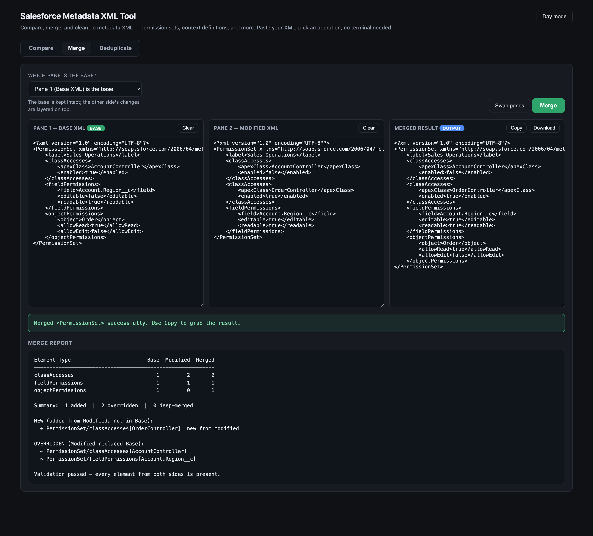
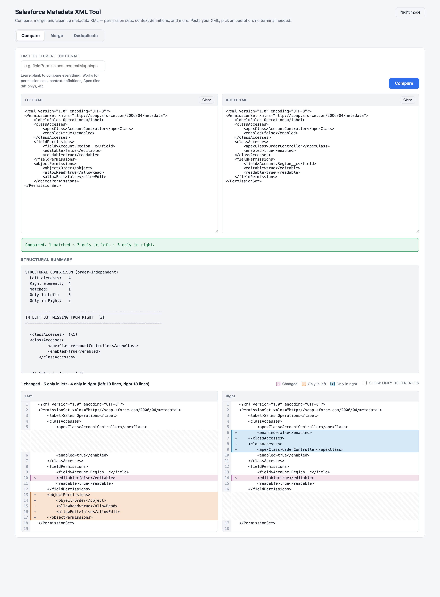
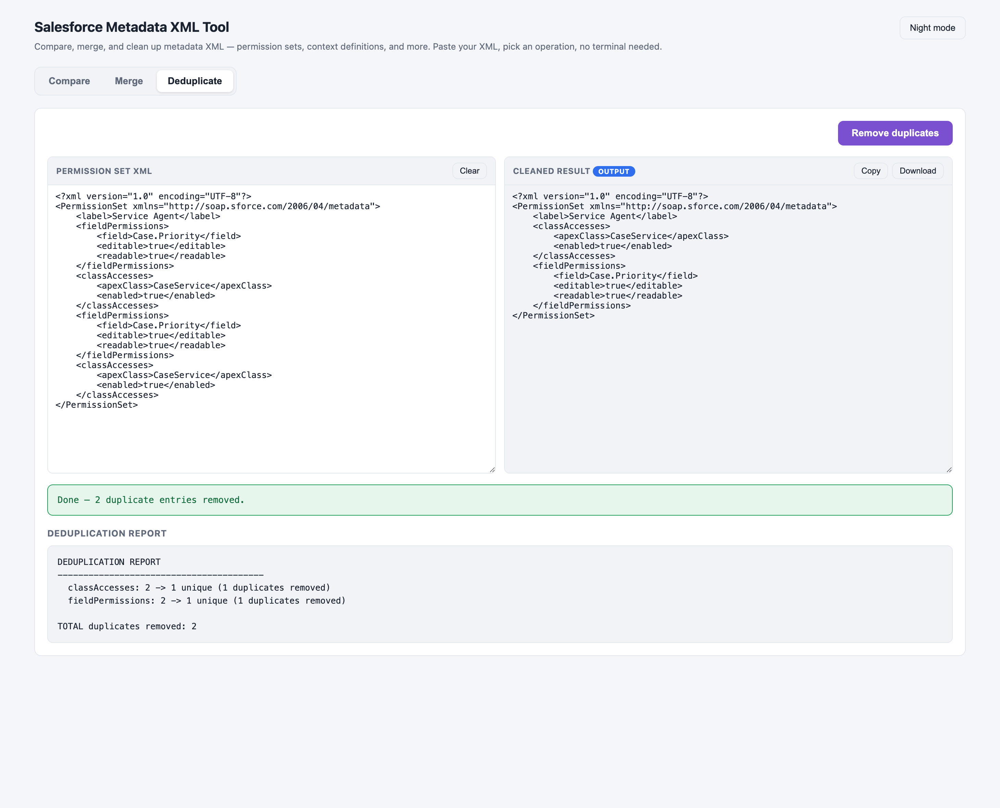

# Salesforce Metadata XML Tool

A tiny, **zero-dependency** local web app for working with Salesforce metadata XML.
Paste your XML, pick an operation, and go — no terminal commands, no installs, and
nothing ever leaves your machine.

It does three things:

| Operation | What it does |
|---|---|
| **Compare** | Side-by-side diff of two XMLs (changed / only-left / only-right) **plus** an order-independent *structural* summary that ignores element ordering. Also works on plain text/Apex (line diff only). |
| **Merge** | Merge a **Base** XML and a **Modified** XML into one. You choose which side is the base; the tool keeps the base intact and layers the other side's changes on top — matching identity keys (e.g. `apexClass`, `field`, `object`, `contextMapping title`) so nothing is duplicated or lost. |
| **Deduplicate** | Remove duplicate entries from a Permission Set / Profile and output a clean, consistently sorted file. |

Built for Salesforce metadata such as **Permission Sets, Profiles, and Context
Definitions**, but the compare works on any XML (or text).



---

## Why it's safe

- Runs a local server bound to **`127.0.0.1` only** — it is not reachable by anyone
  else on your network.
- **No external dependencies** — uses only the Python 3 standard library.
- **No telemetry, no cloud** — your XML is processed in memory on your own computer.

---

## Requirements

- **Python 3.8+** (already installed on most macOS/Linux machines).
  - macOS: comes preinstalled, or run `xcode-select --install`.
  - Windows: install from [python.org](https://www.python.org/downloads/) and tick
    **"Add Python to PATH"**.

---

## Quick start

### macOS (easiest)

1. Download/clone this folder.
2. Double-click **`Open XML Tool.command`**.
3. Your browser opens at `http://127.0.0.1:8799`. Done.

To stop it later, double-click **`Stop XML Tool.command`**.

> First launch: macOS may say *"unidentified developer."* Right-click the file →
> **Open** → **Open**, or allow it under **System Settings → Privacy & Security →
> Open Anyway**. This is a one-time approval per machine.

if you encounter error -> 

> **First launch shows a security warning?** That's normal — see
> [macOS security warning](#macos-security-warning-apple-could-not-verify) below.
> The quickest fix is to **`git clone`** the repo instead of receiving the files
> via AirDrop/Slack/email/zip.

### Windows

Double-click **`run.bat`** (or run it from a terminal). Your browser opens
automatically. Close the window to stop the tool.

### Linux / any terminal

```bash
./run.sh
# or:
python3 xml_tool.py
```

Then open `http://127.0.0.1:8799` if it doesn't open automatically. Press
`Ctrl+C` to stop.

### Change the port

```bash
XML_UI_PORT=8900 python3 xml_tool.py      # macOS / Linux
set XML_UI_PORT=8900 && python xml_tool.py  # Windows
```

---

## How to use

### Compare
1. Open the **Compare** tab.
2. Paste XML into the **Left** and **Right** panes.
3. (Optional) Type an element name in *"Limit to element"* (e.g. `fieldPermissions`)
   to focus the structural summary.
4. Click **Compare**. You get a synced two-pane line diff and a structural summary.



### Merge
1. Open the **Merge** tab.
2. Paste the **Base XML** (Pane 1) and the **Modified XML** (Pane 2).
3. Pick **which pane is the base** (or use **Swap panes**).
4. Click **Merge**. The merged XML appears in Pane 3 — use **Copy** or **Download**.
5. A merge report shows what was added, overridden, and deep-merged, plus a
   validation check that every element from both sides survived.

### Deduplicate
1. Open the **Deduplicate** tab.
2. Paste a Permission Set / Profile XML.
3. Click **Remove duplicates** → copy/download the cleaned result.



Toggle **Night / Day mode** any time with the button in the top-right (the Merge
screenshot above shows dark mode).

---

## Project structure

```
salesforce-xml-tool/
├── xml_tool.py            # Local server + merge/compare/dedup engine (the logic)
├── xml_tool_page.py       # The web UI (HTML + CSS + JS), kept separate for clarity
├── Open XML Tool.command  # macOS: double-click to start (runs in background)
├── Stop XML Tool.command  # macOS: double-click to stop
├── run.sh                 # macOS / Linux launcher
├── run.bat                # Windows launcher
├── README.md
├── LICENSE
├── .gitignore
└── docs/
    └── screenshots/       # Images used in this README
```

The endpoints (`/api/compare`, `/api/merge`, `/api/dedup`) are simple JSON POSTs,
so you can also script against the server if you want.

---

## How the merge works (in short)

Repeating elements are matched by an **identity key** rather than by position, so
order in the file never matters. Examples:

| Element | Identity |
|---|---|
| `classAccesses` | `apexClass` |
| `fieldPermissions` | `field` |
| `objectPermissions` | `object` |
| `recordTypeVisibilities` | `recordType` |
| `contextMappings` / `contextNodes` | `title` |
| `contextAttributeMappings` | `contextAttribute` |

- An element only in the base → **kept**.
- An element in both → the **modified** version wins (or is deep-merged for nested
  containers).
- An element only in the modified → **added**.

Permission Sets / Profiles are additionally re-sorted into a stable section order
for clean diffs.

---

## Troubleshooting

### macOS security warning: *"Apple could not verify…"*

When you double-click `Open XML Tool.command` you may see:

> *"Apple could not verify 'Open XML Tool.command' is free of malware that may
> harm your Mac or compromise your privacy."*

**Why this happens (and why the author didn't see it):** macOS adds a hidden
*quarantine* flag to files that arrive from "the outside" — downloads, AirDrop,
Slack/Teams, email, or an unzipped archive. Gatekeeper then blocks them because
these scripts aren't signed by a paid Apple Developer account. The person who
*created* the files locally has no quarantine flag, so they never see the prompt.
It has nothing to do with the tool being unsafe — the source is plain, readable
Python you can inspect.

**Fix — pick whichever is easiest:**

1. **Best: clone instead of copying.** Files obtained with `git clone` are **not**
   quarantined, so there's no warning at all:
   ```bash
   git clone https://github.com/<your-username>/salesforce-xml-tool.git
   cd salesforce-xml-tool
   open "Open XML Tool.command"
   ```

2. **Allow it in System Settings** (works on all recent macOS, including Sequoia):
   double-click once (it gets blocked) → open **System Settings → Privacy &
   Security** → scroll to the message about the blocked file → click
   **"Open Anyway"** → confirm. One-time per machine.

3. **Right-click → Open** (older macOS 14 and earlier): right-click (or
   Control-click) the file → **Open** → **Open**. *(Apple removed this shortcut on
   macOS 15 Sequoia — use option 1 or 2 there.)*

4. **Remove the quarantine flag from Terminal** (clears it for the whole folder):
   ```bash
   xattr -dr com.apple.quarantine "/path/to/salesforce-xml-tool"
   ```
   Then double-click normally.

> None of this requires admin rights or installing anything. If you'd rather skip
> the `.command` launcher entirely, teammates can just run `python3 xml_tool.py`
> in Terminal — that never triggers Gatekeeper.

### "Port 8799 is in use"

Another copy is already running, or something else holds the port. Stop it with
`Stop XML Tool.command`, or start on a different port:
`XML_UI_PORT=8900 python3 xml_tool.py`.

---

## Contributing

Issues and pull requests are welcome. The whole thing is plain Python + vanilla
JS with no build step, so editing is easy: change `xml_tool.py` (logic) or
`xml_tool_page.py` (UI) and relaunch.

## License

[MIT](./LICENSE) — free to use, modify, and share.
